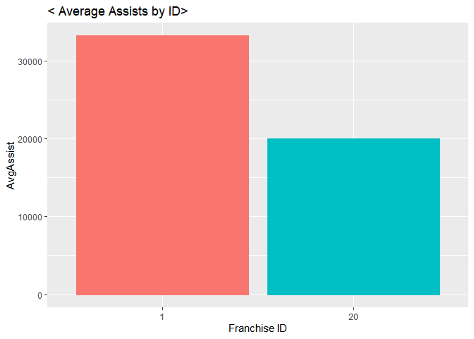
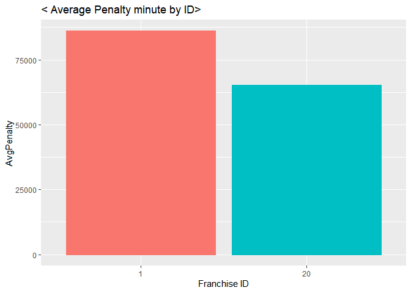
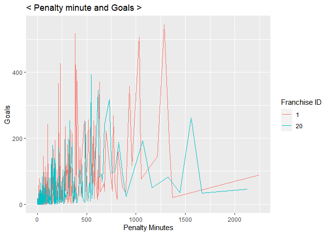

Project I
================
Soohee Jung
6/11/2021

-   [FUNCTIONS](#functions)
    -   [Record-API Functions](#record-api-functions)
    -   [Stat-API function](#stat-api-function)
    -   [Wrapper function to call the functions
        above](#wrapper-function-to-call-the-functions-above)
-   [FACTORS WHICH INFLUENCE TEAM
    WINNING](#factors-which-influence-team-winning)
    -   [Choose two franchises to compare
        with](#choose-two-franchises-to-compare-with)
    -   [How skater assists affect
        winning?](#how-skater-assists-affect-winning)
    -   [How skater penalty time affect
        winning?](#how-skater-penalty-time-affect-winning)
    -   [How goalie goal against affect to
        winning?](#how-goalie-goal-against-affect-to-winning)

# FUNCTIONS

## Record-API Functions

``` r
library(httr)
library(jsonlite)
library(tidyverse)

# to get the franchise ids and the team names
frurl <- GET("https://records.nhl.com/site/api/franchise")
frtext <- content(frurl, "text", encoding = "UTF-8")
frlist <- fromJSON(frtext, flatten=TRUE)
frlist <- as.data.frame(frlist)
frtbl <- tibble(frlist$data.id, frlist$data.fullName)

# record API function
rcdURL <- function(list,recd,type,id){
  if (missing(recd) & missing(type) & missing(id)){
    rcdurl <- paste0("https://records.nhl.com/site/api/",list)
  }
  else if (missing(type) & missing(id)){
    rcdurl <- paste0("https://records.nhl.com/site/api/",list,"-",recd)
  }
  else {
    if (is.numeric(id)){
      rcdurl <- paste0("https://records.nhl.com/site/api/franchise","-",recd,"?cayenneExp=", type, "=", id)
    }
    else {
      id <- filter(filter(frtbl,frtbl[2]==id)[1])
      rcdurl <- paste0("https://records.nhl.com/site/api/franchise","-",recd,"?cayenneExp=", type, "=", id)
    }
  }
  return(rcdurl)
}

rcddt <- function(list,...){
  rcdNHL <- GET(rcdURL(list,...))
  rcdtext <- content(rcdNHL, "text",encoding = "UTF-8")
  rcdlist <- fromJSON(rcdtext, flatten=TRUE)
  rcdlist <- as.data.frame(rcdlist)
  return(rcdlist)
}
```

## Stat-API function

``` r
statURL <- function(list,id){
  if (missing(id)){
    staturl <- paste0("https://statsapi.web.nhl.com/api/v1/",list,"?expand=team.stats")
  }
  else{
    if (is.numeric(id)){
      staturl <- paste0("https://statsapi.web.nhl.com/api/v1/",list,"/",id,"?expand=team.stats")
    }
    else {
      id <- filter(filter(frtbl,frtbl[2]==id)[1])
      staturl <- paste0("https://statsapi.web.nhl.com/api/v1/",list,"/",id,"?expand=team.stats")
    }
  }
  return(staturl)
}

statdt <- function(list,...){
  statNHL <- GET(statURL(list,...))
  stattext <- content(statNHL, "text",encoding = "UTF-8")
  statlist <- fromJSON(stattext, flatten=TRUE)
  statlist <- as.data.frame(statlist)
  return(statlist)
}
```

## Wrapper function to call the functions above

``` r
# choose record or stat and then put parameters what we want
wrapfnc <- function(fnc,list,...){
  if (fnc=="record"){
    return(rcddt(list,...))
  }
  else if (fnc=="stat"){
    return(statdt(list,...))
  }
  else cat("choose record or stat!!")
}
```

# FACTORS WHICH INFLUENCE TEAM WINNING

## Choose two franchises to compare with

``` r
# Look for interesting results. 
a <- wrapfnc("record","franchise","team-totals") %>% filter(data.gameTypeId==2) %>% 
  mutate(Winchance=data.wins/data.gamesPlayed) %>% select(data.franchiseId,data.gamesPlayed, data.wins, Winchance) 
a[order(a$Winchance),] %>% filter(data.gamesPlayed >2000)
```

    ##    data.franchiseId data.gamesPlayed data.wins Winchance
    ## 1                15             2062       758 0.3676043
    ## 2                20             3945      1649 0.4179975
    ## 3                14             4172      1754 0.4204219
    ## 4                33             2109       889 0.4215268
    ## 5                11             6560      2812 0.4286585
    ## 6                10             6560      2883 0.4394817
    ## 7                 5             6516      2873 0.4409147
    ## 8                30             2195       971 0.4423690
    ## 9                22             3788      1688 0.4456177
    ## 10               31             2194       985 0.4489517
    ## 11               25             3235      1469 0.4540958
    ## 12               17             4171      1903 0.4562455
    ## 13               19             3945      1805 0.4575412
    ## 14               12             6293      2891 0.4593993
    ## 15               18             4173      1929 0.4622574
    ## 16               23             2993      1394 0.4657534
    ## 17               24             3633      1700 0.4679328
    ## 18               32             2111       990 0.4689721
    ## 19               29             2274      1070 0.4705365
    ## 20               21             3154      1497 0.4746354
    ## 21                6             6626      3241 0.4891337
    ## 22               16             4171      2079 0.4984416
    ## 23                1             6787      3473 0.5117136
    ## 24               15             2109      1084 0.5139877

ID=1 had higher chance of win than ID=20 had. Let’s find the factors
which affect team winning!

## How skater assists affect winning?

``` r
# Filter datasets and create new variables
skid1 <- wrapfnc("record","franchise", "skater-records","franchiseId",1) %>% 
  mutate(AvgAssist=mean(data.assists), AvgPenalty=mean(data.penaltyMinutes)) %>% 
  select(data.franchiseId,data.playerId,data.assists,data.goals,data.penaltyMinutes,data.assists,AvgAssist,AvgPenalty)

skid20 <- wrapfnc("record","franchise", "skater-records","franchiseId",20) %>%
  mutate(AvgAssist=mean(data.assists), AvgPenalty=mean(data.penaltyMinutes)) %>% 
  select(data.franchiseId,data.playerId,data.assists,data.goals,data.penaltyMinutes,data.assists,AvgAssist,AvgPenalty)

# Combine two datasets
cosk <- rbind(skid1,skid20)
cosk$data.franchiseId <- as.character(cosk$data.franchiseId)

library(ggplot2)
# Create a graph to see which franchise has more average assists
sk <- ggplot(cosk, aes(x=data.franchiseId, y=AvgAssist))
sk + geom_col(aes(color=data.franchiseId)) + labs(x="Franchise ID", title="< Average Assists by ID>") + 
  theme(legend.position = "none")
```

<!-- -->

``` r
# Create a graph to see the relationship between assists and goals
sk2 <- ggplot(cosk, aes(x=data.assists, y=data.goals))
sk2+geom_jitter(aes(color=data.franchiseId))+labs(x="Assists",y="Goals",color="Franchise ID",title="< Assists and Goals >")
```

<!-- --> We can see
Franchise ID=1 had more average assists from the first graph. And the
second graph tells us the relationship between assists and goals is
linear. So, we can say **more assists leads higher chance of winning!**

## How skater penalty time affect winning?

``` r
# Create a graph to see which franchise has more average penalty minutes
skpt <- ggplot(cosk, aes(x=data.franchiseId, y=AvgPenalty))
skpt + geom_col(aes(color=data.franchiseId)) + 
  labs(x="Franchise ID", title="< Average Penalty minute by ID>") + theme(legend.position = "none")
```

<!-- -->

``` r
# Create a graph to see the relationship between penalty minutes and goals
skpt2 <- ggplot(cosk, aes(x=data.penaltyMinutes, y=data.goals))
skpt2 + geom_line(aes(color=data.franchiseId)) + 
  labs(x="Penalty Minutes", y="Goals", color="Franchise ID",title="< Penalty minute and Goals >")
```

<!-- --> What a
surprising result!! I thought the penalty minutes definitely affects
winning but the graphs tell us no relationship between the penalty
minutes and the chance of winning. I could not believe that so searched
up and found a website.
[ESPN/NHL](https://www.espn.com/nhl/statistics/team/_/stat/major-penalties/league/east).
Teams can be higher rank regardless of penalty minutes.

## How goalie goal against affect to winning?

A good goals against average will fall between 2.00 and 2.70 for NHL
goaltenders. Anything between 2.70-3.00 is considered respectable, while
below 2.00 is very exceptional.

``` r
#goid3 <- wrapfnc("record","franchise", "goalie-records","franchiseId",3)
#goid5 <- wrapfnc("record","franchise", "goalie-records","franchiseId",5)
#goid35 <- rbind(goid3,goid5) %>% select(data.franchiseId,data.playerId,data.mostGoalsAgainstOneGame)
```
