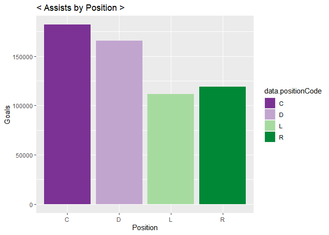
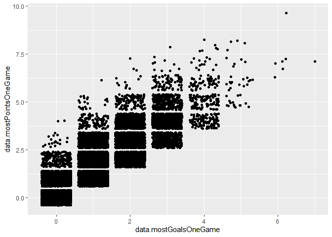
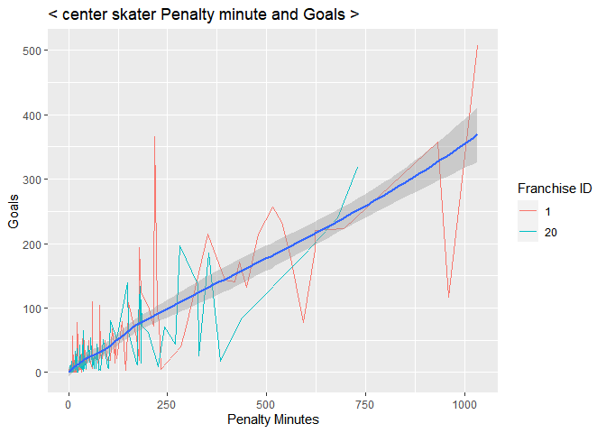
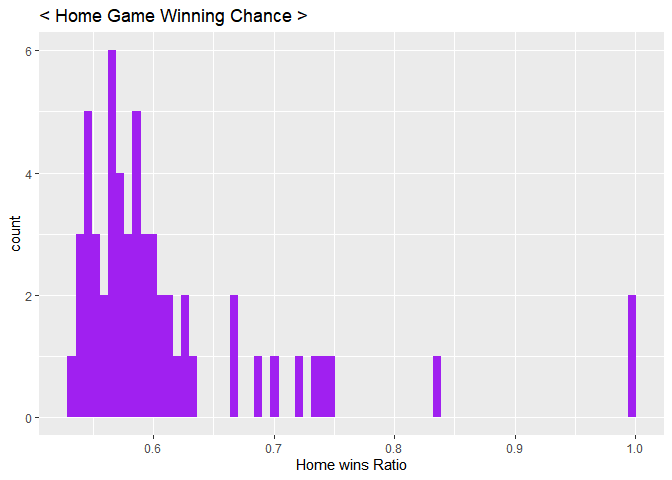

Project I
================
Soohee Jung
6/11/2021

-   [FUNCTIONS](#functions)
    -   [Required Packages](#required-packages)
    -   [Record-API Functions](#record-api-functions)
    -   [Stat-API function](#stat-api-function)
    -   [Wrapper function to call the functions
        above](#wrapper-function-to-call-the-functions-above)
-   [Contingency Tables](#contingency-tables)
    -   [Franchise Records](#franchise-records)
    -   [Franchise-team-totals Records](#franchise-team-totals-records)
    -   [franchise-season-records by
        franchiseId=ID](#franchise-season-records-by-franchiseidid)
    -   [franchise-goalie-records by
        franchiseId=ID](#franchise-goalie-records-by-franchiseidid)
    -   [franchise-skater-records by
        franchiseId=ID](#franchise-skater-records-by-franchiseidid)
    -   [franchise-detail records by
        mostRecentTeamId=ID](#franchise-detail-records-by-mostrecentteamidid)
    -   [Team Stat modifier](#team-stat-modifier)
-   [Getting basic ideas](#getting-basic-ideas)
    -   [Choose two franchises to compare
        with](#choose-two-franchises-to-compare-with)
    -   [Goals by skater position](#goals-by-skater-position)
    -   [Assists by skater position](#assists-by-skater-position)
-   [FACTORS WHICH INFLUENCE TEAM
    WINNING](#factors-which-influence-team-winning)
    -   [How skater assists affect
        winning?](#how-skater-assists-affect-winning)
    -   [How center position skater’s penalty time affect
        goal?](#how-center-position-skaters-penalty-time-affect-goal)
    -   [Is playing at Home really an
        advantage?](#is-playing-at-home-really-an-advantage)
    -   [Stat](#stat)

# FUNCTIONS

## Required Packages

``` r
library(httr)
library(jsonlite)
library(tidyverse)
library(ggplot2)
library(xml2)
```

## Record-API Functions

``` r
# to mapping Franchise ids vs Full names vs Most recent team ID
frurl <- GET("https://records.nhl.com/site/api/franchise")
frtext <- content(frurl, "text", encoding = "UTF-8")
frlist <- fromJSON(frtext, flatten=TRUE)
frlist <- as.data.frame(frlist)
frtbl <- tibble(frlist$data.id, frlist$data.fullName, frlist$data.mostRecentTeamId)
# print to see what it looks like
head(frtbl)
```

    ## # A tibble: 6 x 3
    ##   `frlist$data.id` `frlist$data.fullName` `frlist$data.mostRecentTeamId`
    ##              <int> <chr>                                           <int>
    ## 1                1 Montréal Canadiens                                  8
    ## 2                2 Montreal Wanderers                                 41
    ## 3                3 St. Louis Eagles                                   45
    ## 4                4 Hamilton Tigers                                    37
    ## 5                5 Toronto Maple Leafs                                10
    ## 6                6 Boston Bruins                                       6

``` r
# record API function
rcdURL <- function(list,recd,type,id){
  if (missing(recd) & missing(type) & missing(id)){
    rcdurl <- paste0("https://records.nhl.com/site/api/",list)
  }
  else if (missing(type) & missing(id)){
    rcdurl <- paste0("https://records.nhl.com/site/api/",list,"-",recd)
  }
  else {
    if (is.numeric(id)){
      rcdurl <- paste0("https://records.nhl.com/site/api/",list,"-",recd,"?cayenneExp=", type, "=", id)
    }
    else {
      if (type=="mostRecentTeamId"){
        id <- filter(filter(frtbl,frtbl[2]==id)[3])
        rcdurl <- paste0("https://records.nhl.com/site/api/",list,"-",recd,"?cayenneExp=", type, "=", id)
      }
      else {
        id <- filter(filter(frtbl,frtbl[2]==id)[1])
        rcdurl <- paste0("https://records.nhl.com/site/api/",list,"-",recd,"?cayenneExp=", type, "=", id)
      }
    }
  }
  return(rcdurl)
}

rcddt <- function(list,recd,...){
  if (missing(recd)){
    rcdNHL <- GET(rcdURL(list))
    rcdtext <- content(rcdNHL, "text",encoding = "UTF-8")
    rcdlist <- fromJSON(rcdtext, flatten=TRUE)
    rcdlist <- as.data.frame(rcdlist)
  }
  else {
    if (recd=="detail"){
      rcdNHL <- GET(rcdURL(list,recd,...))
      rcdtext <- content(rcdNHL, "text",encoding = "UTF-8")
      rcdlist <- fromJSON(rcdtext, flatten=TRUE)
      rcdlist <- as.data.frame(rcdlist)
      ca<-read_html(rcdlist$data.captainHistory)        
      rcdlist$data.captainHistory<- xml_text(ca)
      co<-read_html(rcdlist$data.coachingHistory)        
      rcdlist$data.coachingHistory<- xml_text(co)
      ge<-read_html(rcdlist$data.generalManagerHistory)        
      rcdlist$data.generalManagerHistory<- xml_text(ge)
      re<-read_html(rcdlist$data.retiredNumbersSummary)        
      rcdlist$data.retiredNumbersSummary<- xml_text(re)
    }
    else {
      rcdNHL <- GET(rcdURL(list,recd,...))
      rcdtext <- content(rcdNHL, "text",encoding = "UTF-8")
      rcdlist <- fromJSON(rcdtext, flatten=TRUE)
      rcdlist <- as.data.frame(rcdlist)
    }
  }
  return(rcdlist)
}
```

## Stat-API function

``` r
statURL <- function(list,id){
  if (missing(id)){
    staturl <- paste0("https://statsapi.web.nhl.com/api/v1/",list,"?expand=team.stats")
  }
  else{
    if (is.numeric(id)){
      staturl <- paste0("https://statsapi.web.nhl.com/api/v1/",list,"/",id,"?expand=team.stats")
    }
    else {
      id <- filter(filter(frtbl,frtbl[2]==id)[1])
      staturl <- paste0("https://statsapi.web.nhl.com/api/v1/",list,"/",id,"?expand=team.stats")
    }
  }
  return(staturl)
}

statdt <- function(list,...){
  statNHL <- GET(statURL(list,...))
  stattext <- content(statNHL, "text",encoding = "UTF-8")
  statlist <- fromJSON(stattext, flatten=TRUE)
  statlist <- as.data.frame(statlist)
  statlist <- unnest(unnest(statlist,cols = c(teams.teamStats)),cols = c(splits))
  return(statlist)
}
```

## Wrapper function to call the functions above

``` r
# choose record or stat and then put parameters what we want
wrapfnc <- function(fnc,list,...){
  if (fnc=="record"){
    return(rcddt(list,...))
  }
  else if (fnc=="stat"){
    return(statdt(list,...))
  }
  else cat("choose record or stat!!")
}
```

# Contingency Tables

## Franchise Records

``` r
as.tbl(wrapfnc("record","franchise"))
```

    ## # A tibble: 39 x 9
    ##    data.id data.firstSeaso~ data.fullName data.lastSeason~ data.mostRecent~
    ##      <int>            <int> <chr>                    <int>            <int>
    ##  1       1         19171918 Montréal Can~               NA                8
    ##  2       2         19171918 Montreal Wan~         19171918               41
    ##  3       3         19171918 St. Louis Ea~         19341935               45
    ##  4       4         19191920 Hamilton Tig~         19241925               37
    ##  5       5         19171918 Toronto Mapl~               NA               10
    ##  6       6         19241925 Boston Bruins               NA                6
    ##  7       7         19241925 Montreal Mar~         19371938               43
    ##  8       8         19251926 Brooklyn Ame~         19411942               51
    ##  9       9         19251926 Philadelphia~         19301931               39
    ## 10      10         19261927 New York Ran~               NA                3
    ## # ... with 29 more rows, and 4 more variables: data.teamAbbrev <chr>,
    ## #   data.teamCommonName <chr>, data.teamPlaceName <chr>, total <int>

## Franchise-team-totals Records

``` r
as.tbl(wrapfnc("record","franchise","team-totals"))
```

    ## # A tibble: 105 x 31
    ##    data.id data.activeFran~ data.firstSeaso~ data.franchiseId
    ##      <int>            <int>            <int>            <int>
    ##  1       1                1         19821983               23
    ##  2       2                1         19821983               23
    ##  3       3                1         19721973               22
    ##  4       4                1         19721973               22
    ##  5       5                1         19261927               10
    ##  6       6                1         19261927               10
    ##  7       7                1         19671968               16
    ##  8       8                1         19671968               16
    ##  9       9                1         19671968               17
    ## 10      10                1         19671968               17
    ## # ... with 95 more rows, and 27 more variables: data.gameTypeId <int>,
    ## #   data.gamesPlayed <int>, data.goalsAgainst <int>, data.goalsFor <int>,
    ## #   data.homeLosses <int>, data.homeOvertimeLosses <int>,
    ## #   data.homeTies <int>, data.homeWins <int>, data.lastSeasonId <int>,
    ## #   data.losses <int>, data.overtimeLosses <int>,
    ## #   data.penaltyMinutes <int>, data.pointPctg <dbl>, data.points <int>,
    ## #   data.roadLosses <int>, data.roadOvertimeLosses <int>,
    ## #   data.roadTies <int>, data.roadWins <int>, data.shootoutLosses <int>,
    ## #   data.shootoutWins <int>, data.shutouts <int>, data.teamId <int>,
    ## #   data.teamName <chr>, data.ties <int>, data.triCode <chr>,
    ## #   data.wins <int>, total <int>

## franchise-season-records by franchiseId=ID

``` r
# I choose ID=10
as.tbl(wrapfnc("record","franchise","season-records","franchiseId",10))
```

    ## # A tibble: 1 x 58
    ##   data.id data.fewestGoals data.fewestGoal~ data.fewestGoal~
    ##     <int>            <int>            <int> <chr>           
    ## 1       3              150              177 1970-71 (78)    
    ## # ... with 54 more variables: data.fewestGoalsSeasons <chr>,
    ## #   data.fewestLosses <int>, data.fewestLossesSeasons <chr>,
    ## #   data.fewestPoints <int>, data.fewestPointsSeasons <chr>,
    ## #   data.fewestTies <int>, data.fewestTiesSeasons <chr>,
    ## #   data.fewestWins <int>, data.fewestWinsSeasons <chr>,
    ## #   data.franchiseId <int>, data.franchiseName <chr>,
    ## #   data.homeLossStreak <int>, data.homeLossStreakDates <chr>,
    ## #   data.homePointStreak <int>, data.homePointStreakDates <chr>,
    ## #   data.homeWinStreak <int>, data.homeWinStreakDates <chr>,
    ## #   data.homeWinlessStreak <int>, data.homeWinlessStreakDates <chr>,
    ## #   data.lossStreak <int>, data.lossStreakDates <chr>,
    ## #   data.mostGameGoals <int>, data.mostGameGoalsDates <chr>,
    ## #   data.mostGoals <int>, data.mostGoalsAgainst <int>,
    ## #   data.mostGoalsAgainstSeasons <chr>, data.mostGoalsSeasons <chr>,
    ## #   data.mostLosses <int>, data.mostLossesSeasons <chr>,
    ## #   data.mostPenaltyMinutes <int>, data.mostPenaltyMinutesSeasons <chr>,
    ## #   data.mostPoints <int>, data.mostPointsSeasons <chr>,
    ## #   data.mostShutouts <int>, data.mostShutoutsSeasons <chr>,
    ## #   data.mostTies <int>, data.mostTiesSeasons <chr>, data.mostWins <int>,
    ## #   data.mostWinsSeasons <chr>, data.pointStreak <int>,
    ## #   data.pointStreakDates <chr>, data.roadLossStreak <int>,
    ## #   data.roadLossStreakDates <chr>, data.roadPointStreak <int>,
    ## #   data.roadPointStreakDates <chr>, data.roadWinStreak <int>,
    ## #   data.roadWinStreakDates <chr>, data.roadWinlessStreak <int>,
    ## #   data.roadWinlessStreakDates <chr>, data.winStreak <int>,
    ## #   data.winStreakDates <chr>, data.winlessStreak <int>,
    ## #   data.winlessStreakDates <chr>, total <int>

``` r
# I choose Franchise full name="New Jersey Devils"
as.tbl(wrapfnc("record","franchise","season-records","franchiseId","New Jersey Devils"))
```

    ## # A tibble: 1 x 58
    ##   data.id data.fewestGoals data.fewestGoal~ data.fewestGoal~
    ##     <int>            <int>            <int> <chr>           
    ## 1       1              174              164 2003-04 (82)    
    ## # ... with 54 more variables: data.fewestGoalsSeasons <chr>,
    ## #   data.fewestLosses <int>, data.fewestLossesSeasons <chr>,
    ## #   data.fewestPoints <int>, data.fewestPointsSeasons <chr>,
    ## #   data.fewestTies <int>, data.fewestTiesSeasons <chr>,
    ## #   data.fewestWins <int>, data.fewestWinsSeasons <chr>,
    ## #   data.franchiseId <int>, data.franchiseName <chr>,
    ## #   data.homeLossStreak <int>, data.homeLossStreakDates <chr>,
    ## #   data.homePointStreak <int>, data.homePointStreakDates <chr>,
    ## #   data.homeWinStreak <int>, data.homeWinStreakDates <chr>,
    ## #   data.homeWinlessStreak <int>, data.homeWinlessStreakDates <chr>,
    ## #   data.lossStreak <int>, data.lossStreakDates <chr>,
    ## #   data.mostGameGoals <int>, data.mostGameGoalsDates <chr>,
    ## #   data.mostGoals <int>, data.mostGoalsAgainst <int>,
    ## #   data.mostGoalsAgainstSeasons <chr>, data.mostGoalsSeasons <chr>,
    ## #   data.mostLosses <int>, data.mostLossesSeasons <chr>,
    ## #   data.mostPenaltyMinutes <int>, data.mostPenaltyMinutesSeasons <chr>,
    ## #   data.mostPoints <int>, data.mostPointsSeasons <chr>,
    ## #   data.mostShutouts <int>, data.mostShutoutsSeasons <chr>,
    ## #   data.mostTies <int>, data.mostTiesSeasons <chr>, data.mostWins <int>,
    ## #   data.mostWinsSeasons <chr>, data.pointStreak <int>,
    ## #   data.pointStreakDates <chr>, data.roadLossStreak <int>,
    ## #   data.roadLossStreakDates <chr>, data.roadPointStreak <int>,
    ## #   data.roadPointStreakDates <chr>, data.roadWinStreak <int>,
    ## #   data.roadWinStreakDates <chr>, data.roadWinlessStreak <int>,
    ## #   data.roadWinlessStreakDates <chr>, data.winStreak <int>,
    ## #   data.winStreakDates <chr>, data.winlessStreak <int>,
    ## #   data.winlessStreakDates <chr>, total <int>

## franchise-goalie-records by franchiseId=ID

``` r
# I choose ID=20
as.tbl(wrapfnc("record","franchise","goalie-records","franchiseId",20))
```

    ## # A tibble: 40 x 30
    ##    data.id data.activePlay~ data.firstName data.franchiseId
    ##      <int> <lgl>            <chr>                     <int>
    ##  1     304 FALSE            Richard                      20
    ##  2     364 FALSE            Gary                         20
    ##  3     367 FALSE            Sean                         20
    ##  4    1224 FALSE            Frank                        20
    ##  5     373 FALSE            Jacques                      20
    ##  6     406 FALSE            Bob                          20
    ##  7     423 FALSE            Troy                         20
    ##  8     424 FALSE            John                         20
    ##  9     500 FALSE            Bob                          20
    ## 10     243 FALSE            Kirk                         20
    ## # ... with 30 more rows, and 26 more variables: data.franchiseName <chr>,
    ## #   data.gameTypeId <int>, data.gamesPlayed <int>, data.lastName <chr>,
    ## #   data.losses <int>, data.mostGoalsAgainstDates <chr>,
    ## #   data.mostGoalsAgainstOneGame <int>, data.mostSavesDates <chr>,
    ## #   data.mostSavesOneGame <int>, data.mostShotsAgainstDates <chr>,
    ## #   data.mostShotsAgainstOneGame <int>, data.mostShutoutsOneSeason <int>,
    ## #   data.mostShutoutsSeasonIds <chr>, data.mostWinsOneSeason <int>,
    ## #   data.mostWinsSeasonIds <chr>, data.overtimeLosses <int>,
    ## #   data.playerId <int>, data.positionCode <chr>,
    ## #   data.rookieGamesPlayed <int>, data.rookieShutouts <int>,
    ## #   data.rookieWins <int>, data.seasons <int>, data.shutouts <int>,
    ## #   data.ties <int>, data.wins <int>, total <int>

``` r
# I choose Franchise full name="Philadelphia Flyers"
as.tbl(wrapfnc("record","franchise","goalie-records","franchiseId","Philadelphia Flyers"))
```

    ## # A tibble: 34 x 30
    ##    data.id data.activePlay~ data.firstName data.franchiseId
    ##      <int> <lgl>            <chr>                     <int>
    ##  1     341 FALSE            Stephane                     16
    ##  2     366 FALSE            Sean                         16
    ##  3     440 FALSE            Jeff                         16
    ##  4     239 FALSE            Ron                          16
    ##  5     466 FALSE            Gary                         16
    ##  6     482 FALSE            Mark                         16
    ##  7     485 FALSE            Michel                       16
    ##  8     531 FALSE            Phil                         16
    ##  9     584 FALSE            Bruce                        16
    ## 10     307 FALSE            Bernie                       16
    ## # ... with 24 more rows, and 26 more variables: data.franchiseName <chr>,
    ## #   data.gameTypeId <int>, data.gamesPlayed <int>, data.lastName <chr>,
    ## #   data.losses <int>, data.mostGoalsAgainstDates <chr>,
    ## #   data.mostGoalsAgainstOneGame <int>, data.mostSavesDates <chr>,
    ## #   data.mostSavesOneGame <int>, data.mostShotsAgainstDates <chr>,
    ## #   data.mostShotsAgainstOneGame <int>, data.mostShutoutsOneSeason <int>,
    ## #   data.mostShutoutsSeasonIds <chr>, data.mostWinsOneSeason <int>,
    ## #   data.mostWinsSeasonIds <chr>, data.overtimeLosses <int>,
    ## #   data.playerId <int>, data.positionCode <chr>,
    ## #   data.rookieGamesPlayed <int>, data.rookieShutouts <int>,
    ## #   data.rookieWins <int>, data.seasons <int>, data.shutouts <int>,
    ## #   data.ties <int>, data.wins <int>, total <int>

## franchise-skater-records by franchiseId=ID

``` r
# I choose ID=30
as.tbl(wrapfnc("record","franchise","skater-records","franchiseId",30))
```

    ## # A tibble: 364 x 32
    ##    data.id data.activePlay~ data.assists data.firstName data.franchiseId
    ##      <int> <lgl>                   <int> <chr>                     <int>
    ##  1   18785 FALSE                       0 Joe                          30
    ##  2   19225 FALSE                       0 Bobby                        30
    ##  3   19982 FALSE                       1 Marc                         30
    ##  4   22168 FALSE                       2 Steve                        30
    ##  5   22256 FALSE                       1 Jim                          30
    ##  6   22437 FALSE                       1 Dominic                      30
    ##  7   22496 FALSE                       2 Stephen                      30
    ##  8   22590 FALSE                       1 Francois                     30
    ##  9   23076 FALSE                       3 Brad                         30
    ## 10   23650 FALSE                       0 Brad                         30
    ## # ... with 354 more rows, and 27 more variables: data.franchiseName <chr>,
    ## #   data.gameTypeId <int>, data.gamesPlayed <int>, data.goals <int>,
    ## #   data.lastName <chr>, data.mostAssistsGameDates <chr>,
    ## #   data.mostAssistsOneGame <int>, data.mostAssistsOneSeason <int>,
    ## #   data.mostAssistsSeasonIds <chr>, data.mostGoalsGameDates <chr>,
    ## #   data.mostGoalsOneGame <int>, data.mostGoalsOneSeason <int>,
    ## #   data.mostGoalsSeasonIds <chr>, data.mostPenaltyMinutesOneSeason <int>,
    ## #   data.mostPenaltyMinutesSeasonIds <chr>,
    ## #   data.mostPointsGameDates <chr>, data.mostPointsOneGame <int>,
    ## #   data.mostPointsOneSeason <int>, data.mostPointsSeasonIds <chr>,
    ## #   data.penaltyMinutes <int>, data.playerId <int>, data.points <int>,
    ## #   data.positionCode <chr>, data.rookieGamesPlayed <int>,
    ## #   data.rookiePoints <int>, data.seasons <int>, total <int>

``` r
# I choose Franchise full name="New York Rangers"
as.tbl(wrapfnc("record","franchise","skater-records","franchiseId","New York Rangers"))
```

    ## # A tibble: 995 x 32
    ##    data.id data.activePlay~ data.assists data.firstName data.franchiseId
    ##      <int> <lgl>                   <int> <chr>                     <int>
    ##  1   17208 FALSE                       1 Doug                         10
    ##  2   17216 FALSE                       0 Lloyd                        10
    ##  3   17230 FALSE                       1 Bill                         10
    ##  4   17310 FALSE                       0 Hub                          10
    ##  5   17360 FALSE                       0 Ron                          10
    ##  6   17374 FALSE                       4 Vern                         10
    ##  7   17444 FALSE                       0 Cliff                        10
    ##  8   17449 FALSE                       0 Frank                        10
    ##  9   17467 FALSE                       1 Harry                        10
    ## 10   17523 FALSE                       0 Bob                          10
    ## # ... with 985 more rows, and 27 more variables: data.franchiseName <chr>,
    ## #   data.gameTypeId <int>, data.gamesPlayed <int>, data.goals <int>,
    ## #   data.lastName <chr>, data.mostAssistsGameDates <chr>,
    ## #   data.mostAssistsOneGame <int>, data.mostAssistsOneSeason <int>,
    ## #   data.mostAssistsSeasonIds <chr>, data.mostGoalsGameDates <chr>,
    ## #   data.mostGoalsOneGame <int>, data.mostGoalsOneSeason <int>,
    ## #   data.mostGoalsSeasonIds <chr>, data.mostPenaltyMinutesOneSeason <int>,
    ## #   data.mostPenaltyMinutesSeasonIds <chr>,
    ## #   data.mostPointsGameDates <chr>, data.mostPointsOneGame <int>,
    ## #   data.mostPointsOneSeason <int>, data.mostPointsSeasonIds <chr>,
    ## #   data.penaltyMinutes <int>, data.playerId <int>, data.points <int>,
    ## #   data.positionCode <chr>, data.rookieGamesPlayed <int>,
    ## #   data.rookiePoints <int>, data.seasons <int>, total <int>

## franchise-detail records by mostRecentTeamId=ID

``` r
# I choose ID=8
as.tbl(wrapfnc("record","franchise","detail","mostRecentTeamId",8))
```

    ## # A tibble: 1 x 14
    ##   data.id data.active data.captainHis~ data.coachingHi~ data.dateAwarded
    ##     <int> <lgl>       <chr>            <chr>            <chr>           
    ## 1       1 TRUE        "Shea Weber: 20~ "Dominique Duch~ 1917-11-26T00:0~
    ## # ... with 9 more variables: data.directoryUrl <chr>,
    ## #   data.firstSeasonId <int>, data.generalManagerHistory <chr>,
    ## #   data.heroImageUrl <chr>, data.mostRecentTeamId <int>,
    ## #   data.retiredNumbersSummary <chr>, data.teamAbbrev <chr>,
    ## #   data.teamFullName <chr>, total <int>

``` r
# I choose Franchise full name="New York Islanders"
as.tbl(wrapfnc("record","franchise","detail","mostRecentTeamId","New York Islanders"))
```

    ## # A tibble: 1 x 14
    ##   data.id data.active data.captainHis~ data.coachingHi~ data.dateAwarded
    ##     <int> <lgl>       <chr>            <chr>            <chr>           
    ## 1      22 TRUE        "Anders Lee: 20~ "Barry Trotz: O~ 1972-06-06T00:0~
    ## # ... with 9 more variables: data.directoryUrl <chr>,
    ## #   data.firstSeasonId <int>, data.generalManagerHistory <chr>,
    ## #   data.heroImageUrl <chr>, data.mostRecentTeamId <int>,
    ## #   data.retiredNumbersSummary <chr>, data.teamAbbrev <chr>,
    ## #   data.teamFullName <chr>, total <int>

## Team Stat modifier

``` r
# I choose all ID
as.tbl(wrapfnc("stat","teams"))
```

    ## # A tibble: 62 x 66
    ##    copyright teams.id teams.name teams.link teams.abbreviat~ teams.teamName
    ##    <fct>        <int> <chr>      <chr>      <chr>            <chr>         
    ##  1 NHL and ~        1 New Jerse~ /api/v1/t~ NJD              Devils        
    ##  2 NHL and ~        1 New Jerse~ /api/v1/t~ NJD              Devils        
    ##  3 NHL and ~        2 New York ~ /api/v1/t~ NYI              Islanders     
    ##  4 NHL and ~        2 New York ~ /api/v1/t~ NYI              Islanders     
    ##  5 NHL and ~        3 New York ~ /api/v1/t~ NYR              Rangers       
    ##  6 NHL and ~        3 New York ~ /api/v1/t~ NYR              Rangers       
    ##  7 NHL and ~        4 Philadelp~ /api/v1/t~ PHI              Flyers        
    ##  8 NHL and ~        4 Philadelp~ /api/v1/t~ PHI              Flyers        
    ##  9 NHL and ~        5 Pittsburg~ /api/v1/t~ PIT              Penguins      
    ## 10 NHL and ~        5 Pittsburg~ /api/v1/t~ PIT              Penguins      
    ## # ... with 52 more rows, and 60 more variables: teams.locationName <chr>,
    ## #   teams.firstYearOfPlay <chr>, stat.gamesPlayed <int>, stat.wins <chr>,
    ## #   stat.losses <chr>, stat.ot <chr>, stat.pts <chr>, stat.ptPctg <chr>,
    ## #   stat.goalsPerGame <chr>, stat.goalsAgainstPerGame <chr>,
    ## #   stat.evGGARatio <chr>, stat.powerPlayPercentage <chr>,
    ## #   stat.powerPlayGoals <chr>, stat.powerPlayGoalsAgainst <chr>,
    ## #   stat.powerPlayOpportunities <chr>, stat.penaltyKillPercentage <chr>,
    ## #   stat.shotsPerGame <chr>, stat.shotsAllowed <chr>,
    ## #   stat.winScoreFirst <chr>, stat.winOppScoreFirst <chr>,
    ## #   stat.winLeadFirstPer <chr>, stat.winLeadSecondPer <chr>,
    ## #   stat.winOutshootOpp <chr>, stat.winOutshotByOpp <chr>,
    ## #   stat.faceOffsTaken <chr>, stat.faceOffsWon <chr>,
    ## #   stat.faceOffsLost <chr>, stat.faceOffWinPercentage <chr>,
    ## #   stat.shootingPctg <dbl>, stat.savePctg <dbl>,
    ## #   stat.penaltyKillOpportunities <chr>, stat.savePctRank <chr>,
    ## #   stat.shootingPctRank <chr>, team.id <int>, team.name <chr>,
    ## #   team.link <chr>, type.displayName <chr>, type.gameType.id <chr>,
    ## #   type.gameType.description <chr>, type.gameType.postseason <lgl>,
    ## #   teams.shortName <chr>, teams.officialSiteUrl <chr>,
    ## #   teams.franchiseId <int>, teams.active <lgl>, teams.venue.name <chr>,
    ## #   teams.venue.link <chr>, teams.venue.city <chr>, teams.venue.id <int>,
    ## #   teams.venue.timeZone.id <chr>, teams.venue.timeZone.offset <int>,
    ## #   teams.venue.timeZone.tz <chr>, teams.division.id <int>,
    ## #   teams.division.name <chr>, teams.division.link <chr>,
    ## #   teams.conference.id <int>, teams.conference.name <chr>,
    ## #   teams.conference.link <chr>, teams.franchise.franchiseId <int>,
    ## #   teams.franchise.teamName <chr>, teams.franchise.link <chr>

``` r
# I choose ID=1
as.tbl(wrapfnc("stat","teams",1))
```

    ## # A tibble: 2 x 65
    ##   copyright teams.id teams.name teams.link teams.abbreviat~ teams.teamName
    ##   <fct>        <int> <chr>      <chr>      <chr>            <chr>         
    ## 1 NHL and ~        1 New Jerse~ /api/v1/t~ NJD              Devils        
    ## 2 NHL and ~        1 New Jerse~ /api/v1/t~ NJD              Devils        
    ## # ... with 59 more variables: teams.locationName <chr>,
    ## #   teams.firstYearOfPlay <chr>, stat.gamesPlayed <int>, stat.wins <chr>,
    ## #   stat.losses <chr>, stat.ot <chr>, stat.pts <chr>, stat.ptPctg <chr>,
    ## #   stat.goalsPerGame <chr>, stat.goalsAgainstPerGame <chr>,
    ## #   stat.evGGARatio <chr>, stat.powerPlayPercentage <chr>,
    ## #   stat.powerPlayGoals <chr>, stat.powerPlayGoalsAgainst <chr>,
    ## #   stat.powerPlayOpportunities <chr>, stat.penaltyKillPercentage <chr>,
    ## #   stat.shotsPerGame <chr>, stat.shotsAllowed <chr>,
    ## #   stat.winScoreFirst <chr>, stat.winOppScoreFirst <chr>,
    ## #   stat.winLeadFirstPer <chr>, stat.winLeadSecondPer <chr>,
    ## #   stat.winOutshootOpp <chr>, stat.winOutshotByOpp <chr>,
    ## #   stat.faceOffsTaken <chr>, stat.faceOffsWon <chr>,
    ## #   stat.faceOffsLost <chr>, stat.faceOffWinPercentage <chr>,
    ## #   stat.shootingPctg <dbl>, stat.savePctg <dbl>,
    ## #   stat.penaltyKillOpportunities <chr>, stat.savePctRank <chr>,
    ## #   stat.shootingPctRank <chr>, team.id <int>, team.name <chr>,
    ## #   team.link <chr>, type.displayName <chr>, type.gameType.id <chr>,
    ## #   type.gameType.description <chr>, type.gameType.postseason <lgl>,
    ## #   teams.shortName <chr>, teams.officialSiteUrl <chr>,
    ## #   teams.franchiseId <int>, teams.active <lgl>, teams.venue.name <chr>,
    ## #   teams.venue.link <chr>, teams.venue.city <chr>,
    ## #   teams.venue.timeZone.id <chr>, teams.venue.timeZone.offset <int>,
    ## #   teams.venue.timeZone.tz <chr>, teams.division.id <int>,
    ## #   teams.division.name <chr>, teams.division.link <chr>,
    ## #   teams.conference.id <int>, teams.conference.name <chr>,
    ## #   teams.conference.link <chr>, teams.franchise.franchiseId <int>,
    ## #   teams.franchise.teamName <chr>, teams.franchise.link <chr>

``` r
# I choose Franchise full name="New Jersey Devils"
as.tbl(wrapfnc("record","franchise","detail","mostRecentTeamId","New Jersey Devils"))
```

    ## # A tibble: 1 x 14
    ##   data.id data.active data.captainHis~ data.coachingHi~ data.dateAwarded
    ##     <int> <lgl>       <chr>            <chr>            <chr>           
    ## 1      23 TRUE        "(No Captain) a~ "Lindy Ruff: Pr~ 1974-06-11T00:0~
    ## # ... with 9 more variables: data.directoryUrl <chr>,
    ## #   data.firstSeasonId <int>, data.generalManagerHistory <chr>,
    ## #   data.heroImageUrl <chr>, data.mostRecentTeamId <int>,
    ## #   data.retiredNumbersSummary <chr>, data.teamAbbrev <chr>,
    ## #   data.teamFullName <chr>, total <int>

# Getting basic ideas

## Choose two franchises to compare with

``` r
# Look for interesting results from 'team-total' dataset. 
a <- wrapfnc("record","franchise","team-totals") %>% filter(data.gameTypeId==2 & data.gamesPlayed >2000) %>% 
  mutate(Winchance=data.wins/data.gamesPlayed) %>% select(data.franchiseId,data.gamesPlayed, data.wins, Winchance)
knitr::kable(a)
```

<table>
<thead>
<tr>
<th style="text-align:right;">
data.franchiseId
</th>
<th style="text-align:right;">
data.gamesPlayed
</th>
<th style="text-align:right;">
data.wins
</th>
<th style="text-align:right;">
Winchance
</th>
</tr>
</thead>
<tbody>
<tr>
<td style="text-align:right;">
23
</td>
<td style="text-align:right;">
2993
</td>
<td style="text-align:right;">
1394
</td>
<td style="text-align:right;">
0.4657534
</td>
</tr>
<tr>
<td style="text-align:right;">
22
</td>
<td style="text-align:right;">
3788
</td>
<td style="text-align:right;">
1688
</td>
<td style="text-align:right;">
0.4456177
</td>
</tr>
<tr>
<td style="text-align:right;">
10
</td>
<td style="text-align:right;">
6560
</td>
<td style="text-align:right;">
2883
</td>
<td style="text-align:right;">
0.4394817
</td>
</tr>
<tr>
<td style="text-align:right;">
16
</td>
<td style="text-align:right;">
4171
</td>
<td style="text-align:right;">
2079
</td>
<td style="text-align:right;">
0.4984416
</td>
</tr>
<tr>
<td style="text-align:right;">
17
</td>
<td style="text-align:right;">
4171
</td>
<td style="text-align:right;">
1903
</td>
<td style="text-align:right;">
0.4562455
</td>
</tr>
<tr>
<td style="text-align:right;">
6
</td>
<td style="text-align:right;">
6626
</td>
<td style="text-align:right;">
3241
</td>
<td style="text-align:right;">
0.4891337
</td>
</tr>
<tr>
<td style="text-align:right;">
19
</td>
<td style="text-align:right;">
3945
</td>
<td style="text-align:right;">
1805
</td>
<td style="text-align:right;">
0.4575412
</td>
</tr>
<tr>
<td style="text-align:right;">
1
</td>
<td style="text-align:right;">
6787
</td>
<td style="text-align:right;">
3473
</td>
<td style="text-align:right;">
0.5117136
</td>
</tr>
<tr>
<td style="text-align:right;">
30
</td>
<td style="text-align:right;">
2195
</td>
<td style="text-align:right;">
971
</td>
<td style="text-align:right;">
0.4423690
</td>
</tr>
<tr>
<td style="text-align:right;">
5
</td>
<td style="text-align:right;">
6516
</td>
<td style="text-align:right;">
2873
</td>
<td style="text-align:right;">
0.4409147
</td>
</tr>
<tr>
<td style="text-align:right;">
33
</td>
<td style="text-align:right;">
2109
</td>
<td style="text-align:right;">
889
</td>
<td style="text-align:right;">
0.4215268
</td>
</tr>
<tr>
<td style="text-align:right;">
31
</td>
<td style="text-align:right;">
2194
</td>
<td style="text-align:right;">
985
</td>
<td style="text-align:right;">
0.4489517
</td>
</tr>
<tr>
<td style="text-align:right;">
24
</td>
<td style="text-align:right;">
3633
</td>
<td style="text-align:right;">
1700
</td>
<td style="text-align:right;">
0.4679328
</td>
</tr>
<tr>
<td style="text-align:right;">
11
</td>
<td style="text-align:right;">
6560
</td>
<td style="text-align:right;">
2812
</td>
<td style="text-align:right;">
0.4286585
</td>
</tr>
<tr>
<td style="text-align:right;">
12
</td>
<td style="text-align:right;">
6293
</td>
<td style="text-align:right;">
2891
</td>
<td style="text-align:right;">
0.4593993
</td>
</tr>
<tr>
<td style="text-align:right;">
18
</td>
<td style="text-align:right;">
4173
</td>
<td style="text-align:right;">
1929
</td>
<td style="text-align:right;">
0.4622574
</td>
</tr>
<tr>
<td style="text-align:right;">
21
</td>
<td style="text-align:right;">
3154
</td>
<td style="text-align:right;">
1497
</td>
<td style="text-align:right;">
0.4746354
</td>
</tr>
<tr>
<td style="text-align:right;">
25
</td>
<td style="text-align:right;">
3235
</td>
<td style="text-align:right;">
1469
</td>
<td style="text-align:right;">
0.4540958
</td>
</tr>
<tr>
<td style="text-align:right;">
20
</td>
<td style="text-align:right;">
3945
</td>
<td style="text-align:right;">
1649
</td>
<td style="text-align:right;">
0.4179975
</td>
</tr>
<tr>
<td style="text-align:right;">
32
</td>
<td style="text-align:right;">
2111
</td>
<td style="text-align:right;">
990
</td>
<td style="text-align:right;">
0.4689721
</td>
</tr>
<tr>
<td style="text-align:right;">
15
</td>
<td style="text-align:right;">
2109
</td>
<td style="text-align:right;">
1084
</td>
<td style="text-align:right;">
0.5139877
</td>
</tr>
<tr>
<td style="text-align:right;">
14
</td>
<td style="text-align:right;">
4172
</td>
<td style="text-align:right;">
1754
</td>
<td style="text-align:right;">
0.4204219
</td>
</tr>
<tr>
<td style="text-align:right;">
29
</td>
<td style="text-align:right;">
2274
</td>
<td style="text-align:right;">
1070
</td>
<td style="text-align:right;">
0.4705365
</td>
</tr>
<tr>
<td style="text-align:right;">
15
</td>
<td style="text-align:right;">
2062
</td>
<td style="text-align:right;">
758
</td>
<td style="text-align:right;">
0.3676043
</td>
</tr>
</tbody>
</table>

ID=1 had higher chance of win than ID=20 had. Let’s find the factors
which affect team winning!

## Goals by skater position

``` r
skr <- wrapfnc("record","franchise","skater-records")
p <- ggplot(skr,aes(x=data.positionCode,y=data.goals,fill=data.positionCode))
p+geom_col()+scale_fill_brewer(palette = "Set2")+labs(x="Position",y="Goals",color="Position",title="< Goals by Position >")
```

<!-- -->

Center position skater scored most goals and then right winger did. That
makes sense!

## Assists by skater position

``` r
a <- ggplot(skr,aes(x=data.positionCode, y=data.assists, fill=data.positionCode))
a+geom_col()+ scale_fill_brewer(palette = "PRGn")+labs(x="Position",y="Goals",color="Position",title="< Assists by Position >")
```

<!-- -->

Center players assisted most and then Defenders did. I guessed wingers
assisted most but the data tells different story. Interesting!!

# FACTORS WHICH INFLUENCE TEAM WINNING

## How skater assists affect winning?

``` r
# Filter datasets and create new variables
skid1 <- wrapfnc("record","franchise", "skater-records","franchiseId",1)
skid20 <- wrapfnc("record","franchise", "skater-records","franchiseId",20)

# Combine two datasets
cosk <- rbind(skid1,skid20)
cosk$data.franchiseId <- as.character(cosk$data.franchiseId)

# Summarise skaters assists records
avgassi <- c(ID.1=mean(skid1$data.assists),ID.20=mean(skid20$data.assists))
knitr::kable(avgassi,col.names = "Avg Assists")
```

<table>
<thead>
<tr>
<th style="text-align:left;">
</th>
<th style="text-align:right;">
Avg Assists
</th>
</tr>
</thead>
<tbody>
<tr>
<td style="text-align:left;">
ID.1
</td>
<td style="text-align:right;">
41.49625
</td>
</tr>
<tr>
<td style="text-align:left;">
ID.20
</td>
<td style="text-align:right;">
34.80696
</td>
</tr>
</tbody>
</table>

We can see Franchise ID=1 had more average assists from the data.

``` r
# Create a graph to see the relationship between assists and goals
sk <- ggplot(cosk, aes(x=data.assists, y=data.goals))
sk+geom_jitter(aes(color=data.franchiseId))+labs(x="Assists",y="Goals",color="Franchise ID",title="< Assists and Goals >")
```

<!-- -->

The franchise ID=1 had more average assists and higher winning chance
than ID=20 did. This graph also tells us the relationship between
assists and goals is linear. So, we can say **more assists leads higher
chance of winning!**

## How center position skater’s penalty time affect goal?

``` r
# Summarise center position skater's penalty minutes records
center <- cosk %>% filter(data.positionCode== "C")
centerpt <- ggplot(center, aes(x=data.penaltyMinutes, y=data.goals))
centerpt + geom_line(aes(color=data.franchiseId)) + geom_smooth() +
  labs(x="Penalty Minutes", y="Goals",color="Franchise ID", title="< center skater Penalty minute and Goals >")
```

    ## `geom_smooth()` using method = 'loess' and formula 'y ~ x'

<!-- -->

The skaters who are in a center position scored more goals as they had
more penalty minutes. What?? Interesting!

``` r
ttotal <- wrapfnc("record","franchise","team-totals")
w <- ggplot(ttotal,aes(data.penaltyMinutes,data.wins))
g <- ggplot(ttotal,aes(data.penaltyMinutes,data.goalsFor))
g+geom_quantile()+labs(x="Penalty Minutes", y="Goals", title="< Penalty minutes and Goals >")
```

    ## Smoothing formula not specified. Using: y ~ x

<!-- -->

``` r
w+geom_quantile()+labs(x="Penalty Minutes", y="Wins", title="< Penalty minutes and Wins >")
```

    ## Smoothing formula not specified. Using: y ~ x

<!-- -->

What a surprising result!! I thought the penalty minutes would affects
goals and winnings in negative ways, but the graphs tell us totally
opposite story.

## Is playing at Home really an advantage?

``` r
hwratio <- ttotal %>% filter(data.gameTypeId==2) %>% mutate(HomeWin.ratio=data.homeWins/data.wins) %>%
  select(data.teamName,data.homeWins, data.wins, HomeWin.ratio)
knitr::kable(hwratio)
```

<table>
<thead>
<tr>
<th style="text-align:left;">
data.teamName
</th>
<th style="text-align:right;">
data.homeWins
</th>
<th style="text-align:right;">
data.wins
</th>
<th style="text-align:right;">
HomeWin.ratio
</th>
</tr>
</thead>
<tbody>
<tr>
<td style="text-align:left;">
New Jersey Devils
</td>
<td style="text-align:right;">
790
</td>
<td style="text-align:right;">
1394
</td>
<td style="text-align:right;">
0.5667145
</td>
</tr>
<tr>
<td style="text-align:left;">
New York Islanders
</td>
<td style="text-align:right;">
963
</td>
<td style="text-align:right;">
1688
</td>
<td style="text-align:right;">
0.5704976
</td>
</tr>
<tr>
<td style="text-align:left;">
New York Rangers
</td>
<td style="text-align:right;">
1614
</td>
<td style="text-align:right;">
2883
</td>
<td style="text-align:right;">
0.5598335
</td>
</tr>
<tr>
<td style="text-align:left;">
Philadelphia Flyers
</td>
<td style="text-align:right;">
1216
</td>
<td style="text-align:right;">
2079
</td>
<td style="text-align:right;">
0.5848966
</td>
</tr>
<tr>
<td style="text-align:left;">
Pittsburgh Penguins
</td>
<td style="text-align:right;">
1138
</td>
<td style="text-align:right;">
1903
</td>
<td style="text-align:right;">
0.5980032
</td>
</tr>
<tr>
<td style="text-align:left;">
Boston Bruins
</td>
<td style="text-align:right;">
1885
</td>
<td style="text-align:right;">
3241
</td>
<td style="text-align:right;">
0.5816106
</td>
</tr>
<tr>
<td style="text-align:left;">
Buffalo Sabres
</td>
<td style="text-align:right;">
1053
</td>
<td style="text-align:right;">
1805
</td>
<td style="text-align:right;">
0.5833795
</td>
</tr>
<tr>
<td style="text-align:left;">
Montréal Canadiens
</td>
<td style="text-align:right;">
2038
</td>
<td style="text-align:right;">
3473
</td>
<td style="text-align:right;">
0.5868126
</td>
</tr>
<tr>
<td style="text-align:left;">
Ottawa Senators
</td>
<td style="text-align:right;">
533
</td>
<td style="text-align:right;">
971
</td>
<td style="text-align:right;">
0.5489186
</td>
</tr>
<tr>
<td style="text-align:left;">
Toronto Maple Leafs
</td>
<td style="text-align:right;">
1702
</td>
<td style="text-align:right;">
2873
</td>
<td style="text-align:right;">
0.5924121
</td>
</tr>
<tr>
<td style="text-align:left;">
Atlanta Thrashers
</td>
<td style="text-align:right;">
183
</td>
<td style="text-align:right;">
342
</td>
<td style="text-align:right;">
0.5350877
</td>
</tr>
<tr>
<td style="text-align:left;">
Carolina Hurricanes
</td>
<td style="text-align:right;">
453
</td>
<td style="text-align:right;">
827
</td>
<td style="text-align:right;">
0.5477630
</td>
</tr>
<tr>
<td style="text-align:left;">
Florida Panthers
</td>
<td style="text-align:right;">
485
</td>
<td style="text-align:right;">
889
</td>
<td style="text-align:right;">
0.5455568
</td>
</tr>
<tr>
<td style="text-align:left;">
Tampa Bay Lightning
</td>
<td style="text-align:right;">
559
</td>
<td style="text-align:right;">
985
</td>
<td style="text-align:right;">
0.5675127
</td>
</tr>
<tr>
<td style="text-align:left;">
Washington Capitals
</td>
<td style="text-align:right;">
959
</td>
<td style="text-align:right;">
1700
</td>
<td style="text-align:right;">
0.5641176
</td>
</tr>
<tr>
<td style="text-align:left;">
Chicago Blackhawks
</td>
<td style="text-align:right;">
1655
</td>
<td style="text-align:right;">
2812
</td>
<td style="text-align:right;">
0.5885491
</td>
</tr>
<tr>
<td style="text-align:left;">
Detroit Red Wings
</td>
<td style="text-align:right;">
1741
</td>
<td style="text-align:right;">
2891
</td>
<td style="text-align:right;">
0.6022138
</td>
</tr>
<tr>
<td style="text-align:left;">
Nashville Predators
</td>
<td style="text-align:right;">
477
</td>
<td style="text-align:right;">
852
</td>
<td style="text-align:right;">
0.5598592
</td>
</tr>
<tr>
<td style="text-align:left;">
St. Louis Blues
</td>
<td style="text-align:right;">
1122
</td>
<td style="text-align:right;">
1929
</td>
<td style="text-align:right;">
0.5816485
</td>
</tr>
<tr>
<td style="text-align:left;">
Calgary Flames
</td>
<td style="text-align:right;">
863
</td>
<td style="text-align:right;">
1497
</td>
<td style="text-align:right;">
0.5764863
</td>
</tr>
<tr>
<td style="text-align:left;">
Colorado Avalanche
</td>
<td style="text-align:right;">
543
</td>
<td style="text-align:right;">
1007
</td>
<td style="text-align:right;">
0.5392254
</td>
</tr>
<tr>
<td style="text-align:left;">
Edmonton Oilers
</td>
<td style="text-align:right;">
830
</td>
<td style="text-align:right;">
1469
</td>
<td style="text-align:right;">
0.5650102
</td>
</tr>
<tr>
<td style="text-align:left;">
Vancouver Canucks
</td>
<td style="text-align:right;">
943
</td>
<td style="text-align:right;">
1649
</td>
<td style="text-align:right;">
0.5718617
</td>
</tr>
<tr>
<td style="text-align:left;">
Anaheim Ducks
</td>
<td style="text-align:right;">
557
</td>
<td style="text-align:right;">
990
</td>
<td style="text-align:right;">
0.5626263
</td>
</tr>
<tr>
<td style="text-align:left;">
Dallas Stars
</td>
<td style="text-align:right;">
594
</td>
<td style="text-align:right;">
1084
</td>
<td style="text-align:right;">
0.5479705
</td>
</tr>
<tr>
<td style="text-align:left;">
Los Angeles Kings
</td>
<td style="text-align:right;">
1027
</td>
<td style="text-align:right;">
1754
</td>
<td style="text-align:right;">
0.5855188
</td>
</tr>
<tr>
<td style="text-align:left;">
Phoenix Coyotes
</td>
<td style="text-align:right;">
340
</td>
<td style="text-align:right;">
615
</td>
<td style="text-align:right;">
0.5528455
</td>
</tr>
<tr>
<td style="text-align:left;">
San Jose Sharks
</td>
<td style="text-align:right;">
589
</td>
<td style="text-align:right;">
1070
</td>
<td style="text-align:right;">
0.5504673
</td>
</tr>
<tr>
<td style="text-align:left;">
Columbus Blue Jackets
</td>
<td style="text-align:right;">
390
</td>
<td style="text-align:right;">
678
</td>
<td style="text-align:right;">
0.5752212
</td>
</tr>
<tr>
<td style="text-align:left;">
Minnesota Wild
</td>
<td style="text-align:right;">
429
</td>
<td style="text-align:right;">
759
</td>
<td style="text-align:right;">
0.5652174
</td>
</tr>
<tr>
<td style="text-align:left;">
Minnesota North Stars
</td>
<td style="text-align:right;">
477
</td>
<td style="text-align:right;">
758
</td>
<td style="text-align:right;">
0.6292876
</td>
</tr>
<tr>
<td style="text-align:left;">
Quebec Nordiques
</td>
<td style="text-align:right;">
300
</td>
<td style="text-align:right;">
497
</td>
<td style="text-align:right;">
0.6036217
</td>
</tr>
<tr>
<td style="text-align:left;">
Winnipeg Jets (1979)
</td>
<td style="text-align:right;">
307
</td>
<td style="text-align:right;">
506
</td>
<td style="text-align:right;">
0.6067194
</td>
</tr>
<tr>
<td style="text-align:left;">
Hartford Whalers
</td>
<td style="text-align:right;">
318
</td>
<td style="text-align:right;">
534
</td>
<td style="text-align:right;">
0.5955056
</td>
</tr>
<tr>
<td style="text-align:left;">
Colorado Rockies
</td>
<td style="text-align:right;">
78
</td>
<td style="text-align:right;">
113
</td>
<td style="text-align:right;">
0.6902655
</td>
</tr>
<tr>
<td style="text-align:left;">
Ottawa Senators (1917)
</td>
<td style="text-align:right;">
160
</td>
<td style="text-align:right;">
258
</td>
<td style="text-align:right;">
0.6201550
</td>
</tr>
<tr>
<td style="text-align:left;">
Hamilton Tigers
</td>
<td style="text-align:right;">
33
</td>
<td style="text-align:right;">
47
</td>
<td style="text-align:right;">
0.7021277
</td>
</tr>
<tr>
<td style="text-align:left;">
Pittsburgh Pirates
</td>
<td style="text-align:right;">
41
</td>
<td style="text-align:right;">
67
</td>
<td style="text-align:right;">
0.6119403
</td>
</tr>
<tr>
<td style="text-align:left;">
Philadelphia Quakers
</td>
<td style="text-align:right;">
3
</td>
<td style="text-align:right;">
4
</td>
<td style="text-align:right;">
0.7500000
</td>
</tr>
<tr>
<td style="text-align:left;">
Detroit Cougars
</td>
<td style="text-align:right;">
35
</td>
<td style="text-align:right;">
64
</td>
<td style="text-align:right;">
0.5468750
</td>
</tr>
<tr>
<td style="text-align:left;">
Montreal Wanderers
</td>
<td style="text-align:right;">
1
</td>
<td style="text-align:right;">
1
</td>
<td style="text-align:right;">
1.0000000
</td>
</tr>
<tr>
<td style="text-align:left;">
Quebec Bulldogs
</td>
<td style="text-align:right;">
4
</td>
<td style="text-align:right;">
4
</td>
<td style="text-align:right;">
1.0000000
</td>
</tr>
<tr>
<td style="text-align:left;">
Montreal Maroons
</td>
<td style="text-align:right;">
156
</td>
<td style="text-align:right;">
271
</td>
<td style="text-align:right;">
0.5756458
</td>
</tr>
<tr>
<td style="text-align:left;">
New York Americans
</td>
<td style="text-align:right;">
147
</td>
<td style="text-align:right;">
239
</td>
<td style="text-align:right;">
0.6150628
</td>
</tr>
<tr>
<td style="text-align:left;">
St. Louis Eagles
</td>
<td style="text-align:right;">
7
</td>
<td style="text-align:right;">
11
</td>
<td style="text-align:right;">
0.6363636
</td>
</tr>
<tr>
<td style="text-align:left;">
Oakland Seals
</td>
<td style="text-align:right;">
44
</td>
<td style="text-align:right;">
66
</td>
<td style="text-align:right;">
0.6666667
</td>
</tr>
<tr>
<td style="text-align:left;">
Atlanta Flames
</td>
<td style="text-align:right;">
161
</td>
<td style="text-align:right;">
268
</td>
<td style="text-align:right;">
0.6007463
</td>
</tr>
<tr>
<td style="text-align:left;">
Kansas City Scouts
</td>
<td style="text-align:right;">
20
</td>
<td style="text-align:right;">
27
</td>
<td style="text-align:right;">
0.7407407
</td>
</tr>
<tr>
<td style="text-align:left;">
Cleveland Barons
</td>
<td style="text-align:right;">
28
</td>
<td style="text-align:right;">
47
</td>
<td style="text-align:right;">
0.5957447
</td>
</tr>
<tr>
<td style="text-align:left;">
Detroit Falcons
</td>
<td style="text-align:right;">
25
</td>
<td style="text-align:right;">
34
</td>
<td style="text-align:right;">
0.7352941
</td>
</tr>
<tr>
<td style="text-align:left;">
Brooklyn Americans
</td>
<td style="text-align:right;">
10
</td>
<td style="text-align:right;">
16
</td>
<td style="text-align:right;">
0.6250000
</td>
</tr>
<tr>
<td style="text-align:left;">
Winnipeg Jets
</td>
<td style="text-align:right;">
207
</td>
<td style="text-align:right;">
382
</td>
<td style="text-align:right;">
0.5418848
</td>
</tr>
<tr>
<td style="text-align:left;">
Arizona Coyotes
</td>
<td style="text-align:right;">
116
</td>
<td style="text-align:right;">
214
</td>
<td style="text-align:right;">
0.5420561
</td>
</tr>
<tr>
<td style="text-align:left;">
Vegas Golden Knights
</td>
<td style="text-align:right;">
96
</td>
<td style="text-align:right;">
173
</td>
<td style="text-align:right;">
0.5549133
</td>
</tr>
<tr>
<td style="text-align:left;">
California Golden Seals
</td>
<td style="text-align:right;">
84
</td>
<td style="text-align:right;">
116
</td>
<td style="text-align:right;">
0.7241379
</td>
</tr>
<tr>
<td style="text-align:left;">
Toronto Arenas
</td>
<td style="text-align:right;">
15
</td>
<td style="text-align:right;">
18
</td>
<td style="text-align:right;">
0.8333333
</td>
</tr>
<tr>
<td style="text-align:left;">
Toronto St. Patricks
</td>
<td style="text-align:right;">
73
</td>
<td style="text-align:right;">
109
</td>
<td style="text-align:right;">
0.6697248
</td>
</tr>
</tbody>
</table>

``` r
r <- ggplot(hwratio,aes(x=HomeWin.ratio))
r+geom_histogram(bins=70,fill="purple")+labs(x="Home wins Ratio", title="< Home Game Winning Chance >")
```

<!-- -->

All teams had over 50% of winning chance when they played at home.
Playing at Home really an advantage!!

## Stat

``` r
stat <- wrapfnc("stat","teams")
# PIck odd number rows
stat <- stat[seq(1,62,2),]
```
