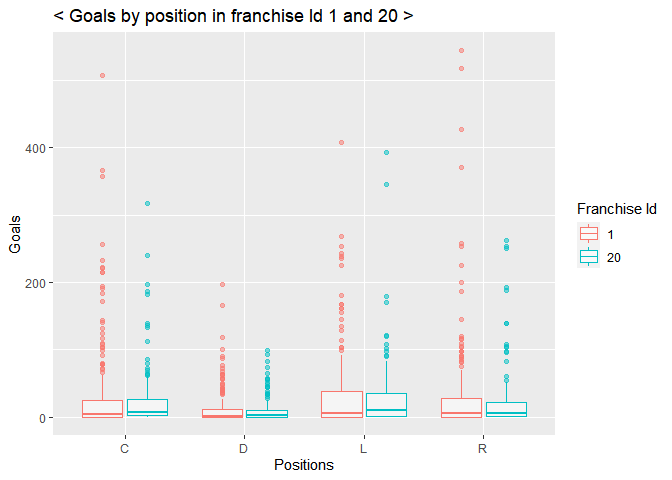
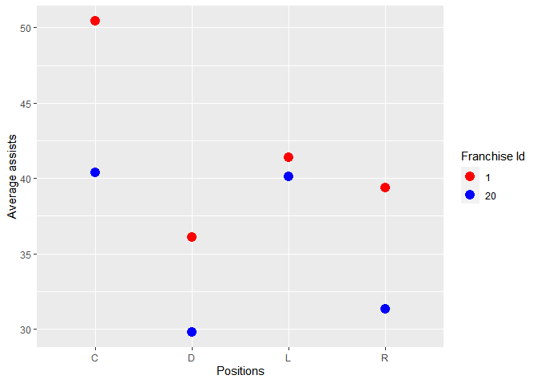
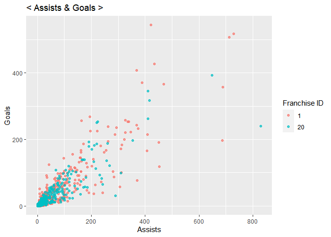

NHL.API.Vignette
================
Soohee Jung
6/11/2021

-   [Required Packages](#required-packages)
-   [API interaction Functions](#api-interaction-functions)
    -   [Setup to Convert value](#setup-to-convert-value)
    -   [Creating Record-API function](#creating-record-api-function)
    -   [Creating Stat-API function](#creating-stat-api-function)
    -   [Wrapper function](#wrapper-function)
-   [Data Exploration](#data-exploration)
    -   [Choose two franchises to compare
        with](#choose-two-franchises-to-compare-with)
    -   [Goals by skater position](#goals-by-skater-position)
    -   [Assists by skater position](#assists-by-skater-position)
    -   [Does the skater’s penalty time affect
        winning?](#does-the-skaters-penalty-time-affect-winning)
        -   [By position](#by-position)
        -   [Comparing more teams](#comparing-more-teams)
    -   [Is playing at Home really an
        advantage?](#is-playing-at-home-really-an-advantage)
-   [Conclusion](#conclusion)

This document is a vignette to show how retrieve data from an
[API](https://en.wikipedia.org/wiki/API). I will use the NHL API to pull
data and then summaries and explore the data pulled.

# Required Packages

To use the functions for interacting with the NHL API, I will use the
following packages:

``` r
library(httr)
library(jsonlite) #needs for API interaction
library(tidyverse) #tons of useful features for data manipulating and visualization
library(xml2)
```

# API interaction Functions

I will define the functions to interact with the [NHL Record
API](https://gitlab.com/dword4/nhlapi/-/blob/master/records-api.md) and
[NHL Stats
API](https://gitlab.com/dword4/nhlapi/-/blob/master/stats-api.md).

## Setup to Convert value

Setting-up to make the function be able to convert a character value
into a numeric value.

``` r
# to mapping Franchise ids vs Full names vs Most recent team ID
fr_url <- GET("https://records.nhl.com/site/api/franchise")
fr_text <- content(fr_url, "text", encoding = "UTF-8")
fr_list <- fromJSON(fr_text, flatten=TRUE)
fr_list <- as.data.frame(fr_list)

# Select Franchise ID, Full names, Most recent team ID
fr_tbl <- tibble(fr_list$data.id, fr_list$data.fullName, fr_list$data.mostRecentTeamId)
```

## Creating Record-API function

``` r
# Creating functions to get each Endpoint URL
rcd_url <- function(list,recd,type,id){
  if (missing(recd) & missing(type) & missing(id)){
    rcdurl <- paste0("https://records.nhl.com/site/api/",list)
  }
  else if (missing(type) & missing(id)){
    rcdurl <- paste0("https://records.nhl.com/site/api/",list,"-",recd)
  }
  else {
    if (is.numeric(id)){
      rcdurl <- paste0("https://records.nhl.com/site/api/",list,"-",recd,"?cayenneExp=", type, "=", id)
    }
    else {
      if (type=="mostRecentTeamId"){
        id <- filter(filter(fr_tbl,fr_tbl[2]==id)[3]) #convert Full name to Most recent team ID
        rcdurl <- paste0("https://records.nhl.com/site/api/",list,"-",recd,"?cayenneExp=", type, "=", id)
      }
      else {
        id <- filter(filter(fr_tbl,fr_tbl[2]==id)[1]) #Convert Full name to Franchise ID
        rcdurl <- paste0("https://records.nhl.com/site/api/",list,"-",recd,"?cayenneExp=", type, "=", id)
      }
    }
  }
  return(rcdurl)
}

#Function to get data from the URL
rcd_dt <- function(list,recd,...){
  if (missing(recd)){
    rcd_NHL <- GET(rcd_url(list))
    rcd_text <- content(rcd_NHL, "text",encoding = "UTF-8")
    rcd_list <- fromJSON(rcd_text, flatten=TRUE)
    rcdl_ist <- as.data.frame(rcd_list)
  }
  else {
    if (recd=="detail"){
      rcd_NHL <- GET(rcd_url(list,recd,...))
      rcd_text <- content(rcd_NHL, "text",encoding = "UTF-8")
      rcd_list <- fromJSON(rcd_text, flatten=TRUE)
      rcd_list <- as.data.frame(rcd_list)
      # unwrap HTML file nested in franchise-detail endpoint
      ca<-read_html(rcd_list$data.captainHistory)        
      rcd_list$data.captainHistory<- xml_text(ca)
      co<-read_html(rcd_list$data.coachingHistory)        
      rcd_list$data.coachingHistory<- xml_text(co)
      ge<-read_html(rcd_list$data.generalManagerHistory)        
      rcd_list$data.generalManagerHistory<- xml_text(ge)
      re<-read_html(rcd_list$data.retiredNumbersSummary)        
      rcd_list$data.retiredNumbersSummary<- xml_text(re)
      rcd_list <- gsub("[\r\n\t]"," ",rcd_list)
    }
    else {
      rcd_NHL <- GET(rcd_url(list,recd,...))
      rcd_text <- content(rcd_NHL, "text",encoding = "UTF-8")
      rcd_list <- fromJSON(rcd_text, flatten=TRUE)
      rcd_list <- as.data.frame(rcd_list)
    }
  }
  return(rcd_list)
}
```

## Creating Stat-API function

``` r
#Creating functions to get each Endpoint URL
stat_URL <- function(list,id){
  if (missing(id)){
    staturl <- paste0("https://statsapi.web.nhl.com/api/v1/",list,"?expand=team.stats")
  }
  else{
    if (is.numeric(id)){
      staturl <- paste0("https://statsapi.web.nhl.com/api/v1/",list,"/",id,"?expand=team.stats")
    }
    else {
      id <- filter(filter(fr_tbl,fr_tbl[2]==id)[3]) #convert Full name to Most recent team ID
      staturl <- paste0("https://statsapi.web.nhl.com/api/v1/",list,"/",id,"?expand=team.stats")
    }
  }
  return(staturl)
}

# Function to get data from the URL
stat_dt <- function(list,...){
  stat_NHL <- GET(stat_URL(list,...))
  stat_text <- content(stat_NHL, "text",encoding = "UTF-8")
  stat_list <- fromJSON(stat_text, flatten=TRUE)
  stat_list <- as.data.frame(stat_list)
  # Unwrap nested lists in stat endpoint
  stat_list <- unnest(unnest(stat_list,cols = c(teams.teamStats)),cols = c(splits))
  return(stat_list)
}
```

## Wrapper function

Creating a wrapper function to call the functions above. To call the
wrapper function, the first two arguments are requirement and users can
add 3 other arguments depending on which endpoint they are interested.
The first argument should be either *record* or *stat* and the second
argument is either *franchise* or *team*.

``` r
# choose record or stat and then put parameters to get data
wrap_fnc <- function(fnc,list,...){
  if (fnc=="record"){
    return(rcd_dt(list,...))
  }
  else if (fnc=="stat"){
    return(stat_dt(list,...))
  }
  else cat("Error: Unavailable arguments!")
}
```

# Data Exploration

## Choose two franchises to compare with

Creating a Winning percentage column and choose two comparable franchise
IDs.

``` r
a <- wrap_fnc("record","franchise","team-totals") %>% 
  filter(data.gameTypeId==2 & data.gamesPlayed >2000) %>% 
  mutate(win_chance=data.wins/data.gamesPlayed) %>% 
  select(data.franchiseId,data.gamesPlayed, data.wins, win_chance) %>% arrange(win_chance)
knitr::kable(a, col.names=gsub("data.","",names(a)), align="cccc",  caption="Winning percentage by Franchise ID")
```

| franchiseId | gamesPlayed | wins | win\_chance |
|:-----------:|:-----------:|:----:|:-----------:|
|     15      |    2062     | 758  |  0.3676043  |
|     20      |    3945     | 1649 |  0.4179975  |
|     14      |    4172     | 1754 |  0.4204219  |
|     33      |    2109     | 889  |  0.4215268  |
|     11      |    6560     | 2812 |  0.4286585  |
|     10      |    6560     | 2883 |  0.4394817  |
|      5      |    6516     | 2873 |  0.4409147  |
|     30      |    2195     | 971  |  0.4423690  |
|     22      |    3788     | 1688 |  0.4456177  |
|     31      |    2194     | 985  |  0.4489517  |
|     25      |    3235     | 1469 |  0.4540958  |
|     17      |    4171     | 1903 |  0.4562455  |
|     19      |    3945     | 1805 |  0.4575412  |
|     12      |    6293     | 2891 |  0.4593993  |
|     18      |    4173     | 1929 |  0.4622574  |
|     23      |    2993     | 1394 |  0.4657534  |
|     24      |    3633     | 1700 |  0.4679328  |
|     32      |    2111     | 990  |  0.4689721  |
|     29      |    2274     | 1070 |  0.4705365  |
|     21      |    3154     | 1497 |  0.4746354  |
|      6      |    6626     | 3241 |  0.4891337  |
|     16      |    4171     | 2079 |  0.4984416  |
|      1      |    6787     | 3473 |  0.5117136  |
|     15      |    2109     | 1084 |  0.5139877  |

Winning percentage by Franchise ID

ID=1 had higher chance of winning(51.2%) than ID=20 had(41.8%). I want
to find which factors affected different winning rates within these two
franchises!

## Goals by skater position

``` r
# Full-join skater and goalie records 
sk_go_join=full_join(wrap_fnc("record","franchise","goalie-records"),wrap_fnc("record","franchise","skater-records"))
```

    ## Joining, by = c("data.id", "data.activePlayer", "data.firstName", "data.franchiseId", "data.franchiseName", "data.gameTypeId", "data.gamesPlayed", "data.lastName", "data.playerId", "data.positionCode", "data.rookieGamesPlayed", "data.seasons", "total")

``` r
# Filter joined data to choose skaters
fr1 <- wrap_fnc("record","franchise","skater-records","franchiseId",1)
fr20 <- wrap_fnc("record","franchise","skater-records","franchiseId",20)
Fr1Fr20 <- full_join(fr1,fr20)
```

    ## Joining, by = c("data.id", "data.activePlayer", "data.assists", "data.firstName", "data.franchiseId", "data.franchiseName", "data.gameTypeId", "data.gamesPlayed", "data.goals", "data.lastName", "data.mostAssistsGameDates", "data.mostAssistsOneGame", "data.mostAssistsOneSeason", "data.mostAssistsSeasonIds", "data.mostGoalsGameDates", "data.mostGoalsOneGame", "data.mostGoalsOneSeason", "data.mostGoalsSeasonIds", "data.mostPenaltyMinutesOneSeason", "data.mostPenaltyMinutesSeasonIds", "data.mostPointsGameDates", "data.mostPointsOneGame", "data.mostPointsOneSeason", "data.mostPointsSeasonIds", "data.penaltyMinutes", "data.playerId", "data.points", "data.positionCode", "data.rookieGamesPlayed", "data.rookiePoints", "data.seasons", "total")

``` r
knitr::kable(table(Fr1Fr20$data.franchiseId,Fr1Fr20$data.positionCode))
```

|     |   C |   D |   L |   R |
|:----|----:|----:|----:|----:|
| 1   | 196 | 249 | 177 | 178 |
| 20  | 147 | 202 | 111 | 115 |

There are more players in franchise Id=1!

``` r
avg_goal1 <- fr1 %>% group_by(data.positionCode) %>% summarise(Goals=mean(data.goals))
avg_goal20 <- fr20 %>% group_by(data.positionCode) %>% summarise(Goals=mean(data.goals))

knitr::kable(avg_goal1, col.names = c("Position","Avg Goals"), caption = "Franchise Id=1 Average goals")
```

| Position | Avg Goals |
|:---------|----------:|
| C        |  33.70408 |
| D        |  11.35743 |
| L        |  34.11864 |
| R        |  35.14607 |

Franchise Id=1 Average goals

``` r
knitr::kable(avg_goal20, col.names = c("Position","Avg Goals"), caption = "Franchise Id=20 Average goals")
```

| Position | Avg Goals |
|:---------|----------:|
| C        | 24.768708 |
| D        |  8.990099 |
| L        | 31.594595 |
| R        | 26.973913 |

Franchise Id=20 Average goals

``` r
# Create a box-plot
ggplot(Fr1Fr20,aes(x=data.positionCode,y=data.goals,col=as.factor(data.franchiseId)))+geom_boxplot(alpha=0.5)+labs(x="Positions",y="Goals",col="Franchise Id",title="< Goals by position in franchise Id 1 and 20 >")
```

<!-- -->

In the first contingency table, we can see there are more players in
each position in the franchise Id=1. The summary tables show us each
position in the franchise Id=1 scored more than Id=20 players did and in
both franchises the wingers scored more than the center players did.
Interesting! I have been thinking the center players score the most.
Anyway, the amount goals and the winning rates have a positive
correlation as we expected.

## Assists by skater position

``` r
# skater's average assists by position
avgAssists <- Fr1Fr20 %>% group_by(data.franchiseId,data.positionCode) %>% summarise(avgAssist=mean(data.assists)) 
```

    ## `summarise()` has grouped output by 'data.franchiseId'. You can override using the `.groups` argument.

``` r
knitr::kable(avgAssists, col.names = c("Franchise Id","Position","Assists"),caption = "Average assists by position")
```

| Franchise Id | Position |  Assists |
|-------------:|:---------|---------:|
|            1 | C        | 50.43367 |
|            1 | D        | 36.07229 |
|            1 | L        | 41.36723 |
|            1 | R        | 39.37079 |
|           20 | C        | 40.38095 |
|           20 | D        | 29.80693 |
|           20 | L        | 40.13514 |
|           20 | R        | 31.32174 |

Average assists by position

``` r
# Create a bar-plot
ggplot(avgAssists, aes(x=data.positionCode,y=avgAssist,col=as.factor(data.franchiseId)))+geom_point(size=4)+scale_color_manual(values = c("red","blue")) +
  labs(x="Positions",y="Average assists",col="Franchise Id",titla="< Average assists by position >")
```

<!-- -->

The summary tables show us the players in the franchise Id=1 assisted
more than the the players in franchise Id=20 did in average. The center
players assisted the most in both franchises. Do you remember the
results we got above? The amount of goals, assists and winning rates all
are positively related.

``` r
# Create a scatter-plot to see the relationship between assists and goals
ag <- ggplot(Fr1Fr20, aes(x=data.assists, y=data.goals))
ag + geom_point(aes(color=as.factor(data.franchiseId)), alpha=0.7) +
  labs(x="Assists",y="Goals",color="Franchise ID",title="< Assists & Goals >")
```

<!-- -->

Here is an additional visual output to support the idea. It shows the
goals and assists have a positive linear relationship. Now I am pretty
confident to say that **more assists brought more goals and higher
chance of winning!**

## Does the skater’s penalty time affect winning?

### By position

``` r
knitr::kable(Fr1Fr20 %>% group_by(data.franchiseId,data.positionCode) %>% summarise(avgPenalty=mean(data.penaltyMinutes)), caption = "penaly time by position")
```

    ## `summarise()` has grouped output by 'data.franchiseId'. You can override using the `.groups` argument.

| data.franchiseId | data.positionCode | avgPenalty |
|-----------------:|:------------------|-----------:|
|                1 | C                 |   84.16327 |
|                1 | D                 |  131.72289 |
|                1 | L                 |  101.80226 |
|                1 | R                 |  105.38764 |
|               20 | C                 |   68.02721 |
|               20 | D                 |  126.02970 |
|               20 | L                 |  155.18018 |
|               20 | R                 |  110.14783 |

penaly time by position

These numbers are interesting!! I have guessed that more penalty time
drives higher chance of losing games but these numbers are not talking
that way. I want to pick more teams and compare with one another to make
sure this idea.  
From the winning rate table on top of the page, I would choose Id=14
with winning rate=42% and Id=16 with winning rate=50%.

### Comparing more teams

``` r
fr14 <- wrap_fnc("record","franchise","skater-records","franchiseId",14)
fr16 <- wrap_fnc("record","franchise","skater-records","franchiseId",16)
Fr20Fr14 <- full_join(fr20,fr14)
Fr20Fr14$w.rate <- "LOW" 
Fr1Fr16 <- full_join(fr1,fr16)
Fr1Fr16$w.rate <- "HIGH"
fourJoin <- full_join(Fr20Fr14,Fr1Fr16)
knitr::kable(fourJoin %>% group_by(w.rate,data.franchiseId) %>% summarise(avgPenalty=mean(data.penaltyMinutes)), caption = "penalty time and winning rate")
```

| w.rate | data.franchiseId | avgPenalty |
|:-------|-----------------:|-----------:|
| HIGH   |                1 |   107.5913 |
| HIGH   |               16 |   127.3825 |
| LOW    |               14 |   106.1845 |
| LOW    |               20 |   113.6522 |

penalty time and winning rate

My expectation was totally wrong. All the number outputs show us the
penalty time has no affect to the winning rate.

## Is playing at Home really an advantage?

``` r
# Create Home game winning ratio by homewins/wins
teamTotal <- tbl_df(wrap_fnc("record","franchise","team-totals"))
hw_ratio <- teamTotal %>% filter(data.gameTypeId==2 & data.homeWins!="NA") %>% mutate(HomeWin.ratio=data.homeWins/data.wins) %>%
  select(data.teamName, HomeWin.ratio) %>% arrange(HomeWin.ratio)
# Look at the output numbers in a table
knitr::kable(hw_ratio)
```

| data.teamName           | HomeWin.ratio |
|:------------------------|--------------:|
| Atlanta Thrashers       |     0.5350877 |
| Colorado Avalanche      |     0.5392254 |
| Winnipeg Jets           |     0.5418848 |
| Arizona Coyotes         |     0.5420561 |
| Florida Panthers        |     0.5455568 |
| Detroit Cougars         |     0.5468750 |
| Carolina Hurricanes     |     0.5477630 |
| Dallas Stars            |     0.5479705 |
| Ottawa Senators         |     0.5489186 |
| San Jose Sharks         |     0.5504673 |
| Phoenix Coyotes         |     0.5528455 |
| Vegas Golden Knights    |     0.5549133 |
| New York Rangers        |     0.5598335 |
| Nashville Predators     |     0.5598592 |
| Anaheim Ducks           |     0.5626263 |
| Washington Capitals     |     0.5641176 |
| Edmonton Oilers         |     0.5650102 |
| Minnesota Wild          |     0.5652174 |
| New Jersey Devils       |     0.5667145 |
| Tampa Bay Lightning     |     0.5675127 |
| New York Islanders      |     0.5704976 |
| Vancouver Canucks       |     0.5718617 |
| Columbus Blue Jackets   |     0.5752212 |
| Montreal Maroons        |     0.5756458 |
| Calgary Flames          |     0.5764863 |
| Boston Bruins           |     0.5816106 |
| St. Louis Blues         |     0.5816485 |
| Buffalo Sabres          |     0.5833795 |
| Philadelphia Flyers     |     0.5848966 |
| Los Angeles Kings       |     0.5855188 |
| Montréal Canadiens      |     0.5868126 |
| Chicago Blackhawks      |     0.5885491 |
| Toronto Maple Leafs     |     0.5924121 |
| Hartford Whalers        |     0.5955056 |
| Cleveland Barons        |     0.5957447 |
| Pittsburgh Penguins     |     0.5980032 |
| Atlanta Flames          |     0.6007463 |
| Detroit Red Wings       |     0.6022138 |
| Quebec Nordiques        |     0.6036217 |
| Winnipeg Jets (1979)    |     0.6067194 |
| Pittsburgh Pirates      |     0.6119403 |
| New York Americans      |     0.6150628 |
| Ottawa Senators (1917)  |     0.6201550 |
| Brooklyn Americans      |     0.6250000 |
| Minnesota North Stars   |     0.6292876 |
| St. Louis Eagles        |     0.6363636 |
| Oakland Seals           |     0.6666667 |
| Toronto St. Patricks    |     0.6697248 |
| Colorado Rockies        |     0.6902655 |
| Hamilton Tigers         |     0.7021277 |
| California Golden Seals |     0.7241379 |
| Detroit Falcons         |     0.7352941 |
| Kansas City Scouts      |     0.7407407 |
| Philadelphia Quakers    |     0.7500000 |
| Toronto Arenas          |     0.8333333 |
| Montreal Wanderers      |     1.0000000 |
| Quebec Bulldogs         |     1.0000000 |

``` r
# Look at the distribution of Home winning ratio
r <- ggplot(hw_ratio,aes(x=HomeWin.ratio))
r+geom_histogram(bins=70,fill="purple")+labs(x="Home wins Ratio", title="< Home Game Winning Chance >")
```

<!-- -->

All the teams had over 50% of winning chance when they played at home
field. Playing at Home really an advantage!!

# Conclusion

According to all the results above, **More assists**, **More goals** and
**Home game** helped teams win the games but the amount of **penalty
time** did not affect the winning or losing games.
