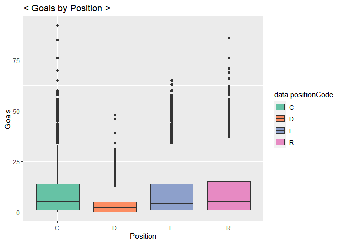
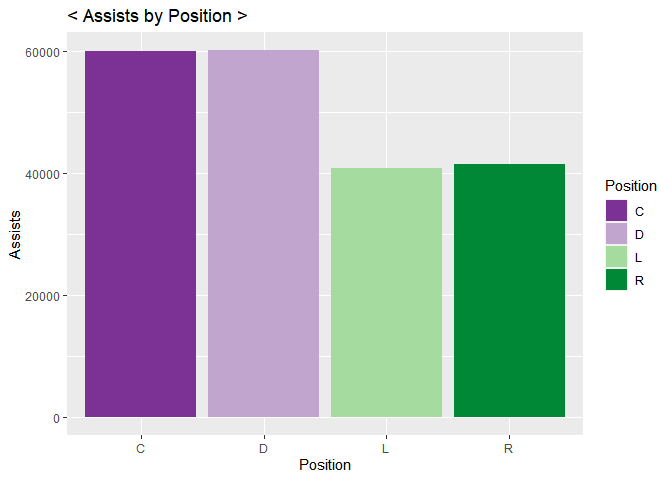

Project I
================
Soohee Jung
6/11/2021

-   [FUNCTIONS](#functions)
    -   [Required Packages](#required-packages)
    -   [Record-API Functions](#record-api-functions)
    -   [Stat-API function](#stat-api-function)
    -   [Wrapper function to call the functions
        above](#wrapper-function-to-call-the-functions-above)
-   [CONTINGENCY TABLES](#contingency-tables)
    -   [Franchise Records](#franchise-records)
    -   [Franchise-team-totals Records](#franchise-team-totals-records)
    -   [franchise-season-records by
        franchiseId=ID](#franchise-season-records-by-franchiseidid)
    -   [franchise-goalie-records by
        franchiseId=ID](#franchise-goalie-records-by-franchiseidid)
    -   [franchise-skater-records by
        franchiseId=ID](#franchise-skater-records-by-franchiseidid)
    -   [franchise-detail records by
        mostRecentTeamId=ID](#franchise-detail-records-by-mostrecentteamidid)
    -   [Team Stat modifier](#team-stat-modifier)
-   [GETTING BASIC IDEAS](#getting-basic-ideas)
    -   [Choose two franchises to compare
        with](#choose-two-franchises-to-compare-with)
    -   [Goals by skater position](#goals-by-skater-position)
    -   [Assists by skater position](#assists-by-skater-position)
-   [FACTORS WHICH INFLUENCE TEAM
    WINNING](#factors-which-influence-team-winning)
    -   [Do skater assists affect
        winning?](#do-skater-assists-affect-winning)
    -   [How center position skater’s penalty time affect
        goal?](#how-center-position-skaters-penalty-time-affect-goal)
    -   [Is playing at Home really an
        advantage?](#is-playing-at-home-really-an-advantage)

# FUNCTIONS

## Required Packages

``` r
library(httr)
library(jsonlite)
library(tidyverse)
library(ggplot2)
library(xml2)
```

## Record-API Functions

``` r
# to mapping Franchise ids vs Full names vs Most recent team ID
fr_url <- GET("https://records.nhl.com/site/api/franchise")
fr_text <- content(fr_url, "text", encoding = "UTF-8")
fr_list <- fromJSON(fr_text, flatten=TRUE)
fr_list <- as.data.frame(fr_list)
# Select Franchise ID, Full names, Most recent team ID
fr_tbl <- tibble(fr_list$data.id, fr_list$data.fullName, fr_list$data.mostRecentTeamId)
# print to see what it looks like
head(fr_tbl)
```

    ## # A tibble: 6 x 3
    ##   `fr_list$data.id` `fr_list$data.fullName` `fr_list$data.mostRecentTeamId`
    ##               <int> <chr>                                             <int>
    ## 1                 1 Montréal Canadiens                                    8
    ## 2                 2 Montreal Wanderers                                   41
    ## 3                 3 St. Louis Eagles                                     45
    ## 4                 4 Hamilton Tigers                                      37
    ## 5                 5 Toronto Maple Leafs                                  10
    ## 6                 6 Boston Bruins                                         6

``` r
# Creating Record API function
# Function to get Endpoint URL
rcd_url <- function(list,recd,type,id){
  if (missing(recd) & missing(type) & missing(id)){
    rcdurl <- paste0("https://records.nhl.com/site/api/",list)
  }
  else if (missing(type) & missing(id)){
    rcdurl <- paste0("https://records.nhl.com/site/api/",list,"-",recd)
  }
  else {
    if (is.numeric(id)){
      rcdurl <- paste0("https://records.nhl.com/site/api/",list,"-",recd,"?cayenneExp=", type, "=", id)
    }
    else {
      if (type=="mostRecentTeamId"){
        id <- filter(filter(fr_tbl,fr_tbl[2]==id)[3]) #convert Full name to Most recent team ID
        rcdurl <- paste0("https://records.nhl.com/site/api/",list,"-",recd,"?cayenneExp=", type, "=", id)
      }
      else {
        id <- filter(filter(fr_tbl,fr_tbl[2]==id)[1]) #Convert Full name to Franchise ID
        rcdurl <- paste0("https://records.nhl.com/site/api/",list,"-",recd,"?cayenneExp=", type, "=", id)
      }
    }
  }
  return(rcdurl)
}

# Function to get data from the URL
rcd_dt <- function(list,recd,...){
  if (missing(recd)){
    rcd_NHL <- GET(rcd_url(list))
    rcd_text <- content(rcd_NHL, "text",encoding = "UTF-8")
    rcd_list <- fromJSON(rcd_text, flatten=TRUE)
    rcdl_ist <- as.data.frame(rcd_list)
  }
  else {
    if (recd=="detail"){
      rcd_NHL <- GET(rcd_url(list,recd,...))
      rcd_text <- content(rcd_NHL, "text",encoding = "UTF-8")
      rcd_list <- fromJSON(rcd_text, flatten=TRUE)
      rcd_list <- as.data.frame(rcd_list)
      # unwrap HTML file nested in franchise-detail endpoint
      ca<-read_html(rcd_list$data.captainHistory)        
      rcd_list$data.captainHistory<- xml_text(ca)
      co<-read_html(rcd_list$data.coachingHistory)        
      rcd_list$data.coachingHistory<- xml_text(co)
      ge<-read_html(rcd_list$data.generalManagerHistory)        
      rcd_list$data.generalManagerHistory<- xml_text(ge)
      re<-read_html(rcd_list$data.retiredNumbersSummary)        
      rcd_list$data.retiredNumbersSummary<- xml_text(re)
      rcd_list <- gsub("[\r\n\t]"," ",rcd_list)
    }
    else {
      rcd_NHL <- GET(rcd_url(list,recd,...))
      rcd_text <- content(rcd_NHL, "text",encoding = "UTF-8")
      rcd_list <- fromJSON(rcd_text, flatten=TRUE)
      rcd_list <- as.data.frame(rcd_list)
    }
  }
  return(rcd_list)
}
```

## Stat-API function

``` r
# Function to get Endpoint URL
stat_URL <- function(list,id){
  if (missing(id)){
    staturl <- paste0("https://statsapi.web.nhl.com/api/v1/",list,"?expand=team.stats")
  }
  else{
    if (is.numeric(id)){
      staturl <- paste0("https://statsapi.web.nhl.com/api/v1/",list,"/",id,"?expand=team.stats")
    }
    else {
      id <- filter(filter(fr_tbl,fr_tbl[2]==id)[3]) #convert Full name to Most recent team ID
      staturl <- paste0("https://statsapi.web.nhl.com/api/v1/",list,"/",id,"?expand=team.stats")
    }
  }
  return(staturl)
}

# Function to get data from the URL
stat_dt <- function(list,...){
  stat_NHL <- GET(stat_URL(list,...))
  stat_text <- content(stat_NHL, "text",encoding = "UTF-8")
  stat_list <- fromJSON(stat_text, flatten=TRUE)
  stat_list <- as.data.frame(stat_list)
  # Unwrap nested lists in stat endpoint
  stat_list <- unnest(unnest(stat_list,cols = c(teams.teamStats)),cols = c(splits))
  return(stat_list)
}
```

## Wrapper function to call the functions above

``` r
# choose record or stat and then put parameters to get data
wrap_fnc <- function(fnc,list,...){
  if (fnc=="record"){
    return(rcd_dt(list,...))
  }
  else if (fnc=="stat"){
    return(stat_dt(list,...))
  }
  else cat("Unavailable arguments")
}
```

# CONTINGENCY TABLES

## Franchise Records

``` r
head(wrap_fnc("record","franchise"))
```

    ## $data
    ##    id firstSeasonId              fullName lastSeasonId mostRecentTeamId
    ## 1   1      19171918    Montréal Canadiens           NA                8
    ## 2   2      19171918    Montreal Wanderers     19171918               41
    ## 3   3      19171918      St. Louis Eagles     19341935               45
    ## 4   4      19191920       Hamilton Tigers     19241925               37
    ## 5   5      19171918   Toronto Maple Leafs           NA               10
    ## 6   6      19241925         Boston Bruins           NA                6
    ## 7   7      19241925      Montreal Maroons     19371938               43
    ## 8   8      19251926    Brooklyn Americans     19411942               51
    ## 9   9      19251926  Philadelphia Quakers     19301931               39
    ## 10 10      19261927      New York Rangers           NA                3
    ## 11 11      19261927    Chicago Blackhawks           NA               16
    ## 12 12      19261927     Detroit Red Wings           NA               17
    ## 13 13      19671968      Cleveland Barons     19771978               49
    ## 14 14      19671968     Los Angeles Kings           NA               26
    ## 15 15      19671968          Dallas Stars           NA               25
    ## 16 16      19671968   Philadelphia Flyers           NA                4
    ## 17 17      19671968   Pittsburgh Penguins           NA                5
    ## 18 18      19671968       St. Louis Blues           NA               19
    ## 19 19      19701971        Buffalo Sabres           NA                7
    ## 20 20      19701971     Vancouver Canucks           NA               23
    ## 21 21      19721973        Calgary Flames           NA               20
    ## 22 22      19721973    New York Islanders           NA                2
    ## 23 23      19741975     New Jersey Devils           NA                1
    ## 24 24      19741975   Washington Capitals           NA               15
    ## 25 25      19791980       Edmonton Oilers           NA               22
    ## 26 26      19791980   Carolina Hurricanes           NA               12
    ## 27 27      19791980    Colorado Avalanche           NA               21
    ## 28 28      19791980       Arizona Coyotes           NA               53
    ## 29 29      19911992       San Jose Sharks           NA               28
    ## 30 30      19921993       Ottawa Senators           NA                9
    ## 31 31      19921993   Tampa Bay Lightning           NA               14
    ## 32 32      19931994         Anaheim Ducks           NA               24
    ## 33 33      19931994      Florida Panthers           NA               13
    ## 34 34      19981999   Nashville Predators           NA               18
    ## 35 35      19992000         Winnipeg Jets           NA               52
    ## 36 36      20002001 Columbus Blue Jackets           NA               29
    ## 37 37      20002001        Minnesota Wild           NA               30
    ## 38 38      20172018  Vegas Golden Knights           NA               54
    ## 39 39      20212022        Seattle Kraken           NA               55
    ##    teamAbbrev teamCommonName teamPlaceName
    ## 1         MTL      Canadiens      Montréal
    ## 2         MWN      Wanderers      Montreal
    ## 3         SLE         Eagles     St. Louis
    ## 4         HAM         Tigers      Hamilton
    ## 5         TOR    Maple Leafs       Toronto
    ## 6         BOS         Bruins        Boston
    ## 7         MMR        Maroons      Montreal
    ## 8         BRK      Americans      Brooklyn
    ## 9         QUA        Quakers  Philadelphia
    ## 10        NYR        Rangers      New York
    ## 11        CHI     Blackhawks       Chicago
    ## 12        DET      Red Wings       Detroit
    ## 13        CLE         Barons     Cleveland
    ## 14        LAK          Kings   Los Angeles
    ## 15        DAL          Stars        Dallas
    ## 16        PHI         Flyers  Philadelphia
    ## 17        PIT       Penguins    Pittsburgh
    ## 18        STL          Blues     St. Louis
    ## 19        BUF         Sabres       Buffalo
    ## 20        VAN        Canucks     Vancouver
    ## 21        CGY         Flames       Calgary
    ## 22        NYI      Islanders      New York
    ## 23        NJD         Devils    New Jersey
    ## 24        WSH       Capitals    Washington
    ## 25        EDM         Oilers      Edmonton
    ## 26        CAR     Hurricanes      Carolina
    ## 27        COL      Avalanche      Colorado
    ## 28        ARI        Coyotes       Arizona
    ## 29        SJS         Sharks      San Jose
    ## 30        OTT       Senators        Ottawa
    ## 31        TBL      Lightning     Tampa Bay
    ## 32        ANA          Ducks       Anaheim
    ## 33        FLA       Panthers       Florida
    ## 34        NSH      Predators     Nashville
    ## 35        WPG           Jets      Winnipeg
    ## 36        CBJ   Blue Jackets      Columbus
    ## 37        MIN           Wild     Minnesota
    ## 38        VGK Golden Knights         Vegas
    ## 39        SEA         Kraken       Seattle
    ## 
    ## $total
    ## [1] 39

## Franchise-team-totals Records

``` r
tbl_df(wrap_fnc("record","franchise","team-totals"))
```

    ## # A tibble: 105 x 31
    ##    data.id data.activeFran~ data.firstSeaso~ data.franchiseId
    ##      <int>            <int>            <int>            <int>
    ##  1       1                1         19821983               23
    ##  2       2                1         19821983               23
    ##  3       3                1         19721973               22
    ##  4       4                1         19721973               22
    ##  5       5                1         19261927               10
    ##  6       6                1         19261927               10
    ##  7       7                1         19671968               16
    ##  8       8                1         19671968               16
    ##  9       9                1         19671968               17
    ## 10      10                1         19671968               17
    ## # ... with 95 more rows, and 27 more variables: data.gameTypeId <int>,
    ## #   data.gamesPlayed <int>, data.goalsAgainst <int>, data.goalsFor <int>,
    ## #   data.homeLosses <int>, data.homeOvertimeLosses <int>,
    ## #   data.homeTies <int>, data.homeWins <int>, data.lastSeasonId <int>,
    ## #   data.losses <int>, data.overtimeLosses <int>,
    ## #   data.penaltyMinutes <int>, data.pointPctg <dbl>, data.points <int>,
    ## #   data.roadLosses <int>, data.roadOvertimeLosses <int>,
    ## #   data.roadTies <int>, data.roadWins <int>, data.shootoutLosses <int>,
    ## #   data.shootoutWins <int>, data.shutouts <int>, data.teamId <int>,
    ## #   data.teamName <chr>, data.ties <int>, data.triCode <chr>,
    ## #   data.wins <int>, total <int>

## franchise-season-records by franchiseId=ID

``` r
# I choose ID=10
tbl_df(wrap_fnc("record","franchise","season-records","franchiseId",10))
```

    ## # A tibble: 1 x 58
    ##   data.id data.fewestGoals data.fewestGoal~ data.fewestGoal~
    ##     <int>            <int>            <int> <chr>           
    ## 1       3              150              177 1970-71 (78)    
    ## # ... with 54 more variables: data.fewestGoalsSeasons <chr>,
    ## #   data.fewestLosses <int>, data.fewestLossesSeasons <chr>,
    ## #   data.fewestPoints <int>, data.fewestPointsSeasons <chr>,
    ## #   data.fewestTies <int>, data.fewestTiesSeasons <chr>,
    ## #   data.fewestWins <int>, data.fewestWinsSeasons <chr>,
    ## #   data.franchiseId <int>, data.franchiseName <chr>,
    ## #   data.homeLossStreak <int>, data.homeLossStreakDates <chr>,
    ## #   data.homePointStreak <int>, data.homePointStreakDates <chr>,
    ## #   data.homeWinStreak <int>, data.homeWinStreakDates <chr>,
    ## #   data.homeWinlessStreak <int>, data.homeWinlessStreakDates <chr>,
    ## #   data.lossStreak <int>, data.lossStreakDates <chr>,
    ## #   data.mostGameGoals <int>, data.mostGameGoalsDates <chr>,
    ## #   data.mostGoals <int>, data.mostGoalsAgainst <int>,
    ## #   data.mostGoalsAgainstSeasons <chr>, data.mostGoalsSeasons <chr>,
    ## #   data.mostLosses <int>, data.mostLossesSeasons <chr>,
    ## #   data.mostPenaltyMinutes <int>, data.mostPenaltyMinutesSeasons <chr>,
    ## #   data.mostPoints <int>, data.mostPointsSeasons <chr>,
    ## #   data.mostShutouts <int>, data.mostShutoutsSeasons <chr>,
    ## #   data.mostTies <int>, data.mostTiesSeasons <chr>, data.mostWins <int>,
    ## #   data.mostWinsSeasons <chr>, data.pointStreak <int>,
    ## #   data.pointStreakDates <chr>, data.roadLossStreak <int>,
    ## #   data.roadLossStreakDates <chr>, data.roadPointStreak <int>,
    ## #   data.roadPointStreakDates <chr>, data.roadWinStreak <int>,
    ## #   data.roadWinStreakDates <chr>, data.roadWinlessStreak <int>,
    ## #   data.roadWinlessStreakDates <chr>, data.winStreak <int>,
    ## #   data.winStreakDates <chr>, data.winlessStreak <int>,
    ## #   data.winlessStreakDates <chr>, total <int>

``` r
# I choose Franchise full name="New Jersey Devils"
tbl_df(wrap_fnc("record","franchise","season-records","franchiseId","New Jersey Devils"))
```

    ## # A tibble: 1 x 58
    ##   data.id data.fewestGoals data.fewestGoal~ data.fewestGoal~
    ##     <int>            <int>            <int> <chr>           
    ## 1       1              174              164 2003-04 (82)    
    ## # ... with 54 more variables: data.fewestGoalsSeasons <chr>,
    ## #   data.fewestLosses <int>, data.fewestLossesSeasons <chr>,
    ## #   data.fewestPoints <int>, data.fewestPointsSeasons <chr>,
    ## #   data.fewestTies <int>, data.fewestTiesSeasons <chr>,
    ## #   data.fewestWins <int>, data.fewestWinsSeasons <chr>,
    ## #   data.franchiseId <int>, data.franchiseName <chr>,
    ## #   data.homeLossStreak <int>, data.homeLossStreakDates <chr>,
    ## #   data.homePointStreak <int>, data.homePointStreakDates <chr>,
    ## #   data.homeWinStreak <int>, data.homeWinStreakDates <chr>,
    ## #   data.homeWinlessStreak <int>, data.homeWinlessStreakDates <chr>,
    ## #   data.lossStreak <int>, data.lossStreakDates <chr>,
    ## #   data.mostGameGoals <int>, data.mostGameGoalsDates <chr>,
    ## #   data.mostGoals <int>, data.mostGoalsAgainst <int>,
    ## #   data.mostGoalsAgainstSeasons <chr>, data.mostGoalsSeasons <chr>,
    ## #   data.mostLosses <int>, data.mostLossesSeasons <chr>,
    ## #   data.mostPenaltyMinutes <int>, data.mostPenaltyMinutesSeasons <chr>,
    ## #   data.mostPoints <int>, data.mostPointsSeasons <chr>,
    ## #   data.mostShutouts <int>, data.mostShutoutsSeasons <chr>,
    ## #   data.mostTies <int>, data.mostTiesSeasons <chr>, data.mostWins <int>,
    ## #   data.mostWinsSeasons <chr>, data.pointStreak <int>,
    ## #   data.pointStreakDates <chr>, data.roadLossStreak <int>,
    ## #   data.roadLossStreakDates <chr>, data.roadPointStreak <int>,
    ## #   data.roadPointStreakDates <chr>, data.roadWinStreak <int>,
    ## #   data.roadWinStreakDates <chr>, data.roadWinlessStreak <int>,
    ## #   data.roadWinlessStreakDates <chr>, data.winStreak <int>,
    ## #   data.winStreakDates <chr>, data.winlessStreak <int>,
    ## #   data.winlessStreakDates <chr>, total <int>

## franchise-goalie-records by franchiseId=ID

``` r
# I choose ID=20
tbl_df(wrap_fnc("record","franchise","goalie-records","franchiseId",20))
```

    ## # A tibble: 40 x 30
    ##    data.id data.activePlay~ data.firstName data.franchiseId
    ##      <int> <lgl>            <chr>                     <int>
    ##  1     304 FALSE            Richard                      20
    ##  2     364 FALSE            Gary                         20
    ##  3     367 FALSE            Sean                         20
    ##  4    1224 FALSE            Frank                        20
    ##  5     373 FALSE            Jacques                      20
    ##  6     406 FALSE            Bob                          20
    ##  7     423 FALSE            Troy                         20
    ##  8     424 FALSE            John                         20
    ##  9     500 FALSE            Bob                          20
    ## 10     243 FALSE            Kirk                         20
    ## # ... with 30 more rows, and 26 more variables: data.franchiseName <chr>,
    ## #   data.gameTypeId <int>, data.gamesPlayed <int>, data.lastName <chr>,
    ## #   data.losses <int>, data.mostGoalsAgainstDates <chr>,
    ## #   data.mostGoalsAgainstOneGame <int>, data.mostSavesDates <chr>,
    ## #   data.mostSavesOneGame <int>, data.mostShotsAgainstDates <chr>,
    ## #   data.mostShotsAgainstOneGame <int>, data.mostShutoutsOneSeason <int>,
    ## #   data.mostShutoutsSeasonIds <chr>, data.mostWinsOneSeason <int>,
    ## #   data.mostWinsSeasonIds <chr>, data.overtimeLosses <int>,
    ## #   data.playerId <int>, data.positionCode <chr>,
    ## #   data.rookieGamesPlayed <int>, data.rookieShutouts <int>,
    ## #   data.rookieWins <int>, data.seasons <int>, data.shutouts <int>,
    ## #   data.ties <int>, data.wins <int>, total <int>

``` r
# I choose Franchise full name="Philadelphia Flyers"
tbl_df(wrap_fnc("record","franchise","goalie-records","franchiseId","Philadelphia Flyers"))
```

    ## # A tibble: 34 x 30
    ##    data.id data.activePlay~ data.firstName data.franchiseId
    ##      <int> <lgl>            <chr>                     <int>
    ##  1     341 FALSE            Stephane                     16
    ##  2     366 FALSE            Sean                         16
    ##  3     440 FALSE            Jeff                         16
    ##  4     239 FALSE            Ron                          16
    ##  5     466 FALSE            Gary                         16
    ##  6     482 FALSE            Mark                         16
    ##  7     485 FALSE            Michel                       16
    ##  8     531 FALSE            Phil                         16
    ##  9     584 FALSE            Bruce                        16
    ## 10     307 FALSE            Bernie                       16
    ## # ... with 24 more rows, and 26 more variables: data.franchiseName <chr>,
    ## #   data.gameTypeId <int>, data.gamesPlayed <int>, data.lastName <chr>,
    ## #   data.losses <int>, data.mostGoalsAgainstDates <chr>,
    ## #   data.mostGoalsAgainstOneGame <int>, data.mostSavesDates <chr>,
    ## #   data.mostSavesOneGame <int>, data.mostShotsAgainstDates <chr>,
    ## #   data.mostShotsAgainstOneGame <int>, data.mostShutoutsOneSeason <int>,
    ## #   data.mostShutoutsSeasonIds <chr>, data.mostWinsOneSeason <int>,
    ## #   data.mostWinsSeasonIds <chr>, data.overtimeLosses <int>,
    ## #   data.playerId <int>, data.positionCode <chr>,
    ## #   data.rookieGamesPlayed <int>, data.rookieShutouts <int>,
    ## #   data.rookieWins <int>, data.seasons <int>, data.shutouts <int>,
    ## #   data.ties <int>, data.wins <int>, total <int>

## franchise-skater-records by franchiseId=ID

``` r
# I choose ID=30
tbl_df(wrap_fnc("record","franchise","skater-records","franchiseId",30))
```

    ## # A tibble: 364 x 32
    ##    data.id data.activePlay~ data.assists data.firstName data.franchiseId
    ##      <int> <lgl>                   <int> <chr>                     <int>
    ##  1   18785 FALSE                       0 Joe                          30
    ##  2   19225 FALSE                       0 Bobby                        30
    ##  3   19982 FALSE                       1 Marc                         30
    ##  4   22168 FALSE                       2 Steve                        30
    ##  5   22256 FALSE                       1 Jim                          30
    ##  6   22437 FALSE                       1 Dominic                      30
    ##  7   22496 FALSE                       2 Stephen                      30
    ##  8   22590 FALSE                       1 Francois                     30
    ##  9   23076 FALSE                       3 Brad                         30
    ## 10   23650 FALSE                       0 Brad                         30
    ## # ... with 354 more rows, and 27 more variables: data.franchiseName <chr>,
    ## #   data.gameTypeId <int>, data.gamesPlayed <int>, data.goals <int>,
    ## #   data.lastName <chr>, data.mostAssistsGameDates <chr>,
    ## #   data.mostAssistsOneGame <int>, data.mostAssistsOneSeason <int>,
    ## #   data.mostAssistsSeasonIds <chr>, data.mostGoalsGameDates <chr>,
    ## #   data.mostGoalsOneGame <int>, data.mostGoalsOneSeason <int>,
    ## #   data.mostGoalsSeasonIds <chr>, data.mostPenaltyMinutesOneSeason <int>,
    ## #   data.mostPenaltyMinutesSeasonIds <chr>,
    ## #   data.mostPointsGameDates <chr>, data.mostPointsOneGame <int>,
    ## #   data.mostPointsOneSeason <int>, data.mostPointsSeasonIds <chr>,
    ## #   data.penaltyMinutes <int>, data.playerId <int>, data.points <int>,
    ## #   data.positionCode <chr>, data.rookieGamesPlayed <int>,
    ## #   data.rookiePoints <int>, data.seasons <int>, total <int>

``` r
# I choose Franchise full name="New York Rangers"
tbl_df(wrap_fnc("record","franchise","skater-records","franchiseId","New York Rangers"))
```

    ## # A tibble: 995 x 32
    ##    data.id data.activePlay~ data.assists data.firstName data.franchiseId
    ##      <int> <lgl>                   <int> <chr>                     <int>
    ##  1   17208 FALSE                       1 Doug                         10
    ##  2   17216 FALSE                       0 Lloyd                        10
    ##  3   17230 FALSE                       1 Bill                         10
    ##  4   17310 FALSE                       0 Hub                          10
    ##  5   17360 FALSE                       0 Ron                          10
    ##  6   17374 FALSE                       4 Vern                         10
    ##  7   17444 FALSE                       0 Cliff                        10
    ##  8   17449 FALSE                       0 Frank                        10
    ##  9   17467 FALSE                       1 Harry                        10
    ## 10   17523 FALSE                       0 Bob                          10
    ## # ... with 985 more rows, and 27 more variables: data.franchiseName <chr>,
    ## #   data.gameTypeId <int>, data.gamesPlayed <int>, data.goals <int>,
    ## #   data.lastName <chr>, data.mostAssistsGameDates <chr>,
    ## #   data.mostAssistsOneGame <int>, data.mostAssistsOneSeason <int>,
    ## #   data.mostAssistsSeasonIds <chr>, data.mostGoalsGameDates <chr>,
    ## #   data.mostGoalsOneGame <int>, data.mostGoalsOneSeason <int>,
    ## #   data.mostGoalsSeasonIds <chr>, data.mostPenaltyMinutesOneSeason <int>,
    ## #   data.mostPenaltyMinutesSeasonIds <chr>,
    ## #   data.mostPointsGameDates <chr>, data.mostPointsOneGame <int>,
    ## #   data.mostPointsOneSeason <int>, data.mostPointsSeasonIds <chr>,
    ## #   data.penaltyMinutes <int>, data.playerId <int>, data.points <int>,
    ## #   data.positionCode <chr>, data.rookieGamesPlayed <int>,
    ## #   data.rookiePoints <int>, data.seasons <int>, total <int>

## franchise-detail records by mostRecentTeamId=ID

``` r
# I choose ID=8
tbl_df(wrap_fnc("record","franchise","detail","mostRecentTeamId",8))
```

    ## # A tibble: 14 x 1
    ##    value                                                                   
    ##    <chr>                                                                   
    ##  1 1                                                                       
    ##  2 TRUE                                                                    
    ##  3 "Shea Weber: 2018-19 – Present   Max Pacioretty: 2015-16 – 2017-18   (N~
    ##  4 "Dominique Ducharme: Feb. 25, 2021 – Present   Claude Julien: Feb. 18, ~
    ##  5 1917-11-26T00:00:00                                                     
    ##  6 https://www.nhl.com/canadiens/team/administration                       
    ##  7 19171918                                                                
    ##  8 "Marc Bergevin: May 2, 2012 – Present   Pierre Gauthier: Feb. 8, 2010 –~
    ##  9 https://records.nhl.com/site/asset/public/ext/hero/Team Pages/MTL/Price~
    ## 10 8                                                                       
    ## 11 "1 – Jacques Plante (1952-63)   2 – Doug Harvey (1947-61)   3 – Butch B~
    ## 12 MTL                                                                     
    ## 13 Montréal Canadiens                                                      
    ## 14 1

``` r
# I choose Franchise full name="New York Islanders"
tbl_df(wrap_fnc("record","franchise","detail","mostRecentTeamId","New York Islanders"))
```

    ## # A tibble: 14 x 1
    ##    value                                                                   
    ##    <chr>                                                                   
    ##  1 22                                                                      
    ##  2 TRUE                                                                    
    ##  3 "Anders Lee: 2018-19 – Present   John Tavares: 2013-14 – 2017-18   Mark~
    ##  4 "Barry Trotz: Oct. 4, 2018 – Present   Doug Weight: Jan. 19, 2017 – Apr~
    ##  5 1972-06-06T00:00:00                                                     
    ##  6 https://www.nhl.com/islanders/team/business-directory                   
    ##  7 19721973                                                                
    ##  8 "Lou Lamoriello: June 5, 2018 – Present   Garth Snow: July 18, 2006 – J~
    ##  9 https://records.nhl.com/site/asset/public/ext/hero/Team Pages/NYI/Barza~
    ## 10 2                                                                       
    ## 11 "5 – Denis Potvin (1973-88)   9 – Clark Gillies (1974-86)   19 – Bryan ~
    ## 12 NYI                                                                     
    ## 13 New York Islanders                                                      
    ## 14 1

## Team Stat modifier

``` r
# I choose all ID
tbl_df(wrap_fnc("stat","teams"))
```

    ## # A tibble: 62 x 66
    ##    copyright teams.id teams.name teams.link teams.abbreviat~ teams.teamName
    ##    <fct>        <int> <chr>      <chr>      <chr>            <chr>         
    ##  1 NHL and ~        1 New Jerse~ /api/v1/t~ NJD              Devils        
    ##  2 NHL and ~        1 New Jerse~ /api/v1/t~ NJD              Devils        
    ##  3 NHL and ~        2 New York ~ /api/v1/t~ NYI              Islanders     
    ##  4 NHL and ~        2 New York ~ /api/v1/t~ NYI              Islanders     
    ##  5 NHL and ~        3 New York ~ /api/v1/t~ NYR              Rangers       
    ##  6 NHL and ~        3 New York ~ /api/v1/t~ NYR              Rangers       
    ##  7 NHL and ~        4 Philadelp~ /api/v1/t~ PHI              Flyers        
    ##  8 NHL and ~        4 Philadelp~ /api/v1/t~ PHI              Flyers        
    ##  9 NHL and ~        5 Pittsburg~ /api/v1/t~ PIT              Penguins      
    ## 10 NHL and ~        5 Pittsburg~ /api/v1/t~ PIT              Penguins      
    ## # ... with 52 more rows, and 60 more variables: teams.locationName <chr>,
    ## #   teams.firstYearOfPlay <chr>, stat.gamesPlayed <int>, stat.wins <chr>,
    ## #   stat.losses <chr>, stat.ot <chr>, stat.pts <chr>, stat.ptPctg <chr>,
    ## #   stat.goalsPerGame <chr>, stat.goalsAgainstPerGame <chr>,
    ## #   stat.evGGARatio <chr>, stat.powerPlayPercentage <chr>,
    ## #   stat.powerPlayGoals <chr>, stat.powerPlayGoalsAgainst <chr>,
    ## #   stat.powerPlayOpportunities <chr>, stat.penaltyKillPercentage <chr>,
    ## #   stat.shotsPerGame <chr>, stat.shotsAllowed <chr>,
    ## #   stat.winScoreFirst <chr>, stat.winOppScoreFirst <chr>,
    ## #   stat.winLeadFirstPer <chr>, stat.winLeadSecondPer <chr>,
    ## #   stat.winOutshootOpp <chr>, stat.winOutshotByOpp <chr>,
    ## #   stat.faceOffsTaken <chr>, stat.faceOffsWon <chr>,
    ## #   stat.faceOffsLost <chr>, stat.faceOffWinPercentage <chr>,
    ## #   stat.shootingPctg <dbl>, stat.savePctg <dbl>,
    ## #   stat.penaltyKillOpportunities <chr>, stat.savePctRank <chr>,
    ## #   stat.shootingPctRank <chr>, team.id <int>, team.name <chr>,
    ## #   team.link <chr>, type.displayName <chr>, type.gameType.id <chr>,
    ## #   type.gameType.description <chr>, type.gameType.postseason <lgl>,
    ## #   teams.shortName <chr>, teams.officialSiteUrl <chr>,
    ## #   teams.franchiseId <int>, teams.active <lgl>, teams.venue.name <chr>,
    ## #   teams.venue.link <chr>, teams.venue.city <chr>, teams.venue.id <int>,
    ## #   teams.venue.timeZone.id <chr>, teams.venue.timeZone.offset <int>,
    ## #   teams.venue.timeZone.tz <chr>, teams.division.id <int>,
    ## #   teams.division.name <chr>, teams.division.link <chr>,
    ## #   teams.conference.id <int>, teams.conference.name <chr>,
    ## #   teams.conference.link <chr>, teams.franchise.franchiseId <int>,
    ## #   teams.franchise.teamName <chr>, teams.franchise.link <chr>

``` r
# I choose ID=1
tbl_df(wrap_fnc("stat","teams",1))
```

    ## # A tibble: 2 x 65
    ##   copyright teams.id teams.name teams.link teams.abbreviat~ teams.teamName
    ##   <fct>        <int> <chr>      <chr>      <chr>            <chr>         
    ## 1 NHL and ~        1 New Jerse~ /api/v1/t~ NJD              Devils        
    ## 2 NHL and ~        1 New Jerse~ /api/v1/t~ NJD              Devils        
    ## # ... with 59 more variables: teams.locationName <chr>,
    ## #   teams.firstYearOfPlay <chr>, stat.gamesPlayed <int>, stat.wins <chr>,
    ## #   stat.losses <chr>, stat.ot <chr>, stat.pts <chr>, stat.ptPctg <chr>,
    ## #   stat.goalsPerGame <chr>, stat.goalsAgainstPerGame <chr>,
    ## #   stat.evGGARatio <chr>, stat.powerPlayPercentage <chr>,
    ## #   stat.powerPlayGoals <chr>, stat.powerPlayGoalsAgainst <chr>,
    ## #   stat.powerPlayOpportunities <chr>, stat.penaltyKillPercentage <chr>,
    ## #   stat.shotsPerGame <chr>, stat.shotsAllowed <chr>,
    ## #   stat.winScoreFirst <chr>, stat.winOppScoreFirst <chr>,
    ## #   stat.winLeadFirstPer <chr>, stat.winLeadSecondPer <chr>,
    ## #   stat.winOutshootOpp <chr>, stat.winOutshotByOpp <chr>,
    ## #   stat.faceOffsTaken <chr>, stat.faceOffsWon <chr>,
    ## #   stat.faceOffsLost <chr>, stat.faceOffWinPercentage <chr>,
    ## #   stat.shootingPctg <dbl>, stat.savePctg <dbl>,
    ## #   stat.penaltyKillOpportunities <chr>, stat.savePctRank <chr>,
    ## #   stat.shootingPctRank <chr>, team.id <int>, team.name <chr>,
    ## #   team.link <chr>, type.displayName <chr>, type.gameType.id <chr>,
    ## #   type.gameType.description <chr>, type.gameType.postseason <lgl>,
    ## #   teams.shortName <chr>, teams.officialSiteUrl <chr>,
    ## #   teams.franchiseId <int>, teams.active <lgl>, teams.venue.name <chr>,
    ## #   teams.venue.link <chr>, teams.venue.city <chr>,
    ## #   teams.venue.timeZone.id <chr>, teams.venue.timeZone.offset <int>,
    ## #   teams.venue.timeZone.tz <chr>, teams.division.id <int>,
    ## #   teams.division.name <chr>, teams.division.link <chr>,
    ## #   teams.conference.id <int>, teams.conference.name <chr>,
    ## #   teams.conference.link <chr>, teams.franchise.franchiseId <int>,
    ## #   teams.franchise.teamName <chr>, teams.franchise.link <chr>

``` r
# I choose Franchise full name="New Jersey Devils"
tbl_df(wrap_fnc("stat","teams","New Jersey Devils"))
```

    ## # A tibble: 2 x 65
    ##   copyright teams.id teams.name teams.link teams.abbreviat~ teams.teamName
    ##   <fct>        <int> <chr>      <chr>      <chr>            <chr>         
    ## 1 NHL and ~        1 New Jerse~ /api/v1/t~ NJD              Devils        
    ## 2 NHL and ~        1 New Jerse~ /api/v1/t~ NJD              Devils        
    ## # ... with 59 more variables: teams.locationName <chr>,
    ## #   teams.firstYearOfPlay <chr>, stat.gamesPlayed <int>, stat.wins <chr>,
    ## #   stat.losses <chr>, stat.ot <chr>, stat.pts <chr>, stat.ptPctg <chr>,
    ## #   stat.goalsPerGame <chr>, stat.goalsAgainstPerGame <chr>,
    ## #   stat.evGGARatio <chr>, stat.powerPlayPercentage <chr>,
    ## #   stat.powerPlayGoals <chr>, stat.powerPlayGoalsAgainst <chr>,
    ## #   stat.powerPlayOpportunities <chr>, stat.penaltyKillPercentage <chr>,
    ## #   stat.shotsPerGame <chr>, stat.shotsAllowed <chr>,
    ## #   stat.winScoreFirst <chr>, stat.winOppScoreFirst <chr>,
    ## #   stat.winLeadFirstPer <chr>, stat.winLeadSecondPer <chr>,
    ## #   stat.winOutshootOpp <chr>, stat.winOutshotByOpp <chr>,
    ## #   stat.faceOffsTaken <chr>, stat.faceOffsWon <chr>,
    ## #   stat.faceOffsLost <chr>, stat.faceOffWinPercentage <chr>,
    ## #   stat.shootingPctg <dbl>, stat.savePctg <dbl>,
    ## #   stat.penaltyKillOpportunities <chr>, stat.savePctRank <chr>,
    ## #   stat.shootingPctRank <chr>, team.id <int>, team.name <chr>,
    ## #   team.link <chr>, type.displayName <chr>, type.gameType.id <chr>,
    ## #   type.gameType.description <chr>, type.gameType.postseason <lgl>,
    ## #   teams.shortName <chr>, teams.officialSiteUrl <chr>,
    ## #   teams.franchiseId <int>, teams.active <lgl>, teams.venue.name <chr>,
    ## #   teams.venue.link <chr>, teams.venue.city <chr>,
    ## #   teams.venue.timeZone.id <chr>, teams.venue.timeZone.offset <int>,
    ## #   teams.venue.timeZone.tz <chr>, teams.division.id <int>,
    ## #   teams.division.name <chr>, teams.division.link <chr>,
    ## #   teams.conference.id <int>, teams.conference.name <chr>,
    ## #   teams.conference.link <chr>, teams.franchise.franchiseId <int>,
    ## #   teams.franchise.teamName <chr>, teams.franchise.link <chr>

# GETTING BASIC IDEAS

## Choose two franchises to compare with

``` r
# create Winning percentage column and choose 2 comparable IDs
a <- wrap_fnc("record","franchise","team-totals") %>% filter(data.gameTypeId==2 & data.gamesPlayed >2000) %>% 
  mutate(Winchance=data.wins/data.gamesPlayed) %>% select(data.franchiseId,data.gamesPlayed, data.wins, Winchance)
knitr::kable(a, caption="< Find winning percent >")
```

| data.franchiseId | data.gamesPlayed | data.wins | Winchance |
|-----------------:|-----------------:|----------:|----------:|
|               23 |             2993 |      1394 | 0.4657534 |
|               22 |             3788 |      1688 | 0.4456177 |
|               10 |             6560 |      2883 | 0.4394817 |
|               16 |             4171 |      2079 | 0.4984416 |
|               17 |             4171 |      1903 | 0.4562455 |
|                6 |             6626 |      3241 | 0.4891337 |
|               19 |             3945 |      1805 | 0.4575412 |
|                1 |             6787 |      3473 | 0.5117136 |
|               30 |             2195 |       971 | 0.4423690 |
|                5 |             6516 |      2873 | 0.4409147 |
|               33 |             2109 |       889 | 0.4215268 |
|               31 |             2194 |       985 | 0.4489517 |
|               24 |             3633 |      1700 | 0.4679328 |
|               11 |             6560 |      2812 | 0.4286585 |
|               12 |             6293 |      2891 | 0.4593993 |
|               18 |             4173 |      1929 | 0.4622574 |
|               21 |             3154 |      1497 | 0.4746354 |
|               25 |             3235 |      1469 | 0.4540958 |
|               20 |             3945 |      1649 | 0.4179975 |
|               32 |             2111 |       990 | 0.4689721 |
|               15 |             2109 |      1084 | 0.5139877 |
|               14 |             4172 |      1754 | 0.4204219 |
|               29 |             2274 |      1070 | 0.4705365 |
|               15 |             2062 |       758 | 0.3676043 |

&lt; Find winning percent &gt;

ID=1 had higher chance of win than ID=20 had. Let’s find the factors
which affect team winning!

## Goals by skater position

``` r
skr <- wrap_fnc("record","franchise","skater-records")
p <- ggplot(skr,aes(x=data.positionCode,y=data.mostGoalsOneSeason,fill=data.positionCode))
p+geom_boxplot()+scale_fill_brewer(palette = "Set2")+labs(x="Position",y="Goals",color="Position",title="< Goals by Position >")
```

<!-- -->

Center position skater scored most goals and then right winger did. That
makes sense!

## Assists by skater position

``` r
b <- ggplot(skr,aes(x=data.positionCode, y=data.mostAssistsOneSeason, fill=data.positionCode))
b+geom_col()+scale_fill_brewer(palette="PRGn")+labs(x="Position",y="Assists",fill="Position",title="< Assists by Position >")
```

<!-- -->

Center players assisted most and then Defenders did. I guessed wingers
assisted most but the data tells different story. Interesting!!

# FACTORS WHICH INFLUENCE TEAM WINNING

## Do skater assists affect winning?

``` r
# Filter datasets and create new variables
sk_id1 <- wrap_fnc("record","franchise", "skater-records","franchiseId",1)
sk_id20 <- wrap_fnc("record","franchise", "skater-records","franchiseId",20)

# Combine two datasets
co_sk <- rbind(sk_id1,sk_id20)
co_sk$data.franchiseId <- as.character(co_sk$data.franchiseId)

# Summarise skaters assists records
avg_assi <- c(ID.1=mean(sk_id1$data.assists),ID.20=mean(sk_id20$data.assists))
knitr::kable(avg_assi,col.names = "Avg Assists")
```

|       | Avg Assists |
|-------|------------:|
| ID.1  |    41.49625 |
| ID.20 |    34.80696 |

The franchise ID=1 had more average assists and higher winning chance
than ID=20 did.

``` r
# Create a graph to see the relationship between assists and goals
sk <- ggplot(co_sk, aes(x=data.assists, y=data.goals))
sk+geom_jitter(aes(color=data.franchiseId))+labs(x="Assists",y="Goals",color="Franchise ID",title="< Assists and Goals >")
```

<!-- -->

This graph also tells us the relationship between assists and goals is
linear. So, we can say **more assists leads higher chance of winning!**

## How center position skater’s penalty time affect goal?

``` r
# Summarise center position skater's penalty minutes records
center <- co_sk %>% filter(data.positionCode== "C")
center_pt <- ggplot(center, aes(x=data.penaltyMinutes, y=data.goals))
center_pt + geom_line(aes(color=data.franchiseId)) + geom_smooth() +
  labs(x="Penalty Minutes", y="Goals",color="Franchise ID", title="< center skater Penalty minute and Goals >")
```

    ## `geom_smooth()` using method = 'loess' and formula 'y ~ x'

<!-- -->

The skaters who are in a center position scored more goals as they had
more penalty minutes. What?? Interesting!

``` r
t_total <- wrap_fnc("record","franchise","team-totals")
w <- ggplot(t_total,aes(data.penaltyMinutes,data.wins))
g <- ggplot(t_total,aes(data.penaltyMinutes,data.goalsFor))
g+geom_quantile()+labs(x="Penalty Minutes", y="Goals", title="< Penalty minutes and Goals >")
```

    ## Smoothing formula not specified. Using: y ~ x

<!-- -->

``` r
w+geom_quantile()+labs(x="Penalty Minutes", y="Wins", title="< Penalty minutes and Wins >")
```

    ## Smoothing formula not specified. Using: y ~ x

<!-- -->

What a surprising result!! I thought the penalty minutes would affects
goals and winnings in negative ways, but the graphs tell us totally
opposite story.

## Is playing at Home really an advantage?

``` r
hw_ratio <- t_total %>% filter(data.gameTypeId==2) %>% mutate(HomeWin.ratio=data.homeWins/data.wins) %>%
  select(data.teamName,data.homeWins, data.wins, HomeWin.ratio)
knitr::kable(hw_ratio)
```

| data.teamName           | data.homeWins | data.wins | HomeWin.ratio |
|:------------------------|--------------:|----------:|--------------:|
| New Jersey Devils       |           790 |      1394 |     0.5667145 |
| New York Islanders      |           963 |      1688 |     0.5704976 |
| New York Rangers        |          1614 |      2883 |     0.5598335 |
| Philadelphia Flyers     |          1216 |      2079 |     0.5848966 |
| Pittsburgh Penguins     |          1138 |      1903 |     0.5980032 |
| Boston Bruins           |          1885 |      3241 |     0.5816106 |
| Buffalo Sabres          |          1053 |      1805 |     0.5833795 |
| Montréal Canadiens      |          2038 |      3473 |     0.5868126 |
| Ottawa Senators         |           533 |       971 |     0.5489186 |
| Toronto Maple Leafs     |          1702 |      2873 |     0.5924121 |
| Atlanta Thrashers       |           183 |       342 |     0.5350877 |
| Carolina Hurricanes     |           453 |       827 |     0.5477630 |
| Florida Panthers        |           485 |       889 |     0.5455568 |
| Tampa Bay Lightning     |           559 |       985 |     0.5675127 |
| Washington Capitals     |           959 |      1700 |     0.5641176 |
| Chicago Blackhawks      |          1655 |      2812 |     0.5885491 |
| Detroit Red Wings       |          1741 |      2891 |     0.6022138 |
| Nashville Predators     |           477 |       852 |     0.5598592 |
| St. Louis Blues         |          1122 |      1929 |     0.5816485 |
| Calgary Flames          |           863 |      1497 |     0.5764863 |
| Colorado Avalanche      |           543 |      1007 |     0.5392254 |
| Edmonton Oilers         |           830 |      1469 |     0.5650102 |
| Vancouver Canucks       |           943 |      1649 |     0.5718617 |
| Anaheim Ducks           |           557 |       990 |     0.5626263 |
| Dallas Stars            |           594 |      1084 |     0.5479705 |
| Los Angeles Kings       |          1027 |      1754 |     0.5855188 |
| Phoenix Coyotes         |           340 |       615 |     0.5528455 |
| San Jose Sharks         |           589 |      1070 |     0.5504673 |
| Columbus Blue Jackets   |           390 |       678 |     0.5752212 |
| Minnesota Wild          |           429 |       759 |     0.5652174 |
| Minnesota North Stars   |           477 |       758 |     0.6292876 |
| Quebec Nordiques        |           300 |       497 |     0.6036217 |
| Winnipeg Jets (1979)    |           307 |       506 |     0.6067194 |
| Hartford Whalers        |           318 |       534 |     0.5955056 |
| Colorado Rockies        |            78 |       113 |     0.6902655 |
| Ottawa Senators (1917)  |           160 |       258 |     0.6201550 |
| Hamilton Tigers         |            33 |        47 |     0.7021277 |
| Pittsburgh Pirates      |            41 |        67 |     0.6119403 |
| Philadelphia Quakers    |             3 |         4 |     0.7500000 |
| Detroit Cougars         |            35 |        64 |     0.5468750 |
| Montreal Wanderers      |             1 |         1 |     1.0000000 |
| Quebec Bulldogs         |             4 |         4 |     1.0000000 |
| Montreal Maroons        |           156 |       271 |     0.5756458 |
| New York Americans      |           147 |       239 |     0.6150628 |
| St. Louis Eagles        |             7 |        11 |     0.6363636 |
| Oakland Seals           |            44 |        66 |     0.6666667 |
| Atlanta Flames          |           161 |       268 |     0.6007463 |
| Kansas City Scouts      |            20 |        27 |     0.7407407 |
| Cleveland Barons        |            28 |        47 |     0.5957447 |
| Detroit Falcons         |            25 |        34 |     0.7352941 |
| Brooklyn Americans      |            10 |        16 |     0.6250000 |
| Winnipeg Jets           |           207 |       382 |     0.5418848 |
| Arizona Coyotes         |           116 |       214 |     0.5420561 |
| Vegas Golden Knights    |            96 |       173 |     0.5549133 |
| California Golden Seals |            84 |       116 |     0.7241379 |
| Toronto Arenas          |            15 |        18 |     0.8333333 |
| Toronto St. Patricks    |            73 |       109 |     0.6697248 |

``` r
r <- ggplot(hw_ratio,aes(x=HomeWin.ratio))
r+geom_histogram(bins=70,fill="purple")+labs(x="Home wins Ratio", title="< Home Game Winning Chance >")
```

<!-- -->

All teams had over 50% of winning chance when they played at home.
Playing at Home really an advantage!!  
According to all above **assists**, **penalty minutes** and **Home
game** help teams win games.
