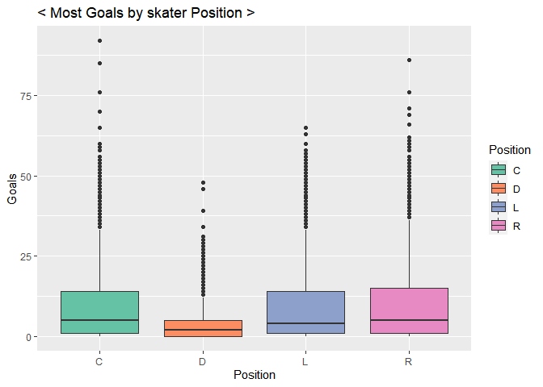
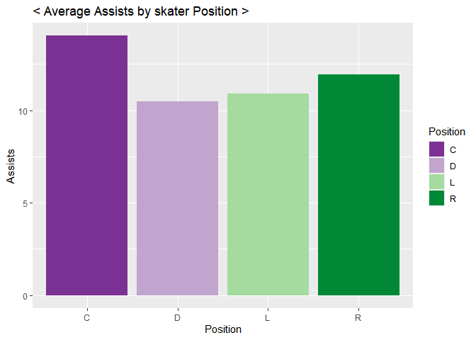
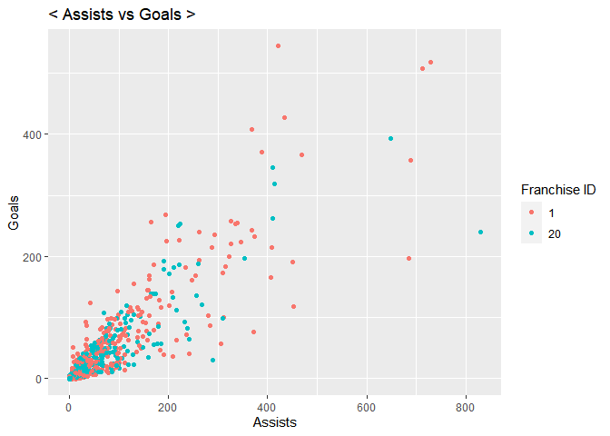
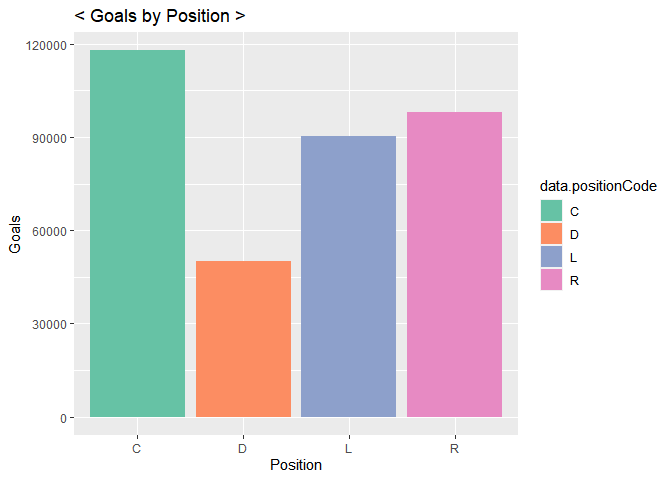

NHL.API.Vignette
================
Soohee Jung
6/11/2021

-   [API interaction Functions](#api-interaction-functions)
    -   [Stat-API function](#stat-api-function)
    -   [Wrapper function to call the functions
        above](#wrapper-function-to-call-the-functions-above)
-   [CONTINGENCY TABLES](#contingency-tables)
    -   [Franchise Records](#franchise-records)
    -   [Franchise-team-totals Records](#franchise-team-totals-records)
    -   [franchise-season-records by
        franchiseId=ID](#franchise-season-records-by-franchiseidid)
    -   [franchise-goalie-records by
        franchiseId=ID](#franchise-goalie-records-by-franchiseidid)
    -   [franchise-skater-records by
        franchiseId=ID](#franchise-skater-records-by-franchiseidid)
    -   [franchise-detail records by
        mostRecentTeamId=ID](#franchise-detail-records-by-mostrecentteamidid)
    -   [Team Stat modifier](#team-stat-modifier)
-   [GETTING BASIC IDEAS](#getting-basic-ideas)
    -   [Choose two franchises to compare
        with](#choose-two-franchises-to-compare-with)
    -   [Goals by skater position](#goals-by-skater-position)
    -   [Assists by skater position](#assists-by-skater-position)
    -   [Some Numerical summaries](#some-numerical-summaries)
-   [FACTORS WHICH INFLUENCED TEAM
    WINNING](#factors-which-influenced-team-winning)
    -   [Do skater assists affect
        winning?](#do-skater-assists-affect-winning)
    -   [How center position skater’s penalty time affect
        goal?](#how-center-position-skaters-penalty-time-affect-goal)
    -   [Is playing at Home really an
        advantage?](#is-playing-at-home-really-an-advantage)

This document is a vignette to show how retrieve data from an
[API](https://en.wikipedia.org/wiki/API). I will use the NHL API to pull
data and then summaries and explore the data pulled.  
\# Required Packages  
To use the functions for interacting with the NHL API, I used the
following packages:

``` r
library(httr)
library(jsonlite) #needs for API interaction
library(tidyverse) #tons of useful features for data manipulating and visualization
library(xml2)
```

# API interaction Functions

I defined the functions to interact with the [NHL Record
API](https://gitlab.com/dword4/nhlapi/-/blob/master/records-api.md) and
[NHL Stats
API](https://gitlab.com/dword4/nhlapi/-/blob/master/stats-api.md).  
\#\# Record-API Functions

``` r
# to mapping Franchise ids vs Full names vs Most recent team ID
fr_url <- GET("https://records.nhl.com/site/api/franchise")
fr_text <- content(fr_url, "text", encoding = "UTF-8")
fr_list <- fromJSON(fr_text, flatten=TRUE)
fr_list <- as.data.frame(fr_list)
# Select Franchise ID, Full names, Most recent team ID
fr_tbl <- tibble(fr_list$data.id, fr_list$data.fullName, fr_list$data.mostRecentTeamId)
# print to see what it looks like
head(fr_tbl)
```

    ## # A tibble: 6 x 3
    ##   `fr_list$data.id` `fr_list$data.fullName` `fr_list$data.mostRecentTeamId`
    ##               <int> <chr>                                             <int>
    ## 1                 1 Montréal Canadiens                                    8
    ## 2                 2 Montreal Wanderers                                   41
    ## 3                 3 St. Louis Eagles                                     45
    ## 4                 4 Hamilton Tigers                                      37
    ## 5                 5 Toronto Maple Leafs                                  10
    ## 6                 6 Boston Bruins                                         6

``` r
# Creating Record API function
# Function to get Endpoint URL
rcd_url <- function(list,recd,type,id){
  if (missing(recd) & missing(type) & missing(id)){
    rcdurl <- paste0("https://records.nhl.com/site/api/",list)
  }
  else if (missing(type) & missing(id)){
    rcdurl <- paste0("https://records.nhl.com/site/api/",list,"-",recd)
  }
  else {
    if (is.numeric(id)){
      rcdurl <- paste0("https://records.nhl.com/site/api/",list,"-",recd,"?cayenneExp=", type, "=", id)
    }
    else {
      if (type=="mostRecentTeamId"){
        id <- filter(filter(fr_tbl,fr_tbl[2]==id)[3]) #convert Full name to Most recent team ID
        rcdurl <- paste0("https://records.nhl.com/site/api/",list,"-",recd,"?cayenneExp=", type, "=", id)
      }
      else {
        id <- filter(filter(fr_tbl,fr_tbl[2]==id)[1]) #Convert Full name to Franchise ID
        rcdurl <- paste0("https://records.nhl.com/site/api/",list,"-",recd,"?cayenneExp=", type, "=", id)
      }
    }
  }
  return(rcdurl)
}

# Function to get data from the URL
rcd_dt <- function(list,recd,...){
  if (missing(recd)){
    rcd_NHL <- GET(rcd_url(list))
    rcd_text <- content(rcd_NHL, "text",encoding = "UTF-8")
    rcd_list <- fromJSON(rcd_text, flatten=TRUE)
    rcdl_ist <- as.data.frame(rcd_list)
  }
  else {
    if (recd=="detail"){
      rcd_NHL <- GET(rcd_url(list,recd,...))
      rcd_text <- content(rcd_NHL, "text",encoding = "UTF-8")
      rcd_list <- fromJSON(rcd_text, flatten=TRUE)
      rcd_list <- as.data.frame(rcd_list)
      # unwrap HTML file nested in franchise-detail endpoint
      ca<-read_html(rcd_list$data.captainHistory)        
      rcd_list$data.captainHistory<- xml_text(ca)
      co<-read_html(rcd_list$data.coachingHistory)        
      rcd_list$data.coachingHistory<- xml_text(co)
      ge<-read_html(rcd_list$data.generalManagerHistory)        
      rcd_list$data.generalManagerHistory<- xml_text(ge)
      re<-read_html(rcd_list$data.retiredNumbersSummary)        
      rcd_list$data.retiredNumbersSummary<- xml_text(re)
      rcd_list <- gsub("[\r\n\t]"," ",rcd_list)
    }
    else {
      rcd_NHL <- GET(rcd_url(list,recd,...))
      rcd_text <- content(rcd_NHL, "text",encoding = "UTF-8")
      rcd_list <- fromJSON(rcd_text, flatten=TRUE)
      rcd_list <- as.data.frame(rcd_list)
    }
  }
  return(rcd_list)
}
```

## Stat-API function

``` r
# Function to get Endpoint URL
stat_URL <- function(list,id){
  if (missing(id)){
    staturl <- paste0("https://statsapi.web.nhl.com/api/v1/",list,"?expand=team.stats")
  }
  else{
    if (is.numeric(id)){
      staturl <- paste0("https://statsapi.web.nhl.com/api/v1/",list,"/",id,"?expand=team.stats")
    }
    else {
      id <- filter(filter(fr_tbl,fr_tbl[2]==id)[3]) #convert Full name to Most recent team ID
      staturl <- paste0("https://statsapi.web.nhl.com/api/v1/",list,"/",id,"?expand=team.stats")
    }
  }
  return(staturl)
}

# Function to get data from the URL
stat_dt <- function(list,...){
  stat_NHL <- GET(stat_URL(list,...))
  stat_text <- content(stat_NHL, "text",encoding = "UTF-8")
  stat_list <- fromJSON(stat_text, flatten=TRUE)
  stat_list <- as.data.frame(stat_list)
  # Unwrap nested lists in stat endpoint
  stat_list <- unnest(unnest(stat_list,cols = c(teams.teamStats)),cols = c(splits))
  return(stat_list)
}
```

## Wrapper function to call the functions above

``` r
# choose record or stat and then put parameters to get data
wrap_fnc <- function(fnc,list,...){
  if (fnc=="record"){
    return(rcd_dt(list,...))
  }
  else if (fnc=="stat"){
    return(stat_dt(list,...))
  }
  else cat("Unavailable arguments")
}
```

# CONTINGENCY TABLES

## Franchise Records

``` r
str(wrap_fnc("record","franchise"))
```

    ## List of 2
    ##  $ data :'data.frame':   39 obs. of  8 variables:
    ##   ..$ id              : int [1:39] 1 2 3 4 5 6 7 8 9 10 ...
    ##   ..$ firstSeasonId   : int [1:39] 19171918 19171918 19171918 19191920 19171918 19241925 19241925 19251926 19251926 19261927 ...
    ##   ..$ fullName        : chr [1:39] "Montréal Canadiens" "Montreal Wanderers" "St. Louis Eagles" "Hamilton Tigers" ...
    ##   ..$ lastSeasonId    : int [1:39] NA 19171918 19341935 19241925 NA NA 19371938 19411942 19301931 NA ...
    ##   ..$ mostRecentTeamId: int [1:39] 8 41 45 37 10 6 43 51 39 3 ...
    ##   ..$ teamAbbrev      : chr [1:39] "MTL" "MWN" "SLE" "HAM" ...
    ##   ..$ teamCommonName  : chr [1:39] "Canadiens" "Wanderers" "Eagles" "Tigers" ...
    ##   ..$ teamPlaceName   : chr [1:39] "Montréal" "Montreal" "St. Louis" "Hamilton" ...
    ##  $ total: int 39

``` r
head(wrap_fnc("record","franchise"))
```

    ## $data
    ##    id firstSeasonId              fullName lastSeasonId mostRecentTeamId teamAbbrev teamCommonName teamPlaceName
    ## 1   1      19171918    Montréal Canadiens           NA                8        MTL      Canadiens      Montréal
    ## 2   2      19171918    Montreal Wanderers     19171918               41        MWN      Wanderers      Montreal
    ## 3   3      19171918      St. Louis Eagles     19341935               45        SLE         Eagles     St. Louis
    ## 4   4      19191920       Hamilton Tigers     19241925               37        HAM         Tigers      Hamilton
    ## 5   5      19171918   Toronto Maple Leafs           NA               10        TOR    Maple Leafs       Toronto
    ## 6   6      19241925         Boston Bruins           NA                6        BOS         Bruins        Boston
    ## 7   7      19241925      Montreal Maroons     19371938               43        MMR        Maroons      Montreal
    ## 8   8      19251926    Brooklyn Americans     19411942               51        BRK      Americans      Brooklyn
    ## 9   9      19251926  Philadelphia Quakers     19301931               39        QUA        Quakers  Philadelphia
    ## 10 10      19261927      New York Rangers           NA                3        NYR        Rangers      New York
    ## 11 11      19261927    Chicago Blackhawks           NA               16        CHI     Blackhawks       Chicago
    ## 12 12      19261927     Detroit Red Wings           NA               17        DET      Red Wings       Detroit
    ## 13 13      19671968      Cleveland Barons     19771978               49        CLE         Barons     Cleveland
    ## 14 14      19671968     Los Angeles Kings           NA               26        LAK          Kings   Los Angeles
    ## 15 15      19671968          Dallas Stars           NA               25        DAL          Stars        Dallas
    ## 16 16      19671968   Philadelphia Flyers           NA                4        PHI         Flyers  Philadelphia
    ## 17 17      19671968   Pittsburgh Penguins           NA                5        PIT       Penguins    Pittsburgh
    ## 18 18      19671968       St. Louis Blues           NA               19        STL          Blues     St. Louis
    ## 19 19      19701971        Buffalo Sabres           NA                7        BUF         Sabres       Buffalo
    ## 20 20      19701971     Vancouver Canucks           NA               23        VAN        Canucks     Vancouver
    ## 21 21      19721973        Calgary Flames           NA               20        CGY         Flames       Calgary
    ## 22 22      19721973    New York Islanders           NA                2        NYI      Islanders      New York
    ## 23 23      19741975     New Jersey Devils           NA                1        NJD         Devils    New Jersey
    ## 24 24      19741975   Washington Capitals           NA               15        WSH       Capitals    Washington
    ## 25 25      19791980       Edmonton Oilers           NA               22        EDM         Oilers      Edmonton
    ## 26 26      19791980   Carolina Hurricanes           NA               12        CAR     Hurricanes      Carolina
    ## 27 27      19791980    Colorado Avalanche           NA               21        COL      Avalanche      Colorado
    ## 28 28      19791980       Arizona Coyotes           NA               53        ARI        Coyotes       Arizona
    ## 29 29      19911992       San Jose Sharks           NA               28        SJS         Sharks      San Jose
    ## 30 30      19921993       Ottawa Senators           NA                9        OTT       Senators        Ottawa
    ## 31 31      19921993   Tampa Bay Lightning           NA               14        TBL      Lightning     Tampa Bay
    ## 32 32      19931994         Anaheim Ducks           NA               24        ANA          Ducks       Anaheim
    ## 33 33      19931994      Florida Panthers           NA               13        FLA       Panthers       Florida
    ## 34 34      19981999   Nashville Predators           NA               18        NSH      Predators     Nashville
    ## 35 35      19992000         Winnipeg Jets           NA               52        WPG           Jets      Winnipeg
    ## 36 36      20002001 Columbus Blue Jackets           NA               29        CBJ   Blue Jackets      Columbus
    ## 37 37      20002001        Minnesota Wild           NA               30        MIN           Wild     Minnesota
    ## 38 38      20172018  Vegas Golden Knights           NA               54        VGK Golden Knights         Vegas
    ## 39 39      20212022        Seattle Kraken           NA               55        SEA         Kraken       Seattle
    ## 
    ## $total
    ## [1] 39

## Franchise-team-totals Records

``` r
tbl_df(wrap_fnc("record","franchise","team-totals"))
```

    ## Warning: `tbl_df()` was deprecated in dplyr 1.0.0.
    ## Please use `tibble::as_tibble()` instead.

    ## # A tibble: 106 x 31
    ##    data.id data.activeFranc~ data.firstSeaso~ data.franchiseId data.gameTypeId data.gamesPlayed data.goalsAgain~ data.goalsFor data.homeLosses data.homeOverti~ data.homeTies
    ##      <int>             <int>            <int>            <int>           <int>            <int>            <int>         <int>           <int>            <int>         <int>
    ##  1       1                 1         19821983               23               2             2993             8902          8792             525               85            96
    ##  2       2                 1         19821983               23               3              257              634           697              53                0            NA
    ##  3       3                 1         19721973               22               2             3788            11907         12045             678               84           170
    ##  4       4                 1         19721973               22               3              313              910           989              53                1            NA
    ##  5       5                 1         19261927               10               2             6560            20020         20041            1143               76           448
    ##  6       6                 1         19261927               10               3              518             1447          1404             104                0             1
    ##  7       7                 1         19671968               16               3              449             1332          1335              97                0            NA
    ##  8       8                 1         19671968               16               2             4171            12255         13690             584               93           193
    ##  9       9                 1         19671968               17               2             4171            14049         13874             683               60           205
    ## 10      10                 1         19671968               17               3              391             1131          1190              85                0            NA
    ## # ... with 96 more rows, and 20 more variables: data.homeWins <int>, data.lastSeasonId <int>, data.losses <int>, data.overtimeLosses <int>, data.penaltyMinutes <int>,
    ## #   data.pointPctg <dbl>, data.points <int>, data.roadLosses <int>, data.roadOvertimeLosses <int>, data.roadTies <int>, data.roadWins <int>, data.shootoutLosses <int>,
    ## #   data.shootoutWins <int>, data.shutouts <int>, data.teamId <int>, data.teamName <chr>, data.ties <int>, data.triCode <chr>, data.wins <int>, total <int>

## franchise-season-records by franchiseId=ID

``` r
# I choose ID=10
tbl_df(wrap_fnc("record","franchise","season-records","franchiseId",10))
```

    ## # A tibble: 1 x 58
    ##   data.id data.fewestGoals data.fewestGoalsA~ data.fewestGoalsAga~ data.fewestGoalsS~ data.fewestLoss~ data.fewestLosses~ data.fewestPoin~ data.fewestPoints~ data.fewestTies
    ##     <int>            <int>              <int> <chr>                <chr>                         <int> <chr>                         <int> <chr>                        <int>
    ## 1       3              150                177 1970-71 (78)         1954-55 (70)                     17 1971-72 (78)                     47 1965-66 (70)                     4
    ## # ... with 48 more variables: data.fewestTiesSeasons <chr>, data.fewestWins <int>, data.fewestWinsSeasons <chr>, data.franchiseId <int>, data.franchiseName <chr>,
    ## #   data.homeLossStreak <int>, data.homeLossStreakDates <chr>, data.homePointStreak <int>, data.homePointStreakDates <chr>, data.homeWinStreak <int>,
    ## #   data.homeWinStreakDates <chr>, data.homeWinlessStreak <int>, data.homeWinlessStreakDates <chr>, data.lossStreak <int>, data.lossStreakDates <chr>,
    ## #   data.mostGameGoals <int>, data.mostGameGoalsDates <chr>, data.mostGoals <int>, data.mostGoalsAgainst <int>, data.mostGoalsAgainstSeasons <chr>,
    ## #   data.mostGoalsSeasons <chr>, data.mostLosses <int>, data.mostLossesSeasons <chr>, data.mostPenaltyMinutes <int>, data.mostPenaltyMinutesSeasons <chr>,
    ## #   data.mostPoints <int>, data.mostPointsSeasons <chr>, data.mostShutouts <int>, data.mostShutoutsSeasons <chr>, data.mostTies <int>, data.mostTiesSeasons <chr>,
    ## #   data.mostWins <int>, data.mostWinsSeasons <chr>, data.pointStreak <int>, data.pointStreakDates <chr>, data.roadLossStreak <int>, data.roadLossStreakDates <chr>,
    ## #   data.roadPointStreak <int>, data.roadPointStreakDates <chr>, data.roadWinStreak <int>, data.roadWinStreakDates <chr>, data.roadWinlessStreak <int>,
    ## #   data.roadWinlessStreakDates <chr>, data.winStreak <int>, data.winStreakDates <chr>, data.winlessStreak <int>, data.winlessStreakDates <chr>, total <int>

``` r
# I choose Franchise full name="New York Rangers"
tbl_df(wrap_fnc("record","franchise","season-records","franchiseId","New York Rangers"))
```

    ## # A tibble: 1 x 58
    ##   data.id data.fewestGoals data.fewestGoalsA~ data.fewestGoalsAga~ data.fewestGoalsS~ data.fewestLoss~ data.fewestLosses~ data.fewestPoin~ data.fewestPoints~ data.fewestTies
    ##     <int>            <int>              <int> <chr>                <chr>                         <int> <chr>                         <int> <chr>                        <int>
    ## 1       3              150                177 1970-71 (78)         1954-55 (70)                     17 1971-72 (78)                     47 1965-66 (70)                     4
    ## # ... with 48 more variables: data.fewestTiesSeasons <chr>, data.fewestWins <int>, data.fewestWinsSeasons <chr>, data.franchiseId <int>, data.franchiseName <chr>,
    ## #   data.homeLossStreak <int>, data.homeLossStreakDates <chr>, data.homePointStreak <int>, data.homePointStreakDates <chr>, data.homeWinStreak <int>,
    ## #   data.homeWinStreakDates <chr>, data.homeWinlessStreak <int>, data.homeWinlessStreakDates <chr>, data.lossStreak <int>, data.lossStreakDates <chr>,
    ## #   data.mostGameGoals <int>, data.mostGameGoalsDates <chr>, data.mostGoals <int>, data.mostGoalsAgainst <int>, data.mostGoalsAgainstSeasons <chr>,
    ## #   data.mostGoalsSeasons <chr>, data.mostLosses <int>, data.mostLossesSeasons <chr>, data.mostPenaltyMinutes <int>, data.mostPenaltyMinutesSeasons <chr>,
    ## #   data.mostPoints <int>, data.mostPointsSeasons <chr>, data.mostShutouts <int>, data.mostShutoutsSeasons <chr>, data.mostTies <int>, data.mostTiesSeasons <chr>,
    ## #   data.mostWins <int>, data.mostWinsSeasons <chr>, data.pointStreak <int>, data.pointStreakDates <chr>, data.roadLossStreak <int>, data.roadLossStreakDates <chr>,
    ## #   data.roadPointStreak <int>, data.roadPointStreakDates <chr>, data.roadWinStreak <int>, data.roadWinStreakDates <chr>, data.roadWinlessStreak <int>,
    ## #   data.roadWinlessStreakDates <chr>, data.winStreak <int>, data.winStreakDates <chr>, data.winlessStreak <int>, data.winlessStreakDates <chr>, total <int>

## franchise-goalie-records by franchiseId=ID

``` r
# I choose ID=20
tbl_df(wrap_fnc("record","franchise","goalie-records","franchiseId",20))
```

    ## # A tibble: 40 x 30
    ##    data.id data.activePlayer data.firstName data.franchiseId data.franchiseN~ data.gameTypeId data.gamesPlayed data.lastName data.losses data.mostGoalsAga~ data.mostGoalsAg~
    ##      <int> <lgl>             <chr>                     <int> <chr>                      <int>            <int> <chr>               <int> <chr>                          <int>
    ##  1     304 FALSE             Richard                      20 Vancouver Canuc~               2              377 Brodeur               173 1981-10-17                        10
    ##  2     364 FALSE             Gary                         20 Vancouver Canuc~               2               73 Bromley                27 1981-02-20, 1979-~                 9
    ##  3     367 FALSE             Sean                         20 Vancouver Canuc~               2               16 Burke                   9 1998-01-28, 1998-~                 6
    ##  4    1224 FALSE             Frank                        20 Vancouver Canuc~               2              102 Caprice                46 1985-11-08                        13
    ##  5     373 FALSE             Jacques                      20 Vancouver Canuc~               2               10 Caron                   5 1973-12-20                         9
    ##  6     406 FALSE             Bob                          20 Vancouver Canuc~               2               39 Essensa                12 2001-02-17, 2000-~                 5
    ##  7     423 FALSE             Troy                         20 Vancouver Canuc~               2               72 Gamble                 29 1991-02-02                         9
    ##  8     424 FALSE             John                         20 Vancouver Canuc~               2               56 Garrett                21 1984-11-29, 1984-~                12
    ##  9     500 FALSE             Bob                          20 Vancouver Canuc~               2                6 Mason                   4 1991-03-03                         8
    ## 10     243 FALSE             Kirk                         20 Vancouver Canuc~               2              516 McLean                228 1996-10-19                         9
    ## # ... with 30 more rows, and 19 more variables: data.mostSavesDates <chr>, data.mostSavesOneGame <int>, data.mostShotsAgainstDates <chr>,
    ## #   data.mostShotsAgainstOneGame <int>, data.mostShutoutsOneSeason <int>, data.mostShutoutsSeasonIds <chr>, data.mostWinsOneSeason <int>, data.mostWinsSeasonIds <chr>,
    ## #   data.overtimeLosses <int>, data.playerId <int>, data.positionCode <chr>, data.rookieGamesPlayed <int>, data.rookieShutouts <int>, data.rookieWins <int>,
    ## #   data.seasons <int>, data.shutouts <int>, data.ties <int>, data.wins <int>, total <int>

``` r
# I choose Franchise full name="Vancouver Canucks"
tbl_df(wrap_fnc("record","franchise","goalie-records","franchiseId","Vancouver Canucks"))
```

    ## # A tibble: 40 x 30
    ##    data.id data.activePlayer data.firstName data.franchiseId data.franchiseN~ data.gameTypeId data.gamesPlayed data.lastName data.losses data.mostGoalsAga~ data.mostGoalsAg~
    ##      <int> <lgl>             <chr>                     <int> <chr>                      <int>            <int> <chr>               <int> <chr>                          <int>
    ##  1     304 FALSE             Richard                      20 Vancouver Canuc~               2              377 Brodeur               173 1981-10-17                        10
    ##  2     364 FALSE             Gary                         20 Vancouver Canuc~               2               73 Bromley                27 1981-02-20, 1979-~                 9
    ##  3     367 FALSE             Sean                         20 Vancouver Canuc~               2               16 Burke                   9 1998-01-28, 1998-~                 6
    ##  4    1224 FALSE             Frank                        20 Vancouver Canuc~               2              102 Caprice                46 1985-11-08                        13
    ##  5     373 FALSE             Jacques                      20 Vancouver Canuc~               2               10 Caron                   5 1973-12-20                         9
    ##  6     406 FALSE             Bob                          20 Vancouver Canuc~               2               39 Essensa                12 2001-02-17, 2000-~                 5
    ##  7     423 FALSE             Troy                         20 Vancouver Canuc~               2               72 Gamble                 29 1991-02-02                         9
    ##  8     424 FALSE             John                         20 Vancouver Canuc~               2               56 Garrett                21 1984-11-29, 1984-~                12
    ##  9     500 FALSE             Bob                          20 Vancouver Canuc~               2                6 Mason                   4 1991-03-03                         8
    ## 10     243 FALSE             Kirk                         20 Vancouver Canuc~               2              516 McLean                228 1996-10-19                         9
    ## # ... with 30 more rows, and 19 more variables: data.mostSavesDates <chr>, data.mostSavesOneGame <int>, data.mostShotsAgainstDates <chr>,
    ## #   data.mostShotsAgainstOneGame <int>, data.mostShutoutsOneSeason <int>, data.mostShutoutsSeasonIds <chr>, data.mostWinsOneSeason <int>, data.mostWinsSeasonIds <chr>,
    ## #   data.overtimeLosses <int>, data.playerId <int>, data.positionCode <chr>, data.rookieGamesPlayed <int>, data.rookieShutouts <int>, data.rookieWins <int>,
    ## #   data.seasons <int>, data.shutouts <int>, data.ties <int>, data.wins <int>, total <int>

## franchise-skater-records by franchiseId=ID

``` r
# I choose ID=30
tbl_df(wrap_fnc("record","franchise","skater-records","franchiseId",30))
```

    ## # A tibble: 364 x 32
    ##    data.id data.activePlayer data.assists data.firstName data.franchiseId data.franchiseN~ data.gameTypeId data.gamesPlayed data.goals data.lastName data.mostAssistsGameDat~
    ##      <int> <lgl>                    <int> <chr>                     <int> <chr>                      <int>            <int>      <int> <chr>         <chr>                   
    ##  1   18785 FALSE                        0 Joe                          30 Ottawa Senators                2                6          0 Cirella       1995-10-07, 1995-10-13,~
    ##  2   19225 FALSE                        0 Bobby                        30 Ottawa Senators                2                1          0 Dollas        1999-11-10, 1999-11-11  
    ##  3   19982 FALSE                        1 Marc                         30 Ottawa Senators                2               10          0 Fortier       1992-10-08              
    ##  4   22168 FALSE                        2 Steve                        30 Ottawa Senators                2                8          0 Konroyd       1994-03-23, 1994-03-30  
    ##  5   22256 FALSE                        1 Jim                          30 Ottawa Senators                2                4          0 Kyte          1992-12-07              
    ##  6   22437 FALSE                        1 Dominic                      30 Ottawa Senators                2                2          0 Lavoie        1992-11-15              
    ##  7   22496 FALSE                        2 Stephen                      30 Ottawa Senators                2                9          0 Leach         1998-10-29, 1998-10-31  
    ##  8   22590 FALSE                        1 Francois                     30 Ottawa Senators                2               23          0 Leroux        1994-03-20              
    ##  9   23076 FALSE                        3 Brad                         30 Ottawa Senators                2               59          0 Marsh         1992-10-27, 1992-11-19,~
    ## 10   23650 FALSE                        0 Brad                         30 Ottawa Senators                2               11          0 Miller        1992-10-12, 1992-10-14,~
    ## # ... with 354 more rows, and 21 more variables: data.mostAssistsOneGame <int>, data.mostAssistsOneSeason <int>, data.mostAssistsSeasonIds <chr>,
    ## #   data.mostGoalsGameDates <chr>, data.mostGoalsOneGame <int>, data.mostGoalsOneSeason <int>, data.mostGoalsSeasonIds <chr>, data.mostPenaltyMinutesOneSeason <int>,
    ## #   data.mostPenaltyMinutesSeasonIds <chr>, data.mostPointsGameDates <chr>, data.mostPointsOneGame <int>, data.mostPointsOneSeason <int>, data.mostPointsSeasonIds <chr>,
    ## #   data.penaltyMinutes <int>, data.playerId <int>, data.points <int>, data.positionCode <chr>, data.rookieGamesPlayed <int>, data.rookiePoints <int>, data.seasons <int>,
    ## #   total <int>

``` r
# I choose Franchise full name="Ottawa Senators"
tbl_df(wrap_fnc("record","franchise","skater-records","franchiseId","Ottawa Senators"))
```

    ## # A tibble: 364 x 32
    ##    data.id data.activePlayer data.assists data.firstName data.franchiseId data.franchiseN~ data.gameTypeId data.gamesPlayed data.goals data.lastName data.mostAssistsGameDat~
    ##      <int> <lgl>                    <int> <chr>                     <int> <chr>                      <int>            <int>      <int> <chr>         <chr>                   
    ##  1   18785 FALSE                        0 Joe                          30 Ottawa Senators                2                6          0 Cirella       1995-10-07, 1995-10-13,~
    ##  2   19225 FALSE                        0 Bobby                        30 Ottawa Senators                2                1          0 Dollas        1999-11-10, 1999-11-11  
    ##  3   19982 FALSE                        1 Marc                         30 Ottawa Senators                2               10          0 Fortier       1992-10-08              
    ##  4   22168 FALSE                        2 Steve                        30 Ottawa Senators                2                8          0 Konroyd       1994-03-23, 1994-03-30  
    ##  5   22256 FALSE                        1 Jim                          30 Ottawa Senators                2                4          0 Kyte          1992-12-07              
    ##  6   22437 FALSE                        1 Dominic                      30 Ottawa Senators                2                2          0 Lavoie        1992-11-15              
    ##  7   22496 FALSE                        2 Stephen                      30 Ottawa Senators                2                9          0 Leach         1998-10-29, 1998-10-31  
    ##  8   22590 FALSE                        1 Francois                     30 Ottawa Senators                2               23          0 Leroux        1994-03-20              
    ##  9   23076 FALSE                        3 Brad                         30 Ottawa Senators                2               59          0 Marsh         1992-10-27, 1992-11-19,~
    ## 10   23650 FALSE                        0 Brad                         30 Ottawa Senators                2               11          0 Miller        1992-10-12, 1992-10-14,~
    ## # ... with 354 more rows, and 21 more variables: data.mostAssistsOneGame <int>, data.mostAssistsOneSeason <int>, data.mostAssistsSeasonIds <chr>,
    ## #   data.mostGoalsGameDates <chr>, data.mostGoalsOneGame <int>, data.mostGoalsOneSeason <int>, data.mostGoalsSeasonIds <chr>, data.mostPenaltyMinutesOneSeason <int>,
    ## #   data.mostPenaltyMinutesSeasonIds <chr>, data.mostPointsGameDates <chr>, data.mostPointsOneGame <int>, data.mostPointsOneSeason <int>, data.mostPointsSeasonIds <chr>,
    ## #   data.penaltyMinutes <int>, data.playerId <int>, data.points <int>, data.positionCode <chr>, data.rookieGamesPlayed <int>, data.rookiePoints <int>, data.seasons <int>,
    ## #   total <int>

## franchise-detail records by mostRecentTeamId=ID

``` r
# I choose ID=8
tbl_df(wrap_fnc("record","franchise","detail","mostRecentTeamId",8))
```

    ## # A tibble: 14 x 1
    ##    value                                                                                                                                                                     
    ##    <chr>                                                                                                                                                                     
    ##  1 "1"                                                                                                                                                                       
    ##  2 "TRUE"                                                                                                                                                                    
    ##  3 "Shea Weber: 2018-19 – Present   Max Pacioretty: 2015-16 – 2017-18   (No Captain): 2014-15   Brian Gionta: 2010-11 – 2013-14   (No Captain): 2009-10   Saku Koivu: 1999-0~
    ##  4 "Dominique Ducharme: Feb. 25, 2021 – Present   Claude Julien: Feb. 18, 2017 – Feb. 23, 2021   Michel Therrien: Jan. 19, 2013 – Feb. 12, 2017   Randy Cunneyworth: Dec. 17~
    ##  5 "1917-11-26T00:00:00"                                                                                                                                                     
    ##  6 "https://www.nhl.com/canadiens/team/administration"                                                                                                                       
    ##  7 "19171918"                                                                                                                                                                
    ##  8 "Marc Bergevin: May 2, 2012 – Present   Pierre Gauthier: Feb. 8, 2010 – March 29, 2012   Bob Gainey: June 2, 2003 – Feb. 8, 2010   Andre Savard: Nov. 20, 2000 – June 2, ~
    ##  9 "https://records.nhl.com/site/asset/public/ext/hero/Team Pages/MTL/Price.jpg"                                                                                             
    ## 10 "8"                                                                                                                                                                       
    ## 11 "1 – Jacques Plante (1952-63)   2 – Doug Harvey (1947-61)   3 – Butch Bouchard (1941-56)   4 – Jean Beliveau (1950-71)   5 – Bernie Geoffrion (1950-64)   5 – Guy Lapoint~
    ## 12 "MTL"                                                                                                                                                                     
    ## 13 "Montréal Canadiens"                                                                                                                                                      
    ## 14 "1"

``` r
# I choose Franchise full name="Montréal Canadiens"
tbl_df(wrap_fnc("record","franchise","detail","mostRecentTeamId","Montréal Canadiens"))
```

    ## # A tibble: 14 x 1
    ##    value                                                                                                                                                                     
    ##    <chr>                                                                                                                                                                     
    ##  1 "1"                                                                                                                                                                       
    ##  2 "TRUE"                                                                                                                                                                    
    ##  3 "Shea Weber: 2018-19 – Present   Max Pacioretty: 2015-16 – 2017-18   (No Captain): 2014-15   Brian Gionta: 2010-11 – 2013-14   (No Captain): 2009-10   Saku Koivu: 1999-0~
    ##  4 "Dominique Ducharme: Feb. 25, 2021 – Present   Claude Julien: Feb. 18, 2017 – Feb. 23, 2021   Michel Therrien: Jan. 19, 2013 – Feb. 12, 2017   Randy Cunneyworth: Dec. 17~
    ##  5 "1917-11-26T00:00:00"                                                                                                                                                     
    ##  6 "https://www.nhl.com/canadiens/team/administration"                                                                                                                       
    ##  7 "19171918"                                                                                                                                                                
    ##  8 "Marc Bergevin: May 2, 2012 – Present   Pierre Gauthier: Feb. 8, 2010 – March 29, 2012   Bob Gainey: June 2, 2003 – Feb. 8, 2010   Andre Savard: Nov. 20, 2000 – June 2, ~
    ##  9 "https://records.nhl.com/site/asset/public/ext/hero/Team Pages/MTL/Price.jpg"                                                                                             
    ## 10 "8"                                                                                                                                                                       
    ## 11 "1 – Jacques Plante (1952-63)   2 – Doug Harvey (1947-61)   3 – Butch Bouchard (1941-56)   4 – Jean Beliveau (1950-71)   5 – Bernie Geoffrion (1950-64)   5 – Guy Lapoint~
    ## 12 "MTL"                                                                                                                                                                     
    ## 13 "Montréal Canadiens"                                                                                                                                                      
    ## 14 "1"

## Team Stat modifier

``` r
# I choose all ID
tbl_df(wrap_fnc("stat","teams"))
```

    ## # A tibble: 62 x 68
    ##    copyright        teams.id teams.name  teams.link teams.abbreviat~ teams.teamName teams.locationN~ teams.firstYear~ stat.gamesPlayed stat.wins stat.losses stat.ot stat.pts
    ##    <fct>               <int> <chr>       <chr>      <chr>            <chr>          <chr>            <chr>                       <int> <chr>     <chr>       <chr>   <chr>   
    ##  1 NHL and the NHL~        1 New Jersey~ /api/v1/t~ NJD              Devils         New Jersey       1982                           56 19        30          7       45      
    ##  2 NHL and the NHL~        1 New Jersey~ /api/v1/t~ NJD              Devils         New Jersey       1982                           NA 28th      29th        15th    29th    
    ##  3 NHL and the NHL~        2 New York I~ /api/v1/t~ NYI              Islanders      New York         1972                           56 32        17          7       71      
    ##  4 NHL and the NHL~        2 New York I~ /api/v1/t~ NYI              Islanders      New York         1972                           NA 12th      11th        11th    12th    
    ##  5 NHL and the NHL~        3 New York R~ /api/v1/t~ NYR              Rangers        New York         1926                           56 27        23          6       60      
    ##  6 NHL and the NHL~        3 New York R~ /api/v1/t~ NYR              Rangers        New York         1926                           NA 16th      18th        17th    17th    
    ##  7 NHL and the NHL~        4 Philadelph~ /api/v1/t~ PHI              Flyers         Philadelphia     1967                           56 25        23          8       58      
    ##  8 NHL and the NHL~        4 Philadelph~ /api/v1/t~ PHI              Flyers         Philadelphia     1967                           NA 18th      19th        8th     19th    
    ##  9 NHL and the NHL~        5 Pittsburgh~ /api/v1/t~ PIT              Penguins       Pittsburgh       1967                           56 37        16          3       77      
    ## 10 NHL and the NHL~        5 Pittsburgh~ /api/v1/t~ PIT              Penguins       Pittsburgh       1967                           NA 4th       7th         25th    7th     
    ## # ... with 52 more rows, and 55 more variables: stat.ptPctg <chr>, stat.goalsPerGame <chr>, stat.goalsAgainstPerGame <chr>, stat.evGGARatio <chr>,
    ## #   stat.powerPlayPercentage <chr>, stat.powerPlayGoals <chr>, stat.powerPlayGoalsAgainst <chr>, stat.powerPlayOpportunities <chr>, stat.penaltyKillPercentage <chr>,
    ## #   stat.shotsPerGame <chr>, stat.shotsAllowed <chr>, stat.winScoreFirst <chr>, stat.winOppScoreFirst <chr>, stat.winLeadFirstPer <chr>, stat.winLeadSecondPer <chr>,
    ## #   stat.winOutshootOpp <chr>, stat.winOutshotByOpp <chr>, stat.faceOffsTaken <chr>, stat.faceOffsWon <chr>, stat.faceOffsLost <chr>, stat.faceOffWinPercentage <chr>,
    ## #   stat.shootingPctg <dbl>, stat.savePctg <dbl>, stat.penaltyKillOpportunities <chr>, stat.savePctRank <chr>, stat.shootingPctRank <chr>, team.id <int>, team.name <chr>,
    ## #   team.link <chr>, type.displayName <chr>, type.gameType.id <chr>, type.gameType.description <chr>, type.gameType.postseason <lgl>, teams.shortName <chr>,
    ## #   teams.officialSiteUrl <chr>, teams.franchiseId <int>, teams.active <lgl>, teams.venue.name <chr>, teams.venue.link <chr>, teams.venue.city <chr>, teams.venue.id <int>,
    ## #   teams.venue.timeZone.id <chr>, teams.venue.timeZone.offset <int>, teams.venue.timeZone.tz <chr>, teams.division.id <int>, teams.division.name <chr>,
    ## #   teams.division.nameShort <chr>, teams.division.link <chr>, teams.division.abbreviation <chr>, teams.conference.id <int>, teams.conference.name <chr>,
    ## #   teams.conference.link <chr>, teams.franchise.franchiseId <int>, teams.franchise.teamName <chr>, teams.franchise.link <chr>

``` r
# I choose ID=1
tbl_df(wrap_fnc("stat","teams",1))
```

    ## # A tibble: 2 x 67
    ##   copyright         teams.id teams.name  teams.link teams.abbreviat~ teams.teamName teams.locationN~ teams.firstYear~ stat.gamesPlayed stat.wins stat.losses stat.ot stat.pts
    ##   <fct>                <int> <chr>       <chr>      <chr>            <chr>          <chr>            <chr>                       <int> <chr>     <chr>       <chr>   <chr>   
    ## 1 NHL and the NHL ~        1 New Jersey~ /api/v1/t~ NJD              Devils         New Jersey       1982                           56 19        30          7       45      
    ## 2 NHL and the NHL ~        1 New Jersey~ /api/v1/t~ NJD              Devils         New Jersey       1982                           NA 28th      29th        15th    29th    
    ## # ... with 54 more variables: stat.ptPctg <chr>, stat.goalsPerGame <chr>, stat.goalsAgainstPerGame <chr>, stat.evGGARatio <chr>, stat.powerPlayPercentage <chr>,
    ## #   stat.powerPlayGoals <chr>, stat.powerPlayGoalsAgainst <chr>, stat.powerPlayOpportunities <chr>, stat.penaltyKillPercentage <chr>, stat.shotsPerGame <chr>,
    ## #   stat.shotsAllowed <chr>, stat.winScoreFirst <chr>, stat.winOppScoreFirst <chr>, stat.winLeadFirstPer <chr>, stat.winLeadSecondPer <chr>, stat.winOutshootOpp <chr>,
    ## #   stat.winOutshotByOpp <chr>, stat.faceOffsTaken <chr>, stat.faceOffsWon <chr>, stat.faceOffsLost <chr>, stat.faceOffWinPercentage <chr>, stat.shootingPctg <dbl>,
    ## #   stat.savePctg <dbl>, stat.penaltyKillOpportunities <chr>, stat.savePctRank <chr>, stat.shootingPctRank <chr>, team.id <int>, team.name <chr>, team.link <chr>,
    ## #   type.displayName <chr>, type.gameType.id <chr>, type.gameType.description <chr>, type.gameType.postseason <lgl>, teams.shortName <chr>, teams.officialSiteUrl <chr>,
    ## #   teams.franchiseId <int>, teams.active <lgl>, teams.venue.name <chr>, teams.venue.link <chr>, teams.venue.city <chr>, teams.venue.timeZone.id <chr>,
    ## #   teams.venue.timeZone.offset <int>, teams.venue.timeZone.tz <chr>, teams.division.id <int>, teams.division.name <chr>, teams.division.nameShort <chr>,
    ## #   teams.division.link <chr>, teams.division.abbreviation <chr>, teams.conference.id <int>, teams.conference.name <chr>, teams.conference.link <chr>,
    ## #   teams.franchise.franchiseId <int>, teams.franchise.teamName <chr>, teams.franchise.link <chr>

``` r
# I choose Franchise full name="New Jersey Devils"
tbl_df(wrap_fnc("stat","teams","New Jersey Devils"))
```

    ## # A tibble: 2 x 67
    ##   copyright         teams.id teams.name  teams.link teams.abbreviat~ teams.teamName teams.locationN~ teams.firstYear~ stat.gamesPlayed stat.wins stat.losses stat.ot stat.pts
    ##   <fct>                <int> <chr>       <chr>      <chr>            <chr>          <chr>            <chr>                       <int> <chr>     <chr>       <chr>   <chr>   
    ## 1 NHL and the NHL ~        1 New Jersey~ /api/v1/t~ NJD              Devils         New Jersey       1982                           56 19        30          7       45      
    ## 2 NHL and the NHL ~        1 New Jersey~ /api/v1/t~ NJD              Devils         New Jersey       1982                           NA 28th      29th        15th    29th    
    ## # ... with 54 more variables: stat.ptPctg <chr>, stat.goalsPerGame <chr>, stat.goalsAgainstPerGame <chr>, stat.evGGARatio <chr>, stat.powerPlayPercentage <chr>,
    ## #   stat.powerPlayGoals <chr>, stat.powerPlayGoalsAgainst <chr>, stat.powerPlayOpportunities <chr>, stat.penaltyKillPercentage <chr>, stat.shotsPerGame <chr>,
    ## #   stat.shotsAllowed <chr>, stat.winScoreFirst <chr>, stat.winOppScoreFirst <chr>, stat.winLeadFirstPer <chr>, stat.winLeadSecondPer <chr>, stat.winOutshootOpp <chr>,
    ## #   stat.winOutshotByOpp <chr>, stat.faceOffsTaken <chr>, stat.faceOffsWon <chr>, stat.faceOffsLost <chr>, stat.faceOffWinPercentage <chr>, stat.shootingPctg <dbl>,
    ## #   stat.savePctg <dbl>, stat.penaltyKillOpportunities <chr>, stat.savePctRank <chr>, stat.shootingPctRank <chr>, team.id <int>, team.name <chr>, team.link <chr>,
    ## #   type.displayName <chr>, type.gameType.id <chr>, type.gameType.description <chr>, type.gameType.postseason <lgl>, teams.shortName <chr>, teams.officialSiteUrl <chr>,
    ## #   teams.franchiseId <int>, teams.active <lgl>, teams.venue.name <chr>, teams.venue.link <chr>, teams.venue.city <chr>, teams.venue.timeZone.id <chr>,
    ## #   teams.venue.timeZone.offset <int>, teams.venue.timeZone.tz <chr>, teams.division.id <int>, teams.division.name <chr>, teams.division.nameShort <chr>,
    ## #   teams.division.link <chr>, teams.division.abbreviation <chr>, teams.conference.id <int>, teams.conference.name <chr>, teams.conference.link <chr>,
    ## #   teams.franchise.franchiseId <int>, teams.franchise.teamName <chr>, teams.franchise.link <chr>

# GETTING BASIC IDEAS

## Choose two franchises to compare with

``` r
# create Winning percentage column and choose 2 comparable franchise IDs
a <- wrap_fnc("record","franchise","team-totals") %>% 
  filter(data.gameTypeId==2 & data.gamesPlayed >2000) %>% 
  mutate(win_chance=data.wins/data.gamesPlayed) %>% 
  select(data.franchiseId,data.gamesPlayed, data.wins, win_chance) %>% arrange(win_chance)
knitr::kable(a, col.names=gsub("data.","",names(a)), align="cccc",  caption="Winning percentage by Franchise ID")
```

| franchiseId | gamesPlayed | wins | win\_chance |
|:-----------:|:-----------:|:----:|:-----------:|
|     15      |    2062     | 758  |  0.3676043  |
|     20      |    3945     | 1649 |  0.4179975  |
|     14      |    4172     | 1754 |  0.4204219  |
|     33      |    2109     | 889  |  0.4215268  |
|     11      |    6560     | 2812 |  0.4286585  |
|     10      |    6560     | 2883 |  0.4394817  |
|      5      |    6516     | 2873 |  0.4409147  |
|     30      |    2195     | 971  |  0.4423690  |
|     22      |    3788     | 1688 |  0.4456177  |
|     31      |    2194     | 985  |  0.4489517  |
|     25      |    3235     | 1469 |  0.4540958  |
|     17      |    4171     | 1903 |  0.4562455  |
|     19      |    3945     | 1805 |  0.4575412  |
|     12      |    6293     | 2891 |  0.4593993  |
|     18      |    4173     | 1929 |  0.4622574  |
|     23      |    2993     | 1394 |  0.4657534  |
|     24      |    3633     | 1700 |  0.4679328  |
|     32      |    2111     | 990  |  0.4689721  |
|     29      |    2274     | 1070 |  0.4705365  |
|     21      |    3154     | 1497 |  0.4746354  |
|      6      |    6626     | 3241 |  0.4891337  |
|     16      |    4171     | 2079 |  0.4984416  |
|      1      |    6787     | 3473 |  0.5117136  |
|     15      |    2109     | 1084 |  0.5139877  |

Winning percentage by Franchise ID

ID=1 had higher chance of win(51.2%) than ID=20 had(41.8%). Let’s find
the factors which affected these different results!

## Goals by skater position

``` r
# Full-join skater and goalie records 
sk_go_join=full_join(wrap_fnc("record","franchise","goalie-records"),wrap_fnc("record","franchise","skater-records"))
```

    ## Joining, by = c("data.id", "data.activePlayer", "data.firstName", "data.franchiseId", "data.franchiseName", "data.gameTypeId", "data.gamesPlayed", "data.lastName", "data.playerId", "data.positionCode", "data.rookieGamesPlayed", "data.seasons", "total")

``` r
# Filter joined data to choose skaters
skaters <- sk_go_join %>% filter(data.positionCode != "G")
most_goal <- skaters %>% group_by(data.positionCode) %>% summarise(Goals=mean(data.mostGoalsOneSeason))
knitr::kable(most_goal, col.names = c("Position","Avg Goals"))
```

| Position | Avg Goals |
|:---------|----------:|
| C        |  9.382497 |
| D        |  3.394374 |
| L        |  8.751073 |
| R        |  9.901238 |

``` r
# Create a box-plot
p <- ggplot(skaters,aes(x=data.positionCode,y=data.mostGoalsOneSeason,fill=data.positionCode))
p+geom_boxplot()+scale_fill_brewer(palette = "Set2")+labs(x="Position",y="Goals",fill="Position",title="< Most Goals by skater Position >")
```

<!-- -->

Right wingers scored most goals and then Center skaters did. Ok, I
guessed center skaters scored most but their numbers are close so not a
big surprise. That makes sense!

## Assists by skater position

``` r
# skater's average assists by position
most_assi <- skaters %>% group_by(data.positionCode) %>% summarise(assist=mean(data.mostAssistsOneSeason))
knitr::kable(most_assi, col.names = c("Position","Assists"))
```

| Position |  Assists |
|:---------|---------:|
| C        | 14.03477 |
| D        | 10.49834 |
| L        | 10.88653 |
| R        | 11.92686 |

``` r
# Create a bar-plot
b <- ggplot(most_assi,aes(x=data.positionCode, y=assist, fill=data.positionCode))
b+geom_col()+scale_fill_brewer(palette="PRGn")+labs(x="Position",y="Assists",fill="Position",title="< Average Assists by skater Position >")
```

<!-- -->

Center players assisted most and then right wingers did. I guessed both
wingers assisted most but the data tells different story. Interesting!!

## Some Numerical summaries

``` r
# How many players by position
table(sk_go_join$data.positionCode)
```

    ## 
    ##    C    D    G    L    R 
    ## 4285 5723 1078 3728 3473

``` r
# Average Rookie games played
rookie <- sk_go_join %>% group_by(data.positionCode) %>% 
  summarise(rookieGames=mean(data.rookieGamesPlayed, na.rm=TRUE))
knitr::kable(rookie, col.names = c("Position","Rookie Game"))
```

| Position | Rookie Game |
|:---------|------------:|
| C        |    32.50886 |
| D        |    31.27485 |
| G        |    36.92053 |
| L        |    30.32852 |
| R        |    30.72996 |

``` r
# 2 = regular Season, 3 = play offs
w<-wrap_fnc("record","franchise","team-totals")
table(w$data.gameTypeId)
```

    ## 
    ##  2  3 
    ## 58 48

# FACTORS WHICH INFLUENCED TEAM WINNING

## Do skater assists affect winning?

``` r
# Filter datasets to choose 2 teams with ID=1 and ID=20
two_ID <- skaters %>% filter(data.franchiseId==1 | data.franchiseId==20)
two_ID$data.franchiseId <- as.character(two_ID$data.franchiseId)
# Summarise skaters assists records
avg_assi <- two_ID %>% group_by(data.franchiseId) %>% summarise(avgassi=mean(data.assists))
knitr::kable(avg_assi,col.names = c("Franchise ID","Avg Assists"))
```

| Franchise ID | Avg Assists |
|:-------------|------------:|
| 1            |    41.49625 |
| 20           |    34.80696 |

The franchise ID=1 had more average assists and higher winning chance
than ID=20 did.

``` r
# Create a scatter-plot to see the relationship between assists and goals
ag <- ggplot(two_ID, aes(x=data.assists, y=data.goals))
ag + geom_jitter(aes(color=data.franchiseId)) +
  labs(x="Assists",y="Goals",color="Franchise ID",title="< Assists vs Goals >")
```

<!-- -->

This graph also tells us the relationship between assists and goals is
linear. So, we can say **more assists brought more goals and higher
chance of winning!**

## How center position skater’s penalty time affect goal?

``` r
# Summarise center position skater's penalty minutes records
center <- two_ID %>% filter(data.positionCode== "C")
center_pt <- ggplot(center, aes(x=data.penaltyMinutes, y=data.goals))
center_pt + geom_line(aes(color=data.franchiseId)) + geom_smooth() +
  labs(x="Penalty Minutes", y="Goals",color="Franchise ID", title="< center skater Penalty minute and Goals >")
```

    ## `geom_smooth()` using method = 'loess' and formula 'y ~ x'

<!-- -->

The center position skaters scored more goals as they had more penalty
minutes. What?? Interesting!

``` r
# Penalty minutes vs Goals(Wins)
t_total <- wrap_fnc("record","franchise","team-totals")
w <- ggplot(t_total,aes(data.penaltyMinutes,data.wins))
g <- ggplot(t_total,aes(data.penaltyMinutes,data.goalsFor))
g+geom_quantile()+labs(x="Penalty Minutes", y="Goals", title="< Penalty minutes and Goals >")
```

<!-- -->

``` r
w+geom_quantile()+labs(x="Penalty Minutes", y="Wins", title="< Penalty minutes and Wins >")
```

<!-- -->

What a surprising result!! I thought the penalty minutes would affects
goals and winnings in negative ways, but the graphs tell us totally
opposite story.

## Is playing at Home really an advantage?

``` r
# Create Home game winning ratio by homewins/wins
hw_ratio <- t_total %>% filter(data.gameTypeId==2) %>% mutate(HomeWin.ratio=data.homeWins/data.wins) %>%
  select(data.teamName,data.homeWins, data.wins, HomeWin.ratio)
# Look at the output numbers in a table
knitr::kable(hw_ratio)
```

| data.teamName           | data.homeWins | data.wins | HomeWin.ratio |
|:------------------------|--------------:|----------:|--------------:|
| New Jersey Devils       |           790 |      1394 |     0.5667145 |
| New York Islanders      |           963 |      1688 |     0.5704976 |
| New York Rangers        |          1614 |      2883 |     0.5598335 |
| Philadelphia Flyers     |          1216 |      2079 |     0.5848966 |
| Pittsburgh Penguins     |          1138 |      1903 |     0.5980032 |
| Boston Bruins           |          1885 |      3241 |     0.5816106 |
| Buffalo Sabres          |          1053 |      1805 |     0.5833795 |
| Montréal Canadiens      |          2038 |      3473 |     0.5868126 |
| Ottawa Senators         |           533 |       971 |     0.5489186 |
| Toronto Maple Leafs     |          1702 |      2873 |     0.5924121 |
| Atlanta Thrashers       |           183 |       342 |     0.5350877 |
| Carolina Hurricanes     |           453 |       827 |     0.5477630 |
| Florida Panthers        |           485 |       889 |     0.5455568 |
| Tampa Bay Lightning     |           559 |       985 |     0.5675127 |
| Washington Capitals     |           959 |      1700 |     0.5641176 |
| Chicago Blackhawks      |          1655 |      2812 |     0.5885491 |
| Detroit Red Wings       |          1741 |      2891 |     0.6022138 |
| Nashville Predators     |           477 |       852 |     0.5598592 |
| St. Louis Blues         |          1122 |      1929 |     0.5816485 |
| Calgary Flames          |           863 |      1497 |     0.5764863 |
| Colorado Avalanche      |           543 |      1007 |     0.5392254 |
| Edmonton Oilers         |           830 |      1469 |     0.5650102 |
| Vancouver Canucks       |           943 |      1649 |     0.5718617 |
| Anaheim Ducks           |           557 |       990 |     0.5626263 |
| Dallas Stars            |           594 |      1084 |     0.5479705 |
| Los Angeles Kings       |          1027 |      1754 |     0.5855188 |
| Phoenix Coyotes         |           340 |       615 |     0.5528455 |
| San Jose Sharks         |           589 |      1070 |     0.5504673 |
| Columbus Blue Jackets   |           390 |       678 |     0.5752212 |
| Minnesota Wild          |           429 |       759 |     0.5652174 |
| Minnesota North Stars   |           477 |       758 |     0.6292876 |
| Quebec Nordiques        |           300 |       497 |     0.6036217 |
| Winnipeg Jets (1979)    |           307 |       506 |     0.6067194 |
| Hartford Whalers        |           318 |       534 |     0.5955056 |
| Colorado Rockies        |            78 |       113 |     0.6902655 |
| Ottawa Senators (1917)  |           160 |       258 |     0.6201550 |
| Hamilton Tigers         |            33 |        47 |     0.7021277 |
| Pittsburgh Pirates      |            41 |        67 |     0.6119403 |
| Philadelphia Quakers    |             3 |         4 |     0.7500000 |
| Detroit Cougars         |            35 |        64 |     0.5468750 |
| Montreal Wanderers      |             1 |         1 |     1.0000000 |
| Quebec Bulldogs         |             4 |         4 |     1.0000000 |
| Montreal Maroons        |           156 |       271 |     0.5756458 |
| New York Americans      |           147 |       239 |     0.6150628 |
| St. Louis Eagles        |             7 |        11 |     0.6363636 |
| Oakland Seals           |            44 |        66 |     0.6666667 |
| Atlanta Flames          |           161 |       268 |     0.6007463 |
| Kansas City Scouts      |            20 |        27 |     0.7407407 |
| Cleveland Barons        |            28 |        47 |     0.5957447 |
| Detroit Falcons         |            25 |        34 |     0.7352941 |
| Brooklyn Americans      |            10 |        16 |     0.6250000 |
| Winnipeg Jets           |           207 |       382 |     0.5418848 |
| Arizona Coyotes         |           116 |       214 |     0.5420561 |
| Vegas Golden Knights    |            96 |       173 |     0.5549133 |
| California Golden Seals |            84 |       116 |     0.7241379 |
| Toronto Arenas          |            15 |        18 |     0.8333333 |
| Toronto St. Patricks    |            73 |       109 |     0.6697248 |
| Seattle Kraken          |            NA |         0 |            NA |

``` r
# Look at the distribution of Home winning ratio
r <- ggplot(hw_ratio,aes(x=HomeWin.ratio))
r+geom_histogram(bins=70,fill="purple")+labs(x="Home wins Ratio", title="< Home Game Winning Chance >")
```

    ## Warning: Removed 1 rows containing non-finite values (stat_bin).

<!-- -->

All teams had over 50% of winning chance when they played at home.
Playing at Home really an advantage!!

According to all above **More assists**, **More penalty minutes** and
**Home game** helped teams win the games.
