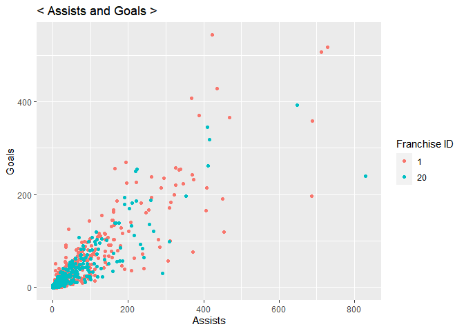
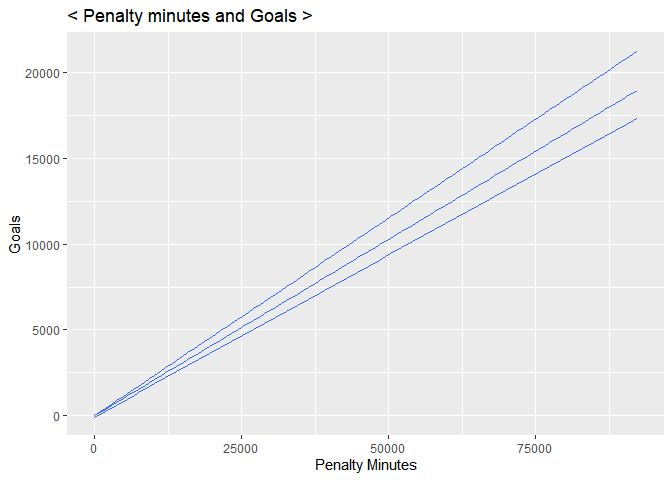
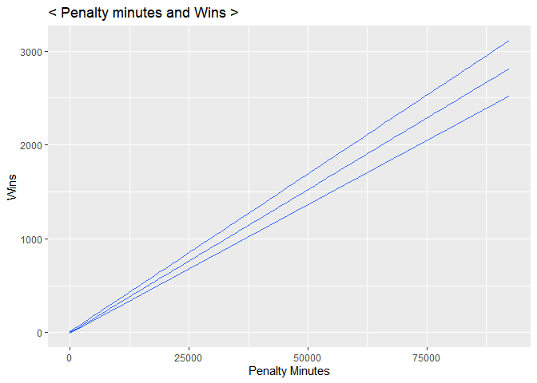

Project I
================
Soohee Jung
6/11/2021

-   [FUNCTIONS](#functions)
    -   [Record-API Functions](#record-api-functions)
    -   [Stat-API function](#stat-api-function)
    -   [Wrapper function to call the functions
        above](#wrapper-function-to-call-the-functions-above)
-   [FACTORS WHICH INFLUENCE TEAM
    WINNING](#factors-which-influence-team-winning)
    -   [Choose two franchises to compare
        with](#choose-two-franchises-to-compare-with)
    -   [How skater assists affect
        winning?](#how-skater-assists-affect-winning)
    -   [How center position skater’s penalty time affect
        goal?](#how-center-position-skaters-penalty-time-affect-goal)

# FUNCTIONS

## Record-API Functions

``` r
library(httr)
library(jsonlite)
library(tidyverse)

# to get the franchise ids and the team names
frurl <- GET("https://records.nhl.com/site/api/franchise")
frtext <- content(frurl, "text", encoding = "UTF-8")
frlist <- fromJSON(frtext, flatten=TRUE)
frlist <- as.data.frame(frlist)
frtbl <- tibble(frlist$data.id, frlist$data.fullName)

# record API function
rcdURL <- function(list,recd,type,id){
  if (missing(recd) & missing(type) & missing(id)){
    rcdurl <- paste0("https://records.nhl.com/site/api/",list)
  }
  else if (missing(type) & missing(id)){
    rcdurl <- paste0("https://records.nhl.com/site/api/",list,"-",recd)
  }
  else {
    if (is.numeric(id)){
      rcdurl <- paste0("https://records.nhl.com/site/api/franchise","-",recd,"?cayenneExp=", type, "=", id)
    }
    else {
      id <- filter(filter(frtbl,frtbl[2]==id)[1])
      rcdurl <- paste0("https://records.nhl.com/site/api/franchise","-",recd,"?cayenneExp=", type, "=", id)
    }
  }
  return(rcdurl)
}

rcddt <- function(list,...){
  rcdNHL <- GET(rcdURL(list,...))
  rcdtext <- content(rcdNHL, "text",encoding = "UTF-8")
  rcdlist <- fromJSON(rcdtext, flatten=TRUE)
  rcdlist <- as.data.frame(rcdlist)
  return(rcdlist)
}
```

## Stat-API function

``` r
statURL <- function(list,id){
  if (missing(id)){
    staturl <- paste0("https://statsapi.web.nhl.com/api/v1/",list,"?expand=team.stats")
  }
  else{
    if (is.numeric(id)){
      staturl <- paste0("https://statsapi.web.nhl.com/api/v1/",list,"/",id,"?expand=team.stats")
    }
    else {
      id <- filter(filter(frtbl,frtbl[2]==id)[1])
      staturl <- paste0("https://statsapi.web.nhl.com/api/v1/",list,"/",id,"?expand=team.stats")
    }
  }
  return(staturl)
}

statdt <- function(list,...){
  statNHL <- GET(statURL(list,...))
  stattext <- content(statNHL, "text",encoding = "UTF-8")
  statlist <- fromJSON(stattext, flatten=TRUE)
  statlist <- as.data.frame(statlist)
  statlist <- unnest(unnest(statlist,cols = c(teams.teamStats)),cols = c(splits))
  return(statlist)
}
```

## Wrapper function to call the functions above

``` r
# choose record or stat and then put parameters what we want
wrapfnc <- function(fnc,list,...){
  if (fnc=="record"){
    return(rcddt(list,...))
  }
  else if (fnc=="stat"){
    return(statdt(list,...))
  }
  else cat("choose record or stat!!")
}
```

# FACTORS WHICH INFLUENCE TEAM WINNING

## Choose two franchises to compare with

``` r
# Look for interesting results from 'team-total' dataset. 
a <- wrapfnc("record","franchise","team-totals") %>% filter(data.gameTypeId==2 & data.gamesPlayed >2000) %>% 
  mutate(Winchance=data.wins/data.gamesPlayed) %>% select(data.franchiseId,data.gamesPlayed, data.wins, Winchance)
knitr::kable(a)
```

|    data.franchiseId |    data.gamesPlayed |    data.wins |                                     Winchance |
|--------------------:|--------------------:|-------------:|----------------------------------------------:|
|                  23 |                2993 |         1394 |                                     0.4657534 |
|                  22 |                3788 |         1688 |                                     0.4456177 |
|                  10 |                6560 |         2883 |                                     0.4394817 |
|                  16 |                4171 |         2079 |                                     0.4984416 |
|                  17 |                4171 |         1903 |                                     0.4562455 |
|                   6 |                6626 |         3241 |                                     0.4891337 |
|                  19 |                3945 |         1805 |                                     0.4575412 |
|                   1 |                6787 |         3473 |                                     0.5117136 |
|                  30 |                2195 |          971 |                                     0.4423690 |
|                   5 |                6516 |         2873 |                                     0.4409147 |
|                  33 |                2109 |          889 |                                     0.4215268 |
|                  31 |                2194 |          985 |                                     0.4489517 |
|                  24 |                3633 |         1700 |                                     0.4679328 |
|                  11 |                6560 |         2812 |                                     0.4286585 |
|                  12 |                6293 |         2891 |                                     0.4593993 |
|                  18 |                4173 |         1929 |                                     0.4622574 |
|                  21 |                3154 |         1497 |                                     0.4746354 |
|                  25 |                3235 |         1469 |                                     0.4540958 |
|                  20 |                3945 |         1649 |                                     0.4179975 |
|                  32 |                2111 |          990 |                                     0.4689721 |
|                  15 |                2109 |         1084 |                                     0.5139877 |
|                  14 |                4172 |         1754 |                                     0.4204219 |
|                  29 |                2274 |         1070 |                                     0.4705365 |
|                  15 |                2062 |          758 |                                     0.3676043 |
| ID=1 had higher cha | nce of win than ID= | 20 had. Let’ | s find the factors which affect team winning! |

## How skater assists affect winning?

``` r
# Filter datasets and create new variables
skid1 <- wrapfnc("record","franchise", "skater-records","franchiseId",1)
skid20 <- wrapfnc("record","franchise", "skater-records","franchiseId",20)

# Combine two datasets
cosk <- rbind(skid1,skid20)
cosk$data.franchiseId <- as.character(cosk$data.franchiseId)

# Summarise skaters assists records
avgassi <- c(ID.1=mean(skid1$data.assists),ID.20=mean(skid20$data.assists))
knitr::kable(avgassi,col.names = "Avg Assists")
```

|          |                                               Avg Assists |
|----------|----------------------------------------------------------:|
| ID.1     |                                                  41.49625 |
| ID.20    |                                                  34.80696 |
| We can s | ee Franchise ID=1 had more average assists from the data. |

``` r
library(ggplot2)
# Create a graph to see the relationship between assists and goals
sk <- ggplot(cosk, aes(x=data.assists, y=data.goals))
sk+geom_jitter(aes(color=data.franchiseId))+labs(x="Assists",y="Goals",color="Franchise ID",title="< Assists and Goals >")
```

<!-- -->

The franchise ID=1 had more average assists and higher winning chance
than ID=20 did. This graph also tells us the relationship between
assists and goals is linear. So, we can say **more assists leads higher
chance of winning!**

## How center position skater’s penalty time affect goal?

``` r
# Summarise center position skater's penalty minutes records
center <- cosk %>% filter(data.positionCode== "C")
centerpt <- ggplot(center, aes(x=data.penaltyMinutes, y=data.goals))
centerpt + geom_line(aes(color=data.franchiseId)) + geom_smooth() +
  labs(x="Penalty Minutes", y="Goals",color="Franchise ID", title="< center skater Penalty minute and Goals >")
```

    ## `geom_smooth()` using method = 'loess' and formula 'y ~ x'

<!-- --> The
skaters who are in a center position scored more goals as they had more
penalty minutes. What?? Interesting!

``` r
ttotal <- wrapfnc("record","franchise","team-totals")
w <- ggplot(ttotal,aes(data.penaltyMinutes,data.wins))
g <- ggplot(ttotal,aes(data.penaltyMinutes,data.goalsFor))
g+geom_quantile()+labs(x="Penalty Minutes", y="Goals", title="< Penalty minutes and Goals >")
```

    ## Smoothing formula not specified. Using: y ~ x

<!-- -->

``` r
w+geom_quantile()+labs(x="Penalty Minutes", y="Wins", title="< Penalty minutes and Wins >")
```

    ## Smoothing formula not specified. Using: y ~ x

<!-- -->

What a surprising result!! I thought the penalty minutes would affects
goals and winnings in negative ways, but the graphs tell us totally
opposite story.
